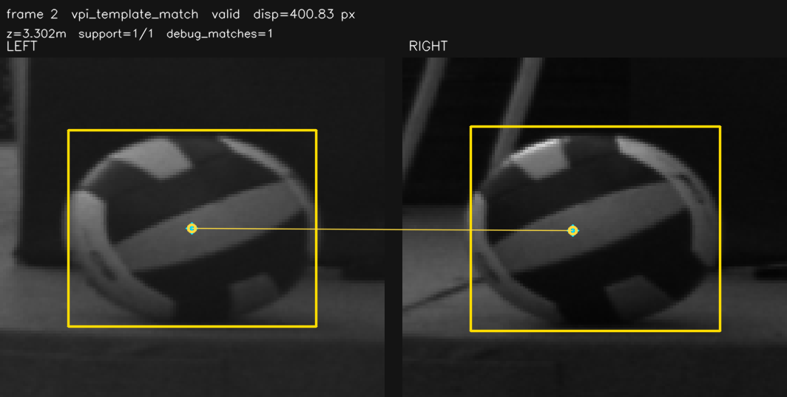
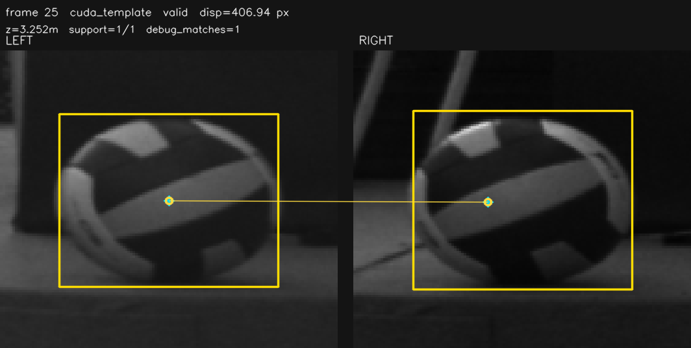
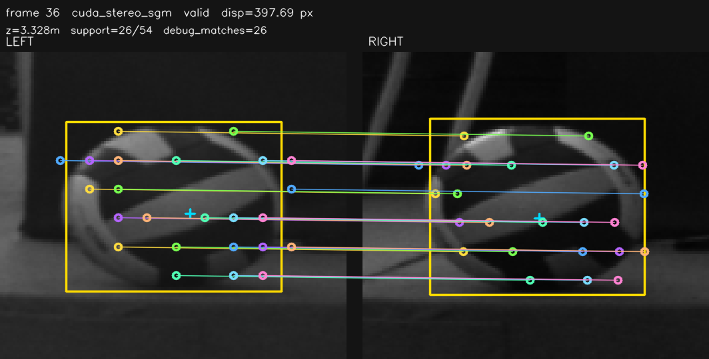
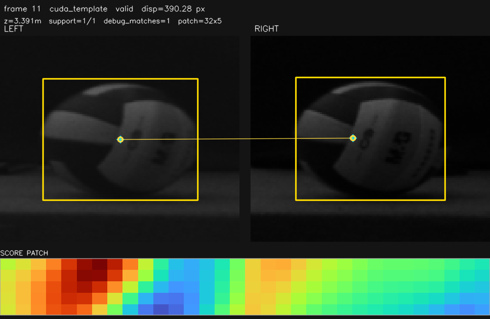

# P2 算法效果与可视化审查

最后核对: 2026-07-05

本页只回答两个问题:

- 当前各 P2 算法在 NX 实时矩阵里的效果如何。
- 现有 zoom/debug 图能不能证明该算法的左右特征点对应关系。

结论先行: 早期 `wiki/assets/p2_20260704/` 仍只是 realtime ROI/status zoom 或全帧 detection panel，不能证明算法内部匹配。2026-07-04 已补四类真实 artifact: diagnostic lane 可输出 OpenCV CUDA ORB/Template/SGM/GFTT-LK、CUDA Hough circle 和 VPI Template 的点对/峰值图；inline debug rerun 可输出 XFeat 和 SuperPoint 的真实左右匹配图；dense stereo 后端可输出 32x32 ROI disparity patch，VPI Stereo 额外输出 confidence patch；Template/VPI Template 已补 score patch，ring-edge 已补候选采样点图。2026-07-05 `z_roi_cuda_template_match` 默认实现已替换为自研 CUDA Template/NCC，并补充有效峰值样张。自研 color/color-edge 当前只有 gate 后 sample overlay，不能当作 `wide_search` 完整匹配正确性证明。

当前默认配置结论: 联合运行已改为去 SGM、去 VPI，并关闭 artifact 显示错配的 `iou_region_color_patch` / `patch_iou_color_edge`；保留 OpenCV CUDA GFTT/LK diagnostic sidecar。XFeat TensorRT 主 CSV 候选已接入但默认关闭。2026-07-04 14:27 当前组合 artifact 复测确认 XFeat 和 GFTT/LK 都能输出真实左右点对 overlay，但性能复测显示 XFeat 主路径使组合降到 `94.4fps`、xfeat-only 也只有 `98.3fps`，因此这些图只证明匹配可视化和字段接线正确，不代表 100fps 准入。

2026-07-05 补充: 自研 CUDA Template/NCC 单算法 isolated `100.1fps`、`1372/1374` 有效、algo `0.30/1.06/1.20/4.89ms`，当前替代 OpenCV CUDA TemplateMatching 作为默认 `z_roi_cuda_template_match` 后端。OpenCV 版本仍保留为 baseline，但不再代表当前实现。

## 数据来源

性能准入:

```text
test_logs/codex_p2_full_20260704_083048/
test_logs/codex_p2_verify_20260704_104947/
```

debug 抽样:

```text
test_logs/codex_p2_debug_20260704_083851/
wiki/assets/p2_20260704/
test_logs/codex_p2_artifact_debug_20260704_105356/
wiki/assets/p2_20260704_artifacts/
NX run: codex_p2_artifacts_final_20260704_110837
wiki/assets/p2_20260704_final/
NX run: codex_p2_inline_artifacts_20260704_122659
NX run: codex_p2_neural_artifacts_20260704_122958
NX run: codex_p2_retest_inline_20260704_130245
NX run: codex_p2_retest_dense_20260704_130617
NX run: codex_p2_retest_dense_priority_20260704_131027
NX run: codex_p2_retest_sgm_valid_20260704_131452
wiki/assets/p2_20260704_inline/
wiki/assets/p2_20260704_dense/
NX run: codex_p2_update_artifacts_20260704_134915
NX run: codex_p2_superpoint_artifacts_20260704_135156
wiki/assets/p2_20260704_update/
test_logs/cuda_template_custom_tiebreak_debug_20260705_074358/
wiki/assets/cuda_template_ncc_20260705/
```

## 可视证据等级

| 等级 | 含义 | 当前状态 |
|---|---|---|
| A | 算法级左右点对/采样点/score 或 disparity/confidence patch overlay | 已达到: ring-edge、XFeat、SuperPoint、OpenCV CUDA ORB/Template/BM/SGM/GFTT-LK、CUDA Hough、VPI Template、VPI ORB、VPI Stereo、Fixstars libSGM |
| A- | 算法级 sample overlay，但缺 search/score 或 case 参数证据 | color/color-edge 当前只画 gate 后 inlier samples，且图内 mode 不区分 base / wide_search |
| B | realtime ROI/status zoom: 检测框、圆、字段值、候选是否有效 | 部分 inline P2 图属于此类 |
| C | 全帧 detection panel: 只显示左右全图和 YOLO 框 | 多数 diagnostic-only 图属于此类 |
| D | 无图 | ALIKED / 未跑方向 |

不能用 B/C 级图片证明“特征点匹配正确”。B 级只能说明该帧主结果里写出了某些候选字段；C 级只能说明检测画面状态。需要看 A 级 `p2_artifacts`。

## zoom 资产核对

`wiki/assets/p2_20260704/` 的图片尺寸已核对:

| 类型 | 文件特征 | 含义 |
|---|---|---|
| ROI/status zoom | `510-523 x 220` | `main_realtime_debug_dump_writer.cpp` 以左右检测框附近 crop 生成，只画 bbox、circle 和 `z_*` 字段 |
| 全帧 detection panel | `2560 x 720` | 没有可用主 `Object3D` zoom 时退回左右全图拼接，只画 YOLO 检测框 |

因此:

- 这些图里的圆、框、字段值只能证明实时结果状态，不能证明 OpenCV CUDA ORB、VPI ORB、GFTT/LK、XFeat 或 SuperPoint 的左右点对正确。
- ROI/status zoom 为了显示会裁剪并缩放左右 crop；显示比例不等于算法输入比例。自研 CUDA color P2 在原始 rectified 图坐标采样，神经特征在 ROI crop 内推理后再映射回原图。
- 全帧 `2560 x 720` 图不是 YOLO-IoU ROI zoom，通常表示该 debug 帧没有主结果写回或 diagnostic-only case 不写主 `z_*` 字段。
- 性能准入只看无 debug/少写盘的 run；凡开启 `p2_diagnostic_artifacts_enabled`、`--debug-all` 或 debug rerun 输出 PNG 的结果，只作为匹配正确性证据，不作为 FPS 准入依据。

## 左右视差口径

所有 P2 artifact 都画 rectified 左右图坐标，不画未校正原图。线段两端来自后端返回的 `SparseFeatureDisparityResult.debug_matches`；视差统一按 `disparity = left_x - right_x`，再用 `z = focal * baseline / disparity` 转深度。`anchor_cx/right_anchor_cx` 只是鲁棒聚合后的代表点，不能替代真实点对。

| 算法族 | 左右匹配方式 |
|---|---|
| 自研 CUDA color patch / color-edge | 左图球 mask 内采样颜色/边缘点，在右图 `initial_disp ± search` 的极线小窗口找最佳 patch；每个样本得到 `left_x - best_right_x`，再做 median/MAD/gate 聚合。当前 inline artifact 只回传 gate 后 inlier samples，不含每个 sample 的 search window、score map 或 reject reason，且图内 mode 名不区分 base / wide_search。 |
| ORB / VPI ORB / GFTT-LK | 左右 ROI 内检点或跟踪，描述子/BF 或 LK 得到点对，按 y gate、视差 gate、RANSAC/MAD 过滤后聚合。 |
| CUDA/VPI Template | 左 anchor patch 在右图极线 search window 做 NCC/相关匹配，峰值位置给 `right_x/right_y`；通常只有 1 个 debug match。自研 CUDA Template/NCC 是当前 `z_roi_cuda_template_match` 默认后端；OpenCV CUDA TemplateMatching 只作为 baseline。13:49 更新测试已把旧 OpenCV/VPI 完整 score map 缩略成 `SCORE PATCH` 同图输出。 |
| BM/SGM/VPI Stereo/libSGM | 在小 ROI 内生成 disparity/confidence patch，再从球 mask 或有效像素做鲁棒统计；artifact 画有效 disparity 样本点，并在下方显示 32x32 disparity patch；VPI Stereo 额外显示 confidence patch。 |
| Ring/edge profile | 沿球边界/径向采样 profile，在右图极线附近找 1D/局部 profile 最佳响应；13:49 更新测试已输出最佳候选视差下的三圈采样点，即使该候选最后被 gate 判 invalid 也能看采样和落点。 |
| Hough circle refinement | 左右 ROI 分别做圆/边缘中心细化，视差来自左右 refined center 的 x 差；artifact 当前画中心点。 |
| XFeat/SuperPoint | 左右 ROI crop 推理后匹配 keypoint descriptor，再映射回 rectified 原图坐标；XFeat 和 SuperPoint 160/top64 均已输出真实 match overlay。 |

## 真实点对 artifact

最终 artifact 来源:

```text
NX run: codex_p2_artifacts_final_20260704_110837
wiki/assets/p2_20260704_final/
```

3 秒 diagnostic-only 复测生成了 `65` 张真实算法级 PNG；随后 inline debug rerun 为 XFeat 生成真实匹配 PNG，color/color-edge 只生成 gate 后 sample overlay，dense stereo 重测为 BM/SGM/VPI Stereo/libSGM 生成 patch PNG。13:49 更新测试又补齐 Template/VPI Template score patch、ring-edge 采样点和 SuperPoint 160/top64 overlay。wiki 保存每类有图后端的一张代表样张:

| 后端 | artifact 数 | 说明 | 样张 |
|---|---:|---|---|
| OpenCV CUDA GFTT/LK | `20` | `73/75` valid，debug match median `5.0`；真实 LK 左右点对 |  |
| VPI Template | `20` | `46/81` valid，debug match median `1.0`；单点模板峰值 |  |
| OpenCV CUDA ORB | `12` | `12/76` valid，debug match median `3.0`；真实 ORB/BF 点对 |  |
| OpenCV CUDA Template | `8` | `8/89` valid，debug match median `1.0`；单点模板峰值 |  |
| OpenCV CUDA StereoSGM | `2` | `2/111` valid，debug match median `26.0`；有效 disparity 样本点 |  |
| CUDA Hough circle | `3` | `3/88` valid，debug match median `1.0`；左右 refined center |  |
| VPI ORB | `2` | 10:53 debug run 有有效点对样张；11:08 final 段没有有效 artifact |  |
| OpenCV CUDA Template score patch | `199` | 13:49 update run `187/500` diagnostic valid；同图显示峰值连线和 `SCORE PATCH` |  |
| 自研 CUDA Template/NCC | `20` | 2026-07-05 debug run `20` 张 valid artifact；当前默认后端，单点模板峰值 |  |
| VPI Template score patch | `309` | 13:49 update run `302/481` diagnostic valid；同图显示峰值连线和 `SCORE PATCH` |  |
| CUDA ring-edge profile | `20` | 13:49 update run `0/849` diagnostic valid，但 `847` 行有 64 个候选采样点；用于看采样/gate 失败 |  |
| `iou_region_color_patch_wide_search` | `15` | inline retest `615/621` 主候选有效；现有图只是 `iou_region_color_patch` gate 后 sample overlay，不能单独证明 wide_search 匹配正确 |  |
| `patch_iou_color_edge_wide_search` | `16` | inline retest `640/643` 主候选有效；现有图只是 `patch_iou_color_edge` gate 后 sample overlay，不能单独证明 wide_search 匹配正确 |  |
| XFeat TensorRT | `15` | inline retest `67/586` 主候选有效；真实 neural keypoint matches，样张为 `support=4/4` |  |
| SuperPoint TensorRT 160/top64 | `20` | 13:51 update run `71/950` 主候选有效，但 `89.0fps` 且 late/deadline/drop；真实 neural keypoint matches，样张为 `support=15/15` |  |
| OpenCV CUDA StereoBM | `20` | dense retest diagnostic 有效行 `0/473`；已输出 invalid disparity patch 用于排查 |  |
| OpenCV CUDA StereoSGM | `23` | SGM valid retest `3/549` diagnostic 有效；样张同时显示有效样本点和 disparity patch |  |
| VPI Stereo | `20` | dense retest diagnostic 有效行 `0/434`；样张显示 disparity patch + confidence patch |  |
| Fixstars libSGM | `20` | dense retest diagnostic 有效行 `0/473`；已输出 invalid disparity patch 用于排查 |  |
| VPI Harris-LK / CUDA-SIFT | `0` | VPI Harris/LK 13:49 仍 `0/848` diagnostic valid；CUDA-SIFT unsupported。不能用 status zoom 代替算法点对图 | - |

当前组合补充样张:

| 方法 | 样张 | 说明 |
|---|---|---|
| XFeat TensorRT 当前组合 |  | `frame 267`，主 CSV `neural_feature` artifact，`support=4/4` |
| OpenCV CUDA GFTT/LK 当前组合 |  | `frame 250`，diagnostic sidecar artifact，`support=4/11` |

这些图直接从 diagnostic worker 的同一帧 GPU gray snapshot 下载绘制，使用 `SparseFeatureDisparityResult.debug_matches`，不是用聚合 anchor 伪造连线。

## 10:49 正式复测

正式复测路径:

```text
test_logs/codex_p2_verify_20260704_104947/
```

临时 YAML 已核对: 每个非神经 case 只开启一个 `depth_modes`；神经 case 只开启 `neural_feature_matching.enabled=true`。frames sidecar 中 host gray 回退为 `0`，没有 CPU/host-gray 路径污染。

| 算法 | 最新实测 | 当前判断 |
|---|---|---|
| `iou_region_color_patch_wide_search` | `100.0fps`, `647/647`, algo p95 `1.09ms` | 可作为 P2 训练候选观察 |
| `patch_iou_color_edge_wide_search` | `100.1fps`, `654/654`, algo p95 `1.17ms`, 1 次 stale/drop | 仍是最稳 P2 候选 |
| OpenCV CUDA Template patch9 | `97.2fps`, `619/619`, max `61.01ms` | 历史 baseline；已被自研 CUDA Template/NCC 替换 |
| OpenCV CUDA StereoSGM patch9 | `99.0fps`, `139/624`, max `10.70ms` | 有效率低且过 deadline，不准入 |
| OpenCV CUDA GFTT/LK diagnostic | `94.0fps`, `501/572`, debug rows `501` | 匹配有效但 GPU 争用/长尾大，不准入 |
| VPI Template diagnostic | `100.1fps`, `601/630`, debug rows `601` | 有效但有 `57.54ms` 长尾，只保留 diagnostic |
| VPI Harris/LK diagnostic | `93.8fps`, `48/606` | 有少量有效帧，不准入 |
| VPI ORB diagnostic | `95.9fps`, `16/603` | 有少量有效帧，不准入 |
| CUDA ring/edge profile diagnostic | `100.1fps`, `0/638` | kernel 轻但无有效候选 |
| XFeat TensorRT 128/top32 | `93.2fps`, `317/579` | 有效率明显提升，但 FPS/长尾仍不准入 |
| SuperPoint TensorRT 224/top64 | `62.5fps`, `0/396` | 不准入 |

## 13:49 artifact 更新测试

本轮只用于补图，不作为 FPS 准入。日志:

```text
test_logs/codex_p2_update_artifacts_20260704_134915/
test_logs/codex_p2_superpoint_artifacts_20260704_135156/
wiki/assets/p2_20260704_update/
```

| 算法 | 更新测试结果 | artifact 结论 |
|---|---|---|
| OpenCV CUDA Template diagnostic | `100.7fps`, `187/500` diagnostic valid, artifacts `199` | 历史 baseline，已补峰值连线 + `SCORE PATCH` |
| VPI Template diagnostic | `100.1fps`, `302/481` diagnostic valid, artifacts `309` | 已补峰值连线 + `SCORE PATCH` |
| CUDA ring-edge profile diagnostic | `100.6fps`, `0/849` diagnostic valid, debug rows `847` | 已补候选采样点；当前最佳候选仍被 gate 判 invalid |
| VPI Harris/LK diagnostic | `97.5fps`, `0/848` diagnostic valid | 仍未捕获有效 artifact |
| SuperPoint 128/top64 | `94.0fps`, `0/1006` | 无有效 overlay |
| SuperPoint 160/top64 | `89.0fps`, `71/950` | 已补真实 keypoint overlay，但 FPS/有效率不准入 |
| SuperPoint 224/top64 | `77.5fps`, `1/827` | 基本不可用 |

## 当前算法效果与 zoom 审查

| 算法 | 实测效果 | 现有图类型 | Review 结论 |
|---|---|---|---|
| `patch_iou_color_edge_wide_search` | 最新 `100.1fps`, `654/654`, worker p95 `1.48ms`; inline artifact run `35/35` | A-: gate 后 sample overlay | 当前最好的 P2 训练候选；现有图不够直观，需重抓带 case 参数、search window、score/reject 的 artifact |
| `iou_region_color_patch_wide_search` | 最新 `100.0fps`, `647/647`, worker p95 `1.39ms`; inline artifact run `27/27` | A-: gate 后 sample overlay | 本轮有效率恢复到全有效；现有图不够直观，需重抓带 case 参数、search window、score/reject 的 artifact |
| `patch_iou_color_edge` base | `98.1fps`, `632/637`, worker max `10.56ms` | B: ROI/status zoom | 有效率高但不稳 100fps，只保留参数对照 |
| `iou_region_color_patch` base | `98.2fps`, `628/628`, worker p95 `4.37ms` | B: ROI/status zoom | 全有效但速度不如 wide_search；只保留参数对照 |
| 自研 CUDA Template/NCC | `100.1fps`, `1372/1374`, algo `0.30/1.06/1.20/4.89ms` | A: 单点峰值 artifact | 当前默认 `z_roi_cuda_template_match` 后端；匹配左 bbox 中心 patch 到右图小极线窗口，满足 isolated 100fps，但仍是 `support=1` P2 候选 |
| OpenCV CUDA StereoSGM patch9 | 最新 `99.0fps`, `139/624`, worker max `10.87ms`; SGM valid retest `3/549` | A: disparity 样本 + patch artifact | 有效率低且过 deadline；少量有效样本可视化已补齐 |
| OpenCV CUDA StereoBM patch9 | `96.4fps`, `0/610`; dense retest `0/473` | A: invalid disparity patch artifact | 无有效候选；patch 图可用于看 ROI disparity 分布，仍需逐帧 reject reason |
| OpenCV CUDA ORB | fast48 `11/570`; wide-y `59/547`; final artifact run `12/76` | A: 点对 artifact | 真 GPU ORB 可跑并可看点对，但 FPS/有效率不准入 |
| CUDA ring/edge profile | 最新 `100.1fps`, diagnostic `0/638`; 13:49 `0/849` | A: 候选采样点 artifact | kernel 轻但无有效候选；采样点已可视化，下一步看 gate/score 失败原因 |
| OpenCV CUDA GFTT/LK | 最新 `94.0fps`, diagnostic `501/572`, algo max `86.39ms`; final artifact run `73/75` | A: 点对 artifact | 点对正确性可查，但长尾大，不准入 |
| CUDA Hough circle | `90.3fps`, diagnostic `9/540`, MAD `5.14cm`; final artifact run `3/88` | A: center artifact | 少量有效但抖动大；可看左右 refined center，仍不准入 |
| VPI Template Matching | 最新 `100.1fps`, diagnostic `601/630`, algo max `57.54ms`; 13:49 `302/481` | A: 单点峰值 + score patch artifact | 有效率高但仍有长尾；只保留 diagnostic |
| VPI Stereo Disparity | `80.3fps`, diagnostic `0/489`; dense retest `0/434` | A: disparity/confidence patch artifact | 无有效候选且 FPS 不准入；confidence patch 已补齐，可继续排查 gate/参数 |
| VPI Harris + PyrLK | 最新 `93.8fps`, diagnostic `48/606`; 13:49 `0/848` | C: 本次无 artifact | 后端真实可跑但有效率低；更新测试仍未捕获 valid debug match |
| VPI ORB + BFM | 最新 `95.9fps`, diagnostic `16/603`; 10:53 artifact `2` 张，final artifact run `0/105` | A: 点对 artifact | 10:53 有少量点对样张，final run 未复现，有效率低，不准入 |
| XFeat TensorRT | 最新 `317/579`, `93.2fps`; inline artifact run `8/26` | A: 点对 artifact | TRT 路径可跑且有效率提升，但仍未到 100fps；已有真实 neural match overlay |
| SuperPoint TensorRT | 13:51 160/top64 `89.0fps`, `71/950`; 224/top64 `77.5fps`, `1/827` | A: 160/top64 点对 artifact | 已有真实 overlay，但 FPS/有效率不准入 |
| ALIKED TensorRT | skipped | D | NX 缺 engine，不能评估 |
| masked dense cost volume / SGM-lite | 未跑 | D | 只是方向，不纳入本轮结论 |

## 已修复的 review finding

- 已把 P2 推荐表和排查指南中的图片口径改为 `debug 图` / `状态图`，不再把它描述成算法匹配图。
- 已在矩阵脚本生成报告时写明: `realtime_zoom` 不是算法级 feature-match overlay；`feature_matches` 是旧 CPU debug 路径，不代表 GPU/VPI/TRT P2 内部匹配。
- 已记录 `wiki/assets/p2_20260704/` 中哪些是 ROI/status zoom、哪些是全帧 detection panel。
- 已把 `--debug-feature-matches` 在 wiki/CLI/脚本中的说明收紧为 legacy CPU debug，避免误用为 P2 后端证明。
- 已新增 `p2_diagnostic_artifacts_enabled`，diagnostic-only run 可输出真实 P2 点对/峰值 PNG；正式 FPS 准入 run 仍应关闭 artifact 写盘。

## 仍待实现

- [x] 为 P2 diagnostic 增加真实点对/峰值 artifact 输出。
- [ ] 自研 color patch/color edge 输出可用于审查的完整 artifact。
  - 现有图只画 gate 后 inlier samples，缺 case 参数、search window、score/reject，不足以证明 `wide_search` 匹配正确。
- [x] XFeat 输出真实神经匹配点 overlay。
- [x] SuperPoint 输出真实神经匹配点 overlay。
- [x] ring-edge 输出采样点和候选视差。
- [x] OpenCV CUDA Template/VPI Template 输出 score peak map。
- [x] BM/SGM/VPI Stereo/libSGM 输出 ROI disparity/confidence patch。
  - OpenCV BM/SGM 和 libSGM 输出 32x32 disparity patch；VPI Stereo 输出 disparity + confidence patch。artifact run 不作为 FPS 准入。
- [ ] ring-edge 继续补 gate 后 inlier/outlier 分类和 reject reason。
- [ ] 延长 VPI Harris/LK artifact debug 抽样，捕获其少量 valid 帧。

不要用聚合 anchor 均值伪造特征点连线。anchor 只能说明最终深度候选的代表位置，不等价于真实点对。
