# 实时特征算法矩阵

最后核对: 2026-07-06

本页只记录 NX 实时管线里的测试结果，不直接代表默认选用结论。当前实际选用见 [稳定100fps深度方法与训练入口](稳定100fps深度方法与训练入口.md)，离线 Python probe、单帧可视化和本机 CPU 诊断见 [离线特征测试结果](离线特征测试结果.md)，实现入口和后端限制见 [特征匹配实现](特征匹配实现.md)。深度相关页面总入口见 [深度算法导航](深度算法导航.md)。

测试失败、超时、deadline 丢弃和 zoom 图抓取按 [P2算法NX测试排查指南](P2算法NX测试排查指南.md) 处理。

## 当前矩阵规则

`scripts/nx_algorithm_matrix_test.py` 当前按单算法隔离测试生成临时 YAML:

- 先关闭全部 `detector.dual_yolo.depth_modes`、`subpixel_enabled`、`fallback_epipolar_search` 和神经特征。
- 每个 case 只打开一个候选或一个神经 backend；不再默认混跑几何候选。
- `corner/texture/binary` sparse-lite 默认不跑，只能用 `--include-approx` 作为诊断项追加。
- `--cases a,b,c` 可只跑指定算法；`--include-experimental` 只用于 relaxed gate 诊断，不作为生产结论。
- 报告中的 `algo_stage`/`algo avg/p95/max` 是该 case 对应算法的 profiler；`worker avg/p95/max` 是完整 async ROI Stage2。
- `diagnosis=late_or_deadline_dropped` 表示结果迟到或被 stale/deadline 丢弃；架构不会强杀已经运行的 CUDA/CPU work。
- `--debug-on-failure` 只用于诊断，会额外抓图和写盘，不能和准入测速混用。
- `all_sparse_gpu` 不再属于正式矩阵 case，不能用来代表真实 ORB/BRISK/AKAZE/SIFT。

推荐命令:

```bash
. /opt/ros/humble/setup.bash
export LD_LIBRARY_PATH=/usr/lib/aarch64-linux-gnu/libcudss/12:${LD_LIBRARY_PATH:-}
python3 scripts/nx_algorithm_matrix_test.py \
  --out test_logs/nx_algorithm_matrix_isolated_$(date +%Y%m%d_%H%M) \
  --duration-sec 8
```

性能准入先跑不带 debug 的矩阵。脚本普通模式只运行 `./build/stereo_pipeline --config <临时yaml>`，会关闭 `ros2.enable`，不启用 `--visualize`、`--debug-feature-matches` 或 `--debug-realtime-dump`；CSV 和 `.frames.csv` 保留用于统计候选有效率，这是采集路径的一部分。`--debug-on-failure` 会在失败/无有效/超 deadline case 后额外重新运行 `--debug-feature-matches` 和短时 `--debug-realtime-dump --debug-realtime-dump-stride 1`，会引入图像拷贝、PNG/JSON 写入和额外同步，只能作为失败后的诊断图来源，不能把 debug run 的 FPS/worker 耗时当作准入结果。

需要额外复查 sparse-lite 近似实现时才追加 `--include-approx`。失败项排查可以单独跑:

```bash
python3 scripts/nx_algorithm_matrix_test.py \
  --out test_logs/nx_algorithm_matrix_relaxed_$(date +%Y%m%d_%H%M) \
  --duration-sec 8 \
  --include-experimental \
  --cases opencv_cuda_orb_relaxed,iou_region_color_patch_relaxed,patch_iou_color_edge_relaxed,neural_xfeat_relaxed,neural_superpoint_lightglue_relaxed
```

2026-07-04 新增 P2 CUDA 候选后，先单独跑下面 case，不要和 P0/P1 或神经特征混跑:

```bash
python3 scripts/nx_algorithm_matrix_test.py \
  --out test_logs/nx_algorithm_matrix_p2_cuda_$(date +%Y%m%d_%H%M) \
  --duration-sec 8 \
  --cases opencv_cuda_template_match,opencv_cuda_stereo_bm,opencv_cuda_stereo_sgm
```

若 strict gate 无有效深度，再只作为诊断跑 relaxed:

```bash
python3 scripts/nx_algorithm_matrix_test.py \
  --out test_logs/nx_algorithm_matrix_p2_cuda_relaxed_$(date +%Y%m%d_%H%M) \
  --duration-sec 8 \
  --include-experimental \
  --cases opencv_cuda_template_match_relaxed,opencv_cuda_stereo_bm_relaxed,opencv_cuda_stereo_sgm_relaxed
```

后续参数复测只改变单项 case 的临时 YAML，不改默认 `pipeline_dual_yolo_roi.yaml`。`--cases` 可以给多个名字，但脚本会逐个 case 生成独立配置并顺序隔离运行；若要手动观察日志，建议一次只给一个 case。

颜色 patch / ORB / OpenCV CUDA dense sweep:

```bash
python3 scripts/nx_algorithm_matrix_test.py \
  --out test_logs/nx_algorithm_matrix_p2_param_sweep_$(date +%Y%m%d_%H%M) \
  --duration-sec 8 \
  --include-experimental \
  --cases opencv_cuda_orb_fast48,opencv_cuda_orb_wide_y,iou_region_color_patch_offline_tuned,iou_region_color_patch_wide_search,patch_iou_color_edge_offline_tuned,patch_iou_color_edge_wide_search,opencv_cuda_template_match_patch9,opencv_cuda_stereo_bm_patch9,opencv_cuda_stereo_sgm_patch9
```

P2 diagnostic lane 只验证“独立 GPU snapshot + 独立低优先级 CUDA stream + 不回写主 CSV”的调度影响。它不会产生 `z_*` 候选字段，不能用 `candidate_valid` 判断深度有效率；矩阵脚本会自动生成 `<case>.p2_diagnostic.csv`，报告中的 `diag_valid/rows`、`diag_over_deadline` 和 `p2_diag_*` 字段才是 diagnostic-only 的逐帧依据:

```bash
python3 scripts/nx_algorithm_matrix_test.py \
  --out test_logs/nx_algorithm_matrix_p2_diag_only_$(date +%Y%m%d_%H%M) \
  --duration-sec 4 \
  --include-experimental \
  --cases opencv_cuda_orb_diagnostic_only,opencv_cuda_template_match_diagnostic_only,opencv_cuda_stereo_bm_diagnostic_only,opencv_cuda_stereo_sgm_diagnostic_only
```

神经特征 sweep 需要先准备对应 TensorRT engine。XFeat:

```bash
ROI_SIZE=96 scripts/nx_build_xfeat_extractor_engine.sh
ROI_SIZE=160 scripts/nx_build_xfeat_extractor_engine.sh
```

SuperPoint:

```bash
ROI_SIZE=128 TOP_K=64 BACKENDS=superpoint scripts/nx_build_lightglue_extractor_engines.sh
ROI_SIZE=160 TOP_K=64 BACKENDS=superpoint scripts/nx_build_lightglue_extractor_engines.sh
ROI_SIZE=224 TOP_K=64 BACKENDS=superpoint scripts/nx_build_lightglue_extractor_engines.sh
```

然后单项或隔离顺序跑:

```bash
python3 scripts/nx_algorithm_matrix_test.py \
  --out test_logs/nx_algorithm_matrix_p2_neural_sweep_$(date +%Y%m%d_%H%M) \
  --duration-sec 8 \
  --include-experimental \
  --cases neural_xfeat_96_top32,neural_xfeat_96_top64,neural_xfeat_128_top32,neural_xfeat_128_top96,neural_xfeat_160_top64,neural_superpoint_128_top64,neural_superpoint_160_top64,neural_superpoint_224_top64
```

ALIKED 只有在真实 TensorRT engine 存在时才跑；当前脚本会在缺 engine 时记录 `skipped_missing_engine`:

```bash
python3 scripts/nx_algorithm_matrix_test.py \
  --out test_logs/nx_algorithm_matrix_p2_aliked_sweep_$(date +%Y%m%d_%H%M) \
  --duration-sec 8 \
  --include-experimental \
  --cases neural_aliked_160_top64,neural_aliked_224_top64
```

失败后抓图复盘:

```bash
python3 scripts/nx_algorithm_matrix_test.py \
  --out test_logs/nx_algorithm_matrix_p2_debug_$(date +%Y%m%d_%H%M) \
  --duration-sec 8 \
  --include-experimental \
  --debug-on-failure \
  --cases opencv_cuda_template_match_patch9
```

输出中的 `debug/<case>/feature_matches/` 用于看左右检测和 legacy 单帧 CPU debug 匹配；`debug/<case>/realtime_zoom/` 用于看实时 bbox/circle/`z_*` 和 `stereo_match_source`。图像诊断不计入 100fps 准入，也不能证明 P2 GPU/VPI/TRT/libSGM 后端的内部点对正确。

需要强制为每个选中 case 生成 debug 输出时用 `--debug-all`。diagnostic-only case 若开启 `p2_diagnostic_artifacts_enabled`，会额外写真实 P2 artifact:

```text
debug/<case>/p2_artifacts/
```

这些 artifact 来自后端返回的 `debug_matches` / peak，不是 realtime status zoom。当前已验证 ring-edge、OpenCV CUDA ORB/Template/BM/SGM/GFTT-LK、CUDA Hough circle、VPI Template/ORB/Stereo、Fixstars libSGM、XFeat 和 SuperPoint 可以输出算法级样张。自研 color/color-edge 目前只输出 gate 后 sample overlay，还缺 search window、score/reject 和 case 参数；仍不能把带 PNG 写盘的 run 当作 FPS 准入。

## 当前有效测试来源

NX:

```text
nvidia@10.42.0.149
/home/nvidia/NX_volleyball/stereo_3d_pipeline
```

无遮挡重跑命令:

```bash
. /opt/ros/humble/setup.bash
export LD_LIBRARY_PATH=/usr/lib/aarch64-linux-gnu/libcudss/12:${LD_LIBRARY_PATH:-}
python3 scripts/nx_algorithm_matrix_test.py \
  --out test_logs/nx_algorithm_matrix_isolated_clean_rerun_20260703_104343 \
  --duration-sec 8
```

relaxed 诊断命令:

```bash
python3 scripts/nx_algorithm_matrix_test.py \
  --out test_logs/nx_algorithm_matrix_relaxed_clean_rerun_20260703_104639 \
  --duration-sec 8 \
  --include-experimental \
  --cases opencv_cuda_orb_relaxed,iou_region_color_patch_relaxed,patch_iou_color_edge_relaxed,neural_xfeat_relaxed,neural_superpoint_lightglue_relaxed
```

本地归档:

```text
test_logs/codex_p2_after_diag_20260704_045653/
test_logs/codex_p2_diag_only_rebuilt_20260704_050431/
test_logs/codex_diag_csv_verify2_20260704_051834/
test_logs/codex_diag_csv_final_20260704_052610/
test_logs/codex_xfeat_remaining_neural_xfeat_128_top32_20260704_053420/
test_logs/codex_xfeat_remaining_neural_xfeat_128_top96_20260704_053426/
test_logs/codex_xfeat_remaining_neural_xfeat_160_top64_20260704_053433/
test_logs/codex_template_reduce_patch9_20260704_054407/
test_logs/codex_cuda_remaining_opencv_cuda_stereo_bm_patch9_20260704_054733/
test_logs/codex_cuda_remaining_opencv_cuda_stereo_sgm_patch9_20260704_054740/
test_logs/codex_cuda_remaining_opencv_cuda_orb_wide_y_20260704_054746/
test_logs/nx_algorithm_matrix_isolated_clean_rerun_20260703_104343/
test_logs/nx_algorithm_matrix_relaxed_clean_rerun_20260703_104639/
test_logs/codex_p2_verify_20260704_104947/
test_logs/codex_p2_artifact_debug_20260704_105356/
wiki/assets/p2_20260704_final/
test_logs/codex_p2_update_artifacts_20260704_134915/
test_logs/codex_p2_superpoint_artifacts_20260704_135156/
wiki/assets/p2_20260704_update/
test_logs/cuda_template_custom_tiebreak_debug_20260705_074358/
wiki/assets/cuda_template_ncc_20260705/
```

构建验证:

```bash
. /opt/ros/humble/setup.bash
cd /home/nvidia/NX_volleyball/stereo_3d_pipeline/build
cmake .. -DCMAKE_BUILD_TYPE=Release -DCUDA_ARCH=87
make -j6
```

## 2026-07-05 自研 CUDA Template/NCC A/B

本轮只验证 `z_roi_cuda_template_match` 的后端替换: 默认后端为自研 CUDA Template/NCC；设置 `STEREO_CUDA_TEMPLATE_BACKEND=opencv` 时回退到旧 OpenCV CUDA TemplateMatching baseline。

```text
custom perf: /home/nvidia/trajectory_dataset/cuda_template_custom_tiebreak_20260705_074117/
opencv baseline: /home/nvidia/trajectory_dataset/cuda_template_baseline_final_20260705_074215/
custom artifact: test_logs/cuda_template_custom_tiebreak_debug_20260705_074358/
wiki assets: wiki/assets/cuda_template_ncc_20260705/
```

| 后端 | profile | FPS | 有效/帧 | median/MAD | algo avg/p95/p99/max | 判断 |
|---|---|---:|---:|---:|---:|---|
| 自研 CUDA Template/NCC | `Stage2_CudaTemplateNccMatch` | `100.1` | `1372/1374` | `3.4831/0.0019m` | `0.30/1.06/1.20/4.89ms` | 默认后端；满足单算法 isolated 100fps 准入 |
| OpenCV CUDA TemplateMatching baseline | `Stage2_CudaTemplateNccMatch` 兼容汇总，旧日志可看 `Stage2_OpenCVCudaTemplateMatch` | `99.8` | `60/1374` | `3.4847/0.0105m` | `1.23/2.87/4.80/26.45ms` | 只用于 A/B，不再作为当前默认实现 |

算法语义见 [CUDA Template/NCC深度候选](CUDA-Template-NCC深度候选.md)。它是单点中心模板匹配，`support=1` 和 `std_px=0` 不能按多点关键点候选解释。

| 样张 | 图 |
|---|---|
| 自研 CUDA Template/NCC valid peak | 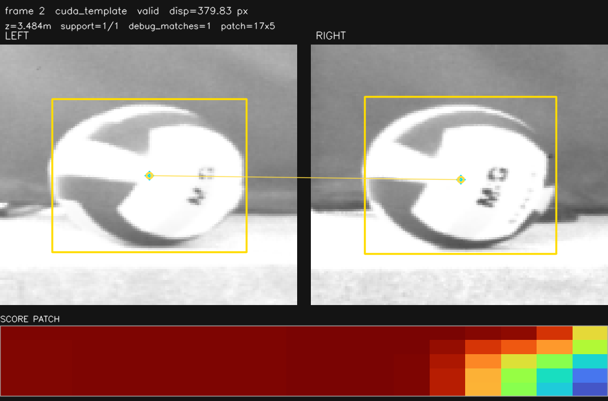 |
| 自研 CUDA Template/NCC valid peak |  |

## 2026-07-05 XFeat sidecar 复测

本轮验证 XFeat 不再作为 inline 主 CSV 候选，而是跑在 P2 diagnostic lane: `neural_feature_matching.enabled=true`、`xfeat_extractor_160_b2.engine`、`roi_size=160`、`top_k=64`、`gpu_postprocess=true`、`p2_realtime_lane_decision_enabled=false`、`p2_diagnostic_stride=1`。

```text
NX perf run: /home/nvidia/test_logs/codex_xfeat_sidecar_20260705_061057/
NX artifact run: /home/nvidia/test_logs/codex_xfeat_sidecar_artifact_20260705_061343/
```

无 artifact 性能 run 主 CSV `3374` 行，时长 `33.705s`，`100.10fps`。主 `Stage2_AsyncRoiWorker avg/p95/max=4.34/5.08/7.47ms`；XFeat diagnostic `3373` 行，`1469` 有效，median/MAD `3.4492/0.0015m`，`algo_ms median/p95/max=3.68/6.12/9.37ms`，`worker p95/max=6.30/9.46ms`，`over_deadline=0`。状态分布: `ok_gpu_b2=1469`、`geometry_reject=1900`、`poor_spatial_quadrants=3`、`not_enough_inliers=1`。

artifact run 只用于看匹配，不能作为 FPS 准入。已确认 `ok_gpu_b2` 和 `geometry_reject` 都输出真实左右 neural keypoint overlay；`p2_diagnostic_artifacts_max` 已修正为严格上限。
point-debug smoke `codex_xfeat_points_debug_20260705_063055` 生成 `11691` 行 `*.points_debug.csv`，可记录 `stage/reject_reason/point z`，但该开关写盘很重，只能用于诊断。

| 样张 | 图 | 说明 |
|---|---|---|
| XFeat sidecar valid | 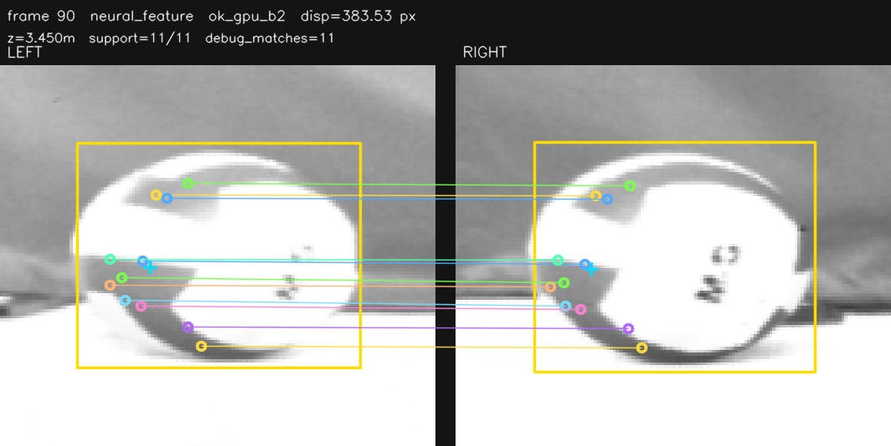 | `frame 90`，`support=11/11`，`disp=383.53px` |
| XFeat sidecar geometry reject | 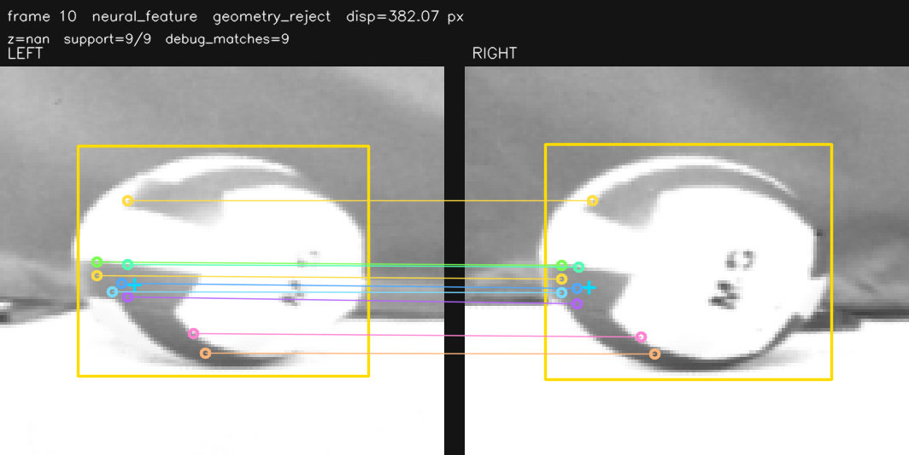 | `frame 10`，保留被 gate 拒绝的点对用于分析 |

结论: XFeat 的模型推理不是主瓶颈；把 XFeat 放入 diagnostic lane 后，D2H/sync 不再阻塞主 `AsyncRoiWorker`，主线可以保持 100fps。但 XFeat 仍不是正式默认深度源，原因是有效率、geometry reject 比例和动态关键点质量还需要验证。

## 2026-07-05 SuperPoint 160/top64 batch=2 复测

本轮实现并验证 SuperPoint fixed extractor 的 batch=2 TensorRT 路径。输入是左右 rectified gray ROI，`superpoint_extractor_160_top64_b2.engine` 一次 enqueue 输出 `keypoints=[2,64,2]`、`descriptors=[2,64,256]`、`scores=[2,64]`；实时后处理使用 `neural_feature_direct_gpu_postprocess.cu` 在 GPU 上做 descriptor mutual-NN、score/margin gate、y/disparity gate，只回传通过几何门的点对。

```text
engine build: /home/nvidia/NX_volleyball/stereo_3d_pipeline/models/neural/superpoint_extractor_160_top64_b2.engine
perf run 1: /home/nvidia/trajectory_dataset/superpoint_b2_noart_20260705_084022/
perf run 2: /home/nvidia/trajectory_dataset/superpoint_b2_stride_20260705_084344/
debug run: /home/nvidia/trajectory_dataset/superpoint_b2_debug_20260705_084510/
wiki assets: wiki/assets/superpoint_b2_20260705/
```

`trtexec` 单独模型为 mean latency `1.780ms`、mean GPU compute `1.743ms`、p95 latency `1.776ms`、p99 latency `2.894ms`、max latency `4.850ms`。在实时管线中它和双路 YOLO 共享 GPU，P2 diagnostic stage 墙钟约 `11.5ms`，因此不适合每帧 realtime 主路径。

| 配置 | FPS | diagnostic 有效/行 | median/MAD | support | algo avg/p95/max | 判断 |
|---|---:|---:|---:|---:|---:|---|
| b2 stride=1, strict outer gate | `98.4` | `110/992` | `3.4810/0.0008m` | `11.0` | `11.48/12.31/19.23ms` | 每帧 sidecar 仍会拖低主 FPS；默认外层 `stddev<=1px` 过严 |
| b2 stride=2, strict outer gate | `98.1` | `194/916` | `3.4050/0.0009m` | `12.0` | `11.52/12.80/18.24ms` | 降频后负载下降有限，仍受 GPU 排队影响 |
| b2 stride=2, `subpixel_max_stddev_px=6.0` | `99.6` | `920/920` | `3.4403/0.0050m` | `13.0` | `11.53/12.83/18.51ms` | 可作为低频训练候选 sidecar；不进入 P0/P1 默认主字段 |

样张来自 P2 diagnostic neural artifact，状态为 `ok_gpu_b2`，不是 legacy CPU debug 图:

| 样张 | 图 | 说明 |
|---|---|---|
| SuperPoint b2 relaxed | 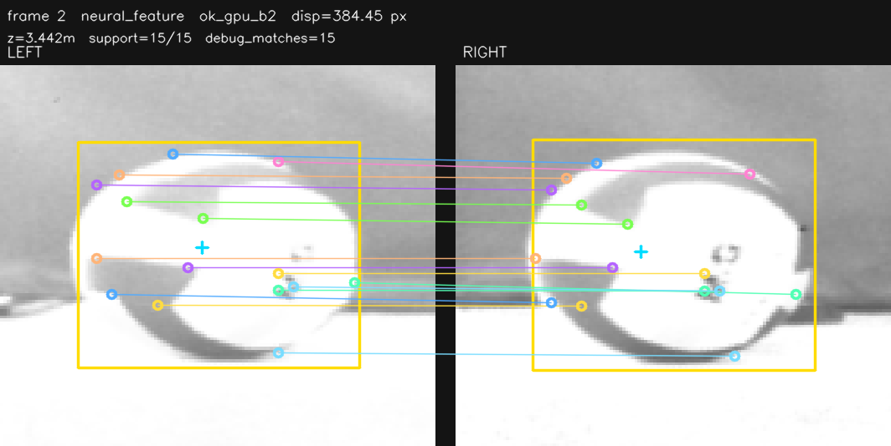 | `support=15/15`, `disp=384.45px`, `z=3.442m` |
| SuperPoint b2 relaxed | 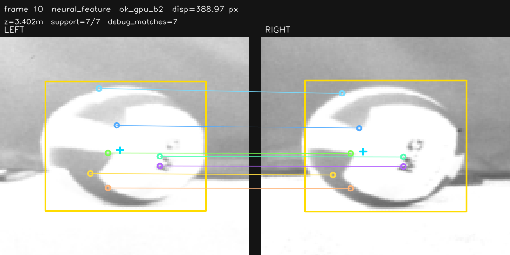 | `support=7/7`, `disp=388.97px`, `z=3.402m` |

结论: SuperPoint 的点对视觉质量比 ORB/GFTT 稳，batch=2 + GPU mutual matching 已真实落地。但在当前 YOLO 并行负载下，每帧运行不能稳定 100fps；推荐只作为 `p2_diagnostic_stride=2` 的训练候选 sidecar，并保留宽松外层 stddev gate，让轨迹可靠性模型学习其偏置和离群概率。

## 2026-07-06 当前轻量神经模型 gate 对照图

本轮重跑当前实际轻量模型，并为每个算法各生成两份 P2 artifact: `current` 保持当前生产 gate，`gate_off` 关闭 neural 自身和最终 sparse 几何复核，用于肉眼检查点对质量。debug run 只用于看图，不作为正式 FPS 准入。

```text
NX temp run: `/home/nvidia/NX_volleyball/stereo_3d_pipeline/test_logs/neural_gate_wiki_images_20260706/`，图片同步后已清理。
wiki assets: `wiki/assets/neural_gate_zoom_20260706_current/`，只保留本节引用的 6 张 P2 artifact。
```

| 算法 | engine | gate | FPS | 有效/帧 | median/MAD | support | algo avg/p95/max | worker avg/p95/max | 判断 |
|---|---|---|---:|---:|---:|---:|---:|---:|---|
| XFeat | `xfeat_extractor_160_b2.engine` | current | `90.0` | `1/336` | `3.4672/0.0000m` | `4.0` | `3.47/6.35/7.96ms` | `3.67/6.63/8.16ms` | 模型能跑，但当前外层 gate 过严 |
| XFeat | same | gate off | `90.0` | `329/329` | `3.4553/0.0051m` | `16.0` | `3.45/6.58/7.47ms` | `3.70/6.91/7.71ms` | 点对充足，需重新设计 gate |
| SuperPoint | `superpoint_extractor_160_top64_b2.engine` | current | `5.2` | `1/26` | `3.4163/0.0000m` | `10.0` | `10.88/12.17/13.70ms` | `11.15/12.43/14.87ms` | 每帧实时超预算，current gate 也过严 |
| SuperPoint | same | gate off | `13.7` | `38/38` | `3.4607/0.0018m` | `33.0` | `11.02/12.28/13.85ms` | `11.27/12.55/14.71ms` | 视觉点对多，但只能低频/训练候选 |
| ALIKED no-DCN 对照 | `aliked_t16_nodcn_extractor_128_top64_b2.engine` | current | `90.2` | `0/336` | `/` | `/` | `8.01/8.88/11.95ms` | `8.29/9.09/13.17ms` | 非官方 DCN 结构，仅保留工程对照 |
| ALIKED no-DCN 对照 | same | gate off | `90.1` | `336/336` | `3.4600/0.0019m` | `30.0` | `8.02/8.91/10.52ms` | `8.30/9.14/11.07ms` | 点对稳定但不是官方模型 |

P2 artifact 是真实 neural 左右点对图；`realtime_zoom/` 只显示 bbox/circle/候选字段状态，不显示内部匹配点。

| 算法 | current gate | gate off |
|---|---|---|
| XFeat | 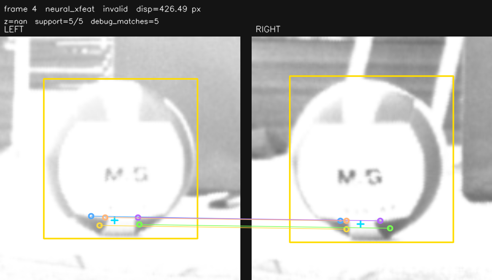 | 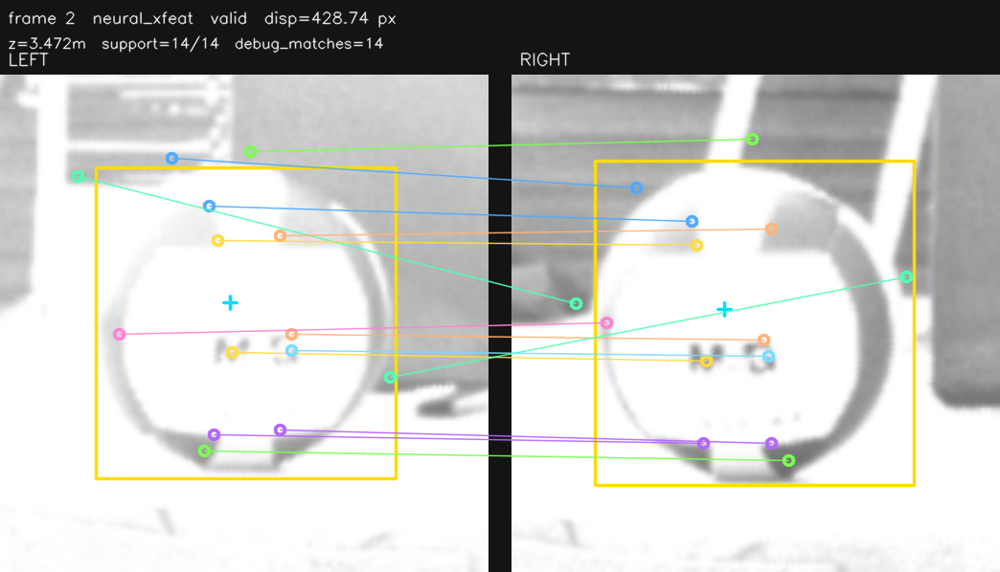 |
| SuperPoint | 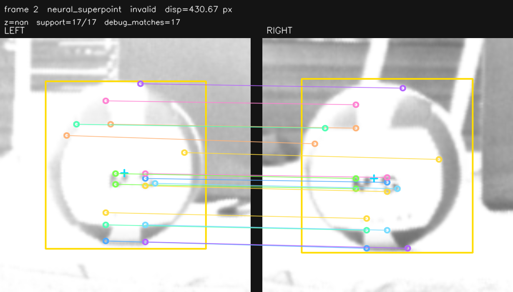 | 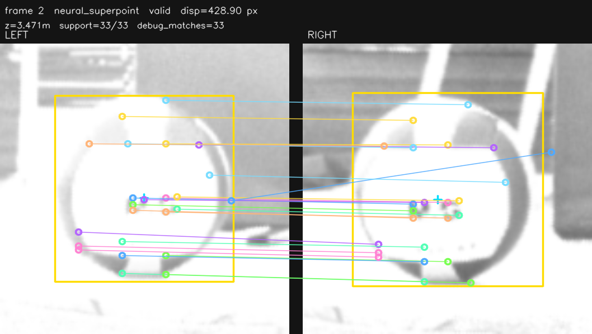 |
| ALIKED | 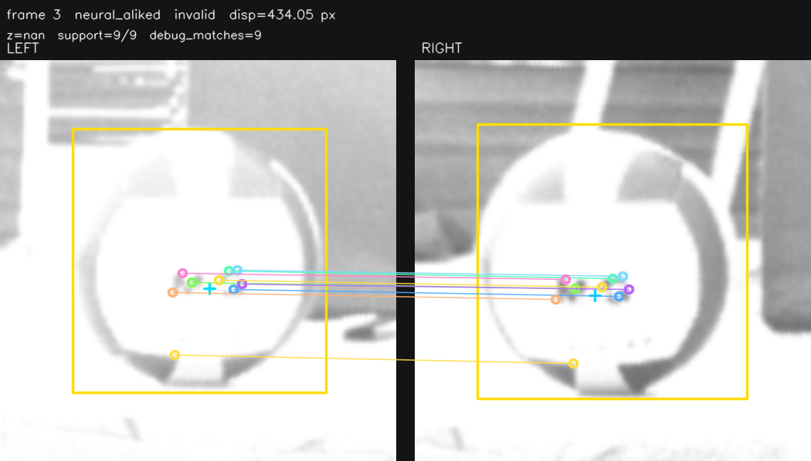 | 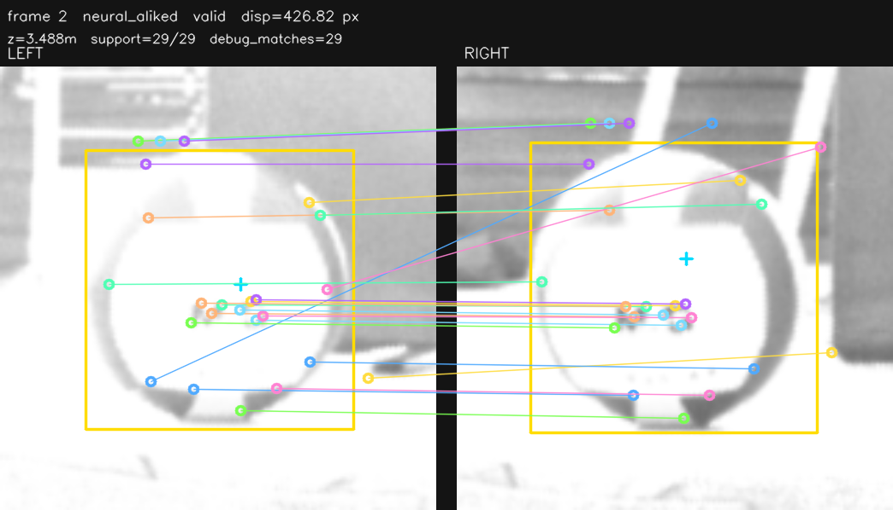 |

2026-07-06 已补官方 ALIKED-DCN engine:

| 模型 | engine | batch/ROI/topK | trtexec latency mean/p95 | GPU compute mean/p95 | 当前状态 |
|---|---|---:|---:|---:|---|
| ALIKED-t16 DCN | `aliked_t16_dcn_extractor_128_top64_b2.engine` | `2 / 128 / 64` | `2.5315 / 2.5574ms` | `2.5074 / 2.5305ms` | TensorRT engine 和 DCNv2 plugin 已构建通过 |

2026-07-06 继续使用官方 ALIKED-DCN 复测。单算法 isolated:

```text
test_logs/neural_aliked_dcn_zoom_20260706_095209/
```

| 模型 | gate | FPS | 有效/帧 | median/MAD | support | algo avg/p95/max | worker avg/p95/max | 判断 |
|---|---|---:|---:|---:|---:|---:|---:|---|
| ALIKED-t16 DCN | current | `89.8` | `0/572` | `/` | `/` | `9.54/9.56/236.25ms` | `9.82/9.78/237.34ms` | current gate 全拒绝 |
| ALIKED-t16 DCN | gate off | `90.3` | `68/572` | `3.4333/0.0370m` | `2.0` | `9.53/9.50/241.34ms` | `9.89/9.82/241.81ms` | 有点但 support 太少，深度离散 |

`NCC + XFeat + ALIKED-DCN` 实际并行:

```text
test_logs/ncc_xfeat_aliked_dcn_20260706_094952/
```

| 指标 | 结果 |
|---|---:|
| `trajectory.frames.csv` | `1438` 帧 |
| frame timestamp FPS | `87.8fps` |
| `Stage2_P2InlineFeatureAlgoCount` | `3` |
| `Stage2_CudaTemplateNccMatch avg/p95/max` | `0.40/0.46/4.57ms` |
| `Stage2_NeuralXFeatMatch avg/p95/max` | `7.90/8.44/9.96ms` |
| `Stage2_NeuralAlikedMatch avg/p95/max` | `10.10/10.29/241.25ms` |
| `Stage2_P2InlineFeatureEndToEnd avg/p95/max` | `10.15/10.33/241.34ms` |
| `Stage2_AsyncRoiOverDeadline` | `40` |

| 字段 | 有效/帧 | median/MAD |
|---|---:|---:|
| `z_roi_cuda_template_match` | `400/1034` | `3.3032/0.0085m` |
| `z_roi_neural_xfeat` | `54/1034` | `3.3320/0.0224m` |
| `z_roi_neural_aliked` | `0/1034` | `/` |

ALIKED no-DCN 与官方 DCN zoom 对比:

| 模型 | zoom | 观察 |
|---|---|---|
| no-DCN gate off |  | `support=29/29`，但含多条跨背景/非同名纹理斜线；不是官方模型 |
| official DCN gate off | 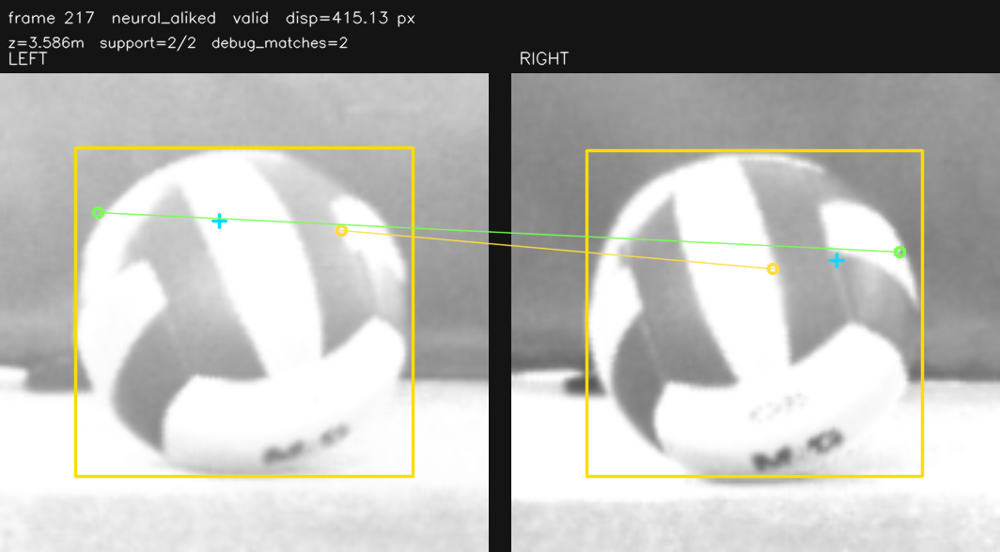 | `support=2/2`，点位大体落在球面相似区域，但点数太少，不能稳定测距 |

后续复查发现上面的 `gate off` 仍保留 neural 内部空间分布门控。2026-07-06 已重跑 true gate-off，额外关闭 `min_spatial_quadrants` 和 `min_spatial_spread_ratio`；完整记录见 [P2 ALIKED-t16 DCN](算法详情/P2-aliked-t16.md)。

| 模型 | true gate-off zoom | 观察 |
|---|---|---|
| official DCN true gate-off | 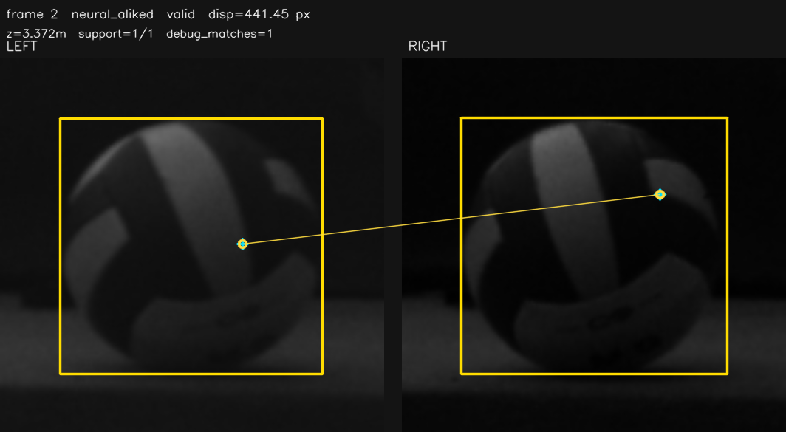 | 有效率升到 `561/573`，但 median support 只有 `1.0`，单点深度 MAD `0.1472m` |
| no-DCN true gate-off | 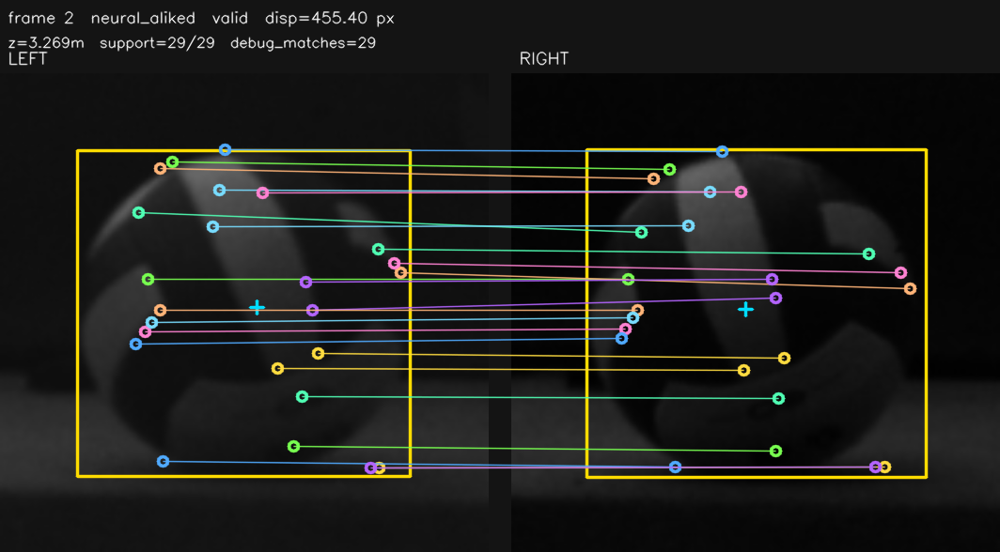 | `590/590` 有效，median support `26.0`，但仍含背景/边界误匹配，只能做工程对照 |

结论: XFeat 仍是当前最现实的轻量神经候选；ALIKED no-DCN 只能作为工程对照，不应写成官方模型效果。官方 ALIKED-DCN 已完成真实 TensorRT/plugin 落地，但在当前 ROI/topK/gate 下不适合进入默认 P1 联合采集: 有效率为 `0/1034`，耗时又接近 90Hz deadline。SuperPoint 视觉点对最好之一，但每帧 `~11ms`，只能低频或训练 sidecar。

## 2026-07-04 复测结论

## 2026-07-04 14:23 当前组合实测

本轮测试当前“去 SGM / 去 VPI / 去 color-color-edge + XFeat TensorRT 主 CSV + OpenCV CUDA GFTT/LK sidecar”的实际组合。

```text
NX perf run: test_logs/codex_current_combo_20260704_142301/
NX artifact run: test_logs/codex_current_combo_artifacts_20260704_142711/
NX A/B run: test_logs/codex_current_combo_ab_20260704_142918/
wiki assets: wiki/assets/p2_current_combo_20260704/
```

无 debug 性能 run 保存 `2508` 行主 CSV、`2508` 行 `.frames.csv` 和 `251` 行 `*.p2_diagnostic.csv`。稳定段 ROI 输出为 `93-95fps`，不是 100fps 准入结果；`Stage2_AsyncRoiWorker avg/p95/max=8.52/9.44/14.52ms`，`Stage2_AsyncRoiOverDeadline=62`。主 CSV 中 `z_roi_neural_feature=52/2508`，median/MAD `3.4287/0.0024m`；sidecar 中 `opencv_cuda_gftt_lk=114/251`，median/MAD `3.4091/0.0004m`，有 `1` 次 diagnostic over-deadline。

A/B 短测结论: `no_xfeat_keep_gftt` 排除启动后回到 `99-100fps`，worker `avg/p95/max=4.51/5.07/10.31ms`，GFTT/LK sidecar `49/147` 有效；`xfeat_no_gftt` 仍只有 `94-98fps`，worker `avg/p95/max=8.51/9.08/13.49ms`。当前瓶颈主要是 XFeat 主路径，不是 GFTT/LK stride=10 sidecar。

artifact run 只用于看匹配，不作为 FPS 准入。代表图:

| 方法 | 图 | 说明 |
|---|---|---|
| XFeat TensorRT | 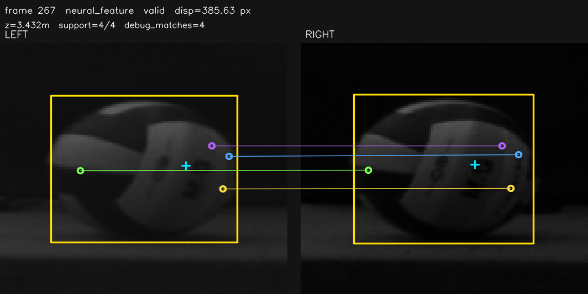 | `frame 267`，`support=4/4`，真实左右 neural keypoint match overlay |
| OpenCV CUDA GFTT/LK | 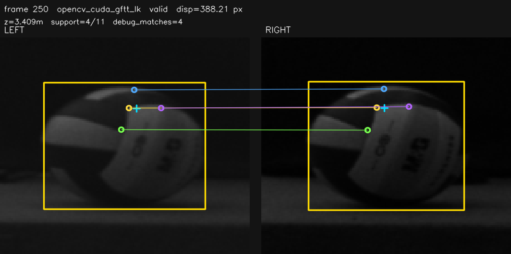 | `frame 250`，`support=4/11`，真实 LK 点对 overlay |

结论: GFTT/LK sidecar 可以保留为低频诊断和训练候选；XFeat 128/top32 虽然能写主 CSV 和 artifact，但当前不满足正式 100fps 录制准入，应关闭、低频化或移到 diagnostic/条件触发后再复测。

## 2026-07-04 10:49 targeted 复核

本轮用于核对 P2 输入路径和最新有效率。日志:

```text
test_logs/codex_p2_verify_20260704_104947/
test_logs/codex_p2_artifact_debug_20260704_105356/
wiki/assets/p2_20260704_final/
```

`codex_p2_verify_20260704_104947` 是无 debug 性能复核；`codex_p2_artifact_debug_20260704_105356`、11:08 final artifact run、13:49 update artifact run 和 13:51 SuperPoint artifact run 只用于算法级 artifact 抽样。样张已复制到 `wiki/assets/p2_20260704_artifacts/`、`wiki/assets/p2_20260704_final/` 和 `wiki/assets/p2_20260704_update/`，详见 [P2算法效果与可视化审查](P2算法效果与可视化审查.md)。

| case | FPS | 有效/帧 | algo avg/p95/max | worker avg/p95/max | 当前判断 |
|---|---:|---:|---:|---:|---|
| `patch_iou_color_edge_wide_search` | `100.1` | `654/654` | `0.85/1.17/4.22ms` | `1.13/1.48/7.06ms` | 历史 isolated 性能好；后续 artifact 显示错配，已退出默认 |
| `iou_region_color_patch_wide_search` | `100.0` | `647/647` | `0.85/1.09/4.10ms` | `1.14/1.39/7.24ms` | 历史 isolated 性能好；后续 artifact 显示错配，已退出默认 |
| OpenCV CUDA Template patch9 | `97.2` | `619/619` | `3.24/4.21/61.01ms` | `3.34/4.40/61.26ms` | 全有效但长尾不准入 |
| OpenCV CUDA StereoSGM patch9 | `99.0` | `139/624` | `2.30/3.54/10.70ms` | `2.38/3.70/10.87ms` | 有效率低且过 deadline |
| CUDA ring/edge profile diagnostic | `100.1` | `0/638` | `0.30/0.60/4.69ms` | `0.10/0.61/1.95ms` | 轻但无有效候选 |
| OpenCV CUDA GFTT/LK diagnostic | `94.0` | `501/572` | `4.05/5.39/86.39ms` | `0.10/0.09/5.08ms` | 有真实点对 artifact，但不准入 |
| VPI Template diagnostic | `100.1` | `601/630` | `1.72/2.56/57.54ms` | `0.07/0.09/3.50ms` | 有 peak artifact，只保留 diagnostic |
| VPI Harris/LK diagnostic | `93.8` | `48/606` | `5.03/7.18/16.43ms` | `0.08/0.09/3.05ms` | 有少量有效帧，不准入 |
| VPI ORB diagnostic | `95.9` | `16/603` | `5.98/9.60/21.71ms` | `0.11/0.62/4.07ms` | 有真实点对 artifact，但有效率低 |
| XFeat TensorRT 128/top32 | `93.2` | `317/579` | `4.14/5.35/11.88ms` | `4.27/5.57/12.81ms` | 有效率改善，但不准入 |
| SuperPoint TensorRT 224/top64 | `62.5` | `0/396` | `8.08/9.31/23.22ms` | `8.25/9.68/25.77ms` | 不准入 |

13:49/13:51 artifact 更新测试只用于补图:

| case | FPS | 有效/帧 | artifact 结果 |
|---|---:|---:|---|
| OpenCV CUDA Template diagnostic | `100.7` | `187/500` diagnostic | 补齐峰值连线 + `SCORE PATCH` |
| VPI Template diagnostic | `100.1` | `302/481` diagnostic | 补齐峰值连线 + `SCORE PATCH` |
| CUDA ring-edge profile diagnostic | `100.6` | `0/849` diagnostic | 补齐最佳候选视差采样点，仍 invalid |
| VPI Harris/LK diagnostic | `97.5` | `0/848` diagnostic | 仍未捕获有效 artifact |
| SuperPoint 160/top64 | `89.0` | `71/950` | 补齐真实 neural keypoint overlay，不准入 |

## 2026-07-04 有球 P2 最终复测

本轮测试条件: NX 实时管线、左右 YOLO 正常看到球、每个 case 单算法 isolated 运行；无球/遮挡数据不计入结论。测试日志:

```text
test_logs/codex_ball_p2_core_20260704_063458/
test_logs/codex_ball_p2_neural_20260704_063923/
test_logs/codex_ball_p2_viable_long_20260704_064200/
test_logs/codex_ball_p2_experimental_diag_20260704_070148/
test_logs/codex_ball_p2_gftt_lk_roi105_20260704_071106/
test_logs/codex_ball_p2_selective_after_exp_20260704_071202/
test_logs/codex_ball_p2_remaining_variants_20260704_072216/
test_logs/codex_ball_p2_base_color_long_20260704_072551/
```

本次全量复测和 debug 图:

```text
test_logs/codex_p2_full_20260704_083048/
test_logs/codex_p2_debug_20260704_083851/
```

本次性能准入只看 `codex_p2_full_20260704_083048`，debug 轮只用于状态图和 legacy CPU feature debug。debug 目录已同步到本地，共 `226` 张 realtime zoom PNG；每个已跑 case 都有 `feature_matches/summary.txt` 和 contact sheet，但该 contact sheet 来自 `--debug-feature-matches` 的旧 CPU sparse/OpenCV 路径，不代表当前 P2 GPU/VPI/TRT 后端内部匹配。diagnostic-only case 不写主 `z_*` 字段，结论以 `<case>.p2_diagnostic.csv` 的 `diag_valid/rows` 为准；realtime zoom 只用于查看画面、检测框和 ROI。

### 08:30 P2 推荐排序总表

当前 P2 不再按 inline/diagnostic 拆两张表维护；所有 P2 已在 [稳定100fps深度方法与训练入口](稳定100fps深度方法与训练入口.md) 的“P2 推荐排序总表”中合并，按推荐顺序列出字段、后端、FPS、有效率、深度统计、结论和 wiki assets 内联状态图。图片类型和证据缺口见 [P2算法效果与可视化审查](P2算法效果与可视化审查.md)。

抽样图已经复制到 `wiki/assets/p2_20260704/`。这些图不是统一的算法级左右特征点对应图；完整性能 CSV、diagnostic CSV、feature debug 和 realtime zoom 仍保留在:

```text
test_logs/codex_p2_full_20260704_083048/
test_logs/codex_p2_debug_20260704_083851/
```

后续分析 diagnostic-only 结果时，优先看 `p2_diagnostic.csv`；realtime zoom 只用于排查画面、检测框和 ROI。现有 feature debug 只能辅助看旧 CPU 特征点分布，不能代表 diagnostic-only GPU/VPI/TRT 算法内部匹配。

### 07:xx 长测参考: 通过或接近通过的 P2

| 方法 | 类型 | 测试 | fps | algo avg/p95/max | worker avg/p95/max | 有效 | median/MAD | 判断 |
|---|---|---|---:|---:|---:|---:|---:|---|
| `patch_iou_color_edge_wide_search` | 自研 CUDA color-edge patch | 20s inline | `100.7` | `1.12/1.46/4.79ms` | `1.41/1.77/5.66ms` | `1861/1861` | `3.3250/0.0000m` | 当前唯一明确满足 100fps + 全有效的 P2 训练候选 |
| `iou_region_color_patch_wide_search` | 自研 CUDA BGR patch | 20s inline | `99.2` | `1.09/1.45/4.72ms` | `1.38/2.04/5.09ms` | `1826/1826` | `3.3250/0.0000m` | 全有效且开销低，但本轮 fps 未稳定到 100；作为 P2 备选长测 |
| `opencv_cuda_stereo_sgm_patch9` | OpenCV CUDA SGM | 20s inline | `98.5` | `2.81/3.65/10.25ms` | `2.89/3.81/10.38ms` | `939/1833` | `3.2924/0.0025m` | 有 51% 有效，但 fps/deadline 不达标，不准入 |
| `patch_iou_color_edge` | 自研 CUDA color-edge patch | 20s inline | `99.9` | `3.46/3.82/12.62ms` | `3.74/4.13/16.00ms` | `1827/1828` | `3.3250/0.0000m` | 全有效但长尾越过 10ms，不如 wide_search |
| `iou_region_color_patch` | 自研 CUDA BGR patch | 20s inline | `99.2` | `3.40/3.75/12.78ms` | `3.67/4.03/13.60ms` | `1817/1818` | `3.3250/0.0000m` | 全有效但长尾越过 10ms，不如 wide_search |

### 07:xx 长测参考: 不合格或后端不可用的 P2

| 方法 | 实测结果 | 主要原因 |
|---|---|---|
| OpenCV CUDA ORB fast48/wide_y | `92.3/91.7fps`，有效率 `2/559`、`134/566` | 真 CUDA ORB 可跑，但每帧运行压低 FPS，排球纹理有效率不足 |
| OpenCV CUDA Template patch9 | `96.0fps`，`0/633` 有效，max `40.42ms` | 有长尾且当前模板/gate 无有效深度 |
| OpenCV CUDA StereoBM patch9 | `95.2fps`，`0/635` 有效 | 调度可跑，但聚合/gate 后无有效深度 |
| CUDA ring/edge profile | diagnostic `100.0fps`，`0/652` 有效 | 自研 kernel 很轻，但本轮 support=0/low confidence，算法无有效匹配 |
| OpenCV CUDA GFTT/LK | 修复连续 ROI 后 `93.6fps`，`0/555` 有效 | 真 CUDA GFTT/LK 可跑，但排球 ROI 跟踪点被几何 gate 全部过滤 |
| CUDA Hough circle | diagnostic `88.0fps`，`6/539` 有效 | 真 CUDA Hough 可跑，但每帧抢 GPU 且有效率过低 |
| OpenCV CUDA Template base/relaxed | `96.7/100.2fps`，有效率 `125/426`、`78/418` | 有部分有效但长尾 `25-34ms`，不满足稳定 100fps |
| OpenCV CUDA SGM base/relaxed | `100.5/99.0fps`，有效率 `0/436`、`161/431` | base 无效；relaxed 有效但比例低且长尾超过 10ms |
| XFeat TensorRT sweep | `93.5-98.1fps`，最好 `44/604` 有效 | extractor 真实 TRT，后处理/匹配有效率不足且未到 100fps |
| SuperPoint TensorRT sweep | `59.2-89.6fps`，最好 `151/402` 有效 | 有效帧不足且超预算；224/top64 匹配多但 FPS 明显不达标 |
| ALIKED TensorRT sweep | historical skipped | 2026-07-04 时缺 vanilla `aliked_extractor_*_top64.engine`；2026-07-06 官方 DCN engine 已单独复测，见上方 ALIKED-t16 DCN 段 |
| VPI Template/Stereo | 历史 diagnostic `0/645`、`0/632` 有效 | 已被 08:30 全量矩阵覆盖；Template 有效但长尾不准入，Stereo 仍无有效 |
| VPI Harris-LK/ORB | 历史 diagnostic 结果来自旧实现 | 已被 08:30 全量矩阵覆盖；Harris/LK 有效率极低，VPI ORB 有一定有效率但 FPS 不准入 |
| CUDA-SIFT / Fixstars libSGM | 历史 diagnostic `0/629-635` 有效 | CUDA-SIFT 仍 unsupported；Fixstars libSGM 已被 08:30 全量矩阵覆盖，当前不准入 |

### Selective 调度验证

`test_logs/codex_ball_p2_selective_after_exp_20260704_071202/`:

- `patch_iou_color_edge_selective_pair_quality`: 强制触发时 `99.6fps`、`645/645` 有效，`algo p95=1.45ms`、`worker p95=1.76ms`。
- `patch_iou_color_edge_selective_no_trigger`: 未触发时 `100.1fps`、`0/652` 候选，`skip=650`，`inline=650;bgr=650`，说明 inline P2 和 BGR snapshot 都被实际跳过。

结论: P2 selective 调度本身可用；当前能进入后续训练候选长测的只有 color/color-edge patch 路线，其中 `patch_iou_color_edge_wide_search` 最稳。其余 P2 不应继续反复测同配置，应转入代码/算法级改造后再测。

## 2026-07-04 历史无遮挡带球测试

早期测试日志:

```text
test_logs/codex_p2_after_diag_20260704_045653/
test_logs/codex_p2_diag_only_rebuilt_20260704_050431/
test_logs/codex_diag_csv_verify2_20260704_051834/
test_logs/codex_diag_csv_final_20260704_052610/
```

### Inline realtime 候选

| 方法 | 实时路径 | fps | algo avg/p95/max | worker avg/p95/max | stale/超时 | 有效深度 | median/MAD | 结论 |
|---|---|---:|---:|---:|---:|---:|---:|---|
| `bbox_pair` | YOLO bbox-center | `100.4` | - | `0.05/0.09/0.67ms` | `0/0` | `241/241` | `3.3468/0.0006m` | P0 正常 |
| `circle_center` | CUDA circle-fit | `100.5` | `0.50/0.80/2.39ms` | `0.57/1.23/2.56ms` | `0/0` | `244/244` | `3.3538/0.0005m` | P0 正常 |
| `roi_subpixel` | CUDA multi-point | `101.9` | `0.00/0.00/0.00ms` | `4.52/4.95/9.02ms` | `0/0` | `256/256` | `3.2838/0.0000m` | P1 可记录, 仍有相对 P0 约 `7cm` 偏置 |
| `iou_region_color_patch_wide_search` | 自研 CUDA BGR patch | `100.7` | `1.07/1.37/6.47ms` | `1.32/1.64/7.30ms` | `2/0` | `241/241` | `3.3250/0.0000m` | 历史 isolated 速度好；artifact 显示错配后退出默认 |
| `patch_iou_color_edge_wide_search` | 自研 CUDA color-edge patch | `99.9` | `1.04/1.51/3.45ms` | `1.30/1.79/3.89ms` | `0/0` | `246/247` | `3.3250/0.0000m` | 历史 isolated 速度好；artifact 显示错配后退出默认 |
| OpenCV CUDA Template | `cv::cuda::TemplateMatching` | `101.7` | `2.69/4.03/41.38ms` | `2.77/4.12/41.54ms` | `3/1` | `0/235` | - | 有长尾且无有效深度 |
| OpenCV CUDA Template patch9 + GPU peak reduce | `cv::cuda::TemplateMatching` + CUDA peak reduce | `98.8` | `3.13/3.91/43.30ms` | `3.19/3.97/43.55ms` | `1/2` | `0/414` | - | 只下载最终 peak 结构, 但仍无有效深度且有长尾 |
| OpenCV CUDA StereoBM | `cv::cuda::StereoBM` | `98.7` | `2.18/2.84/5.78ms` | `2.26/2.90/5.92ms` | `3/0` | `0/231` | - | 速度尚可, 当前 gate/聚合无有效深度 |
| OpenCV CUDA StereoBM patch9 | `cv::cuda::StereoBM` | `85.4` | `1.83/2.73/5.62ms` | `1.91/2.79/5.81ms` | stale | `0/409` | - | patch9 仍无有效深度, 且总 FPS 不准入 |
| OpenCV CUDA StereoSGM | `cv::cuda::StereoSGM` | `100.4` | `2.83/3.69/10.82ms` | `2.91/3.75/12.95ms` | `3/1` | `0/231` | - | 有长尾且无有效深度 |
| OpenCV CUDA StereoSGM patch9 | `cv::cuda::StereoSGM` | `101.1` | `2.19/3.12/12.68ms` | `2.27/3.19/12.90ms` | `1` 超时 | `0/436` | - | 速度尚可但仍无有效深度 |
| OpenCV CUDA ORB fast48 | `cv::cuda::ORB` + CUDA BF | `84.6` | `5.24/7.78/30.69ms` | `5.36/7.88/30.80ms` | `2/7` | `21/198` | `3.2919/0.0000m` | 真 GPU ORB, 仍不满足 100fps/有效率 |
| OpenCV CUDA ORB wide_y | `cv::cuda::ORB` + CUDA BF | `94.5` | `4.62/6.08/38.29ms` | `4.72/6.14/40.07ms` | `6` 超时 | `51/397` | `3.2919/0.0000m` | 有效率提升, 但 FPS/长尾不准入 |
| XFeat 96/top32 | TensorRT + CPU 后处理 | `98.6` | `3.50/4.65/5.95ms` | `3.59/4.76/6.09ms` | `1/0` | `6/229` | `3.3202/0.0319m` | extractor 快, 匹配有效率太低 |
| XFeat 96/top64 | TensorRT + CPU 后处理 | `99.2` | `3.50/4.28/8.53ms` | `3.60/4.47/8.77ms` | `0/0` | `0/248` | - | 无有效深度 |
| XFeat 128/top32 | TensorRT + CPU 后处理 | `94.7` | `4.02/5.39/8.34ms` | `4.15/5.69/8.47ms` | stale | `24/375` | `3.3470/0.0027m` | 变体里有效率最高, 但 FPS 和有效率仍不准入 |
| XFeat 128/top96 | TensorRT + CPU 后处理 | `96.4` | `5.34/6.58/10.77ms` | `5.46/6.76/11.04ms` | `1` 超时 | `2/402` | `3.2936/0.0021m` | top-k 增大没有改善有效率 |
| XFeat 160/top64 | TensorRT + CPU 后处理 | `87.9` | `5.05/6.30/9.29ms` | `5.16/6.48/11.19ms` | `1` 超时 | `6/398` | `3.3006/0.0009m` | ROI 变大后 FPS 更差, 有效率仍低 |
| SuperPoint 128/top64 | TensorRT + CPU 后处理 | `90.4` | `5.59/7.34/20.73ms` | `5.70/7.43/20.90ms` | `0/1` | `12/230` | `3.2991/0.0012m` | 比 224/top128 快, 仍低于 100fps 且有效率低 |
| SuperPoint 160/top64 | TensorRT + CPU 后处理 | `57.9` | `7.31/9.17/21.73ms` | `7.47/9.28/21.97ms` | `37/7` | `0/147` | - | 不可作为 realtime |
| SuperPoint 224/top64 | TensorRT + CPU 后处理 | `74.1` | `7.87/9.19/20.77ms` | `8.01/9.32/22.66ms` | `10/6` | `2/178` | `3.3295/0.0007m` | 不可作为 realtime |
| ALIKED 160/top64 | TensorRT | historical skipped | - | - | - | no engine | - | 2026-07-04 vanilla 导出失败；2026-07-06 官方 ALIKED-t16 DCN 改走 plugin engine |

### Diagnostic-only lane

这些 case 开启 `p2_feature_job_scaffold_enabled=true`、`p2_diagnostic_lane_decision_enabled=true`、`p2_realtime_lane_decision_enabled=false`，并让 diagnostic lane 每帧运行。它验证调度和 GPU 争用，不写 `z_*` CSV 字段。`test_logs/codex_diag_csv_final_20260704_052610/` 已验证 diagnostic 独立 CSV 落盘和矩阵汇总字段: Template diagnostic-only `diag_valid/rows=6/227`、`diag_over_deadline=1`、`rate=0.026`；该长尾也再次说明 diagnostic 每帧运行不能作为默认路径。

| 方法 | diagnostic profiler | fps | algo avg/p95/max | main worker avg/p95/max | valid/invalid profiler | 结论 |
|---|---|---:|---:|---:|---:|---|
| ORB diagnostic-only | `Stage2_P2FeatureJobDiagnosticOpenCVCudaORB` | `53.4` | `5.56/7.32/28.74ms` | `0.07/0.09/2.42ms` | `23/78` | 主 Stage2 不阻塞, 但每帧 diagnostic ORB 抢 GPU 后整体 FPS 下降 |
| Template diagnostic-only | `Stage2_P2FeatureJobDiagnosticCudaTemplate` | `54.6` | `4.02/5.75/45.86ms` | `0.09/0.09/2.08ms` | `1/100` | 可独立运行, 长尾明显 |
| StereoBM diagnostic-only | `Stage2_P2FeatureJobDiagnosticCudaStereoBM` | `62.5` | `2.28/3.62/6.17ms` | `0.06/0.06/1.10ms` | `0/121` | 调度可行, 当前无有效匹配 |
| StereoSGM diagnostic-only | `Stage2_P2FeatureJobDiagnosticCudaStereoSGM` | `72.4` | `2.81/3.60/14.07ms` | `0.04/0.07/0.64ms` | `37/95` | 调度可行, 每帧运行仍会压低总体 FPS |

结论: diagnostic lane 的内存生命周期和独立 worker 已跑通，但 P2 不能“每帧低优先级随便跑”。只要和 YOLO 共用 GPU，每帧 diagnostic ORB/Template/BM/SGM 都会明显影响总体 FPS。后续应按 stride 或 P0/P1 异常触发运行，并只把准入后的轻量 P2 迁回 realtime candidate CSV。

## 2026-07-03 隔离总表

| 方法 | 实时路径 | fps | worker avg/max | 10ms 超时 | 有效深度 | median/MAD | 结论 |
|---|---|---:|---:|---:|---:|---:|---|
| `bbox_pair` | YOLO bbox-center | `100.1` | `0.11/3.21ms` | `0` | `610/610` | `3.6216/0.0009m` | 100fps 基线 |
| `circle_center` | CUDA circle-fit | `99.5` | `0.58/4.36ms` | `0` | `608/608` | `3.5970/0.0010m` | 生产可用 |
| `roi_edge_centroid` | CUDA edge centroid | `100.1` | `0.67/5.25ms` | `0` | `609/609` | `3.5780/0.0010m` | 生产可用 |
| `roi_radial_center` | CUDA radial center | `99.3` | `0.65/5.29ms` | `0` | `605/605` | `3.5956/0.0009m` | 生产可用 |
| `roi_edge_pair_center` | CUDA edge-pair center | `97.8` | `0.56/4.86ms` | `0` | `620/620` | `3.6059/0.0000m` | 生产可用 |
| `roi_center_patch` | CUDA ZNCC center patch | `100.4` | `0.69/5.12ms` | `0` | `609/609` | `3.5196/0.0000m` | 快且稳定, 但与几何有系统深度差 |
| `roi_subpixel` / `multi_point` | CUDA multi-point patch | `100.0` | `4.47/18.86ms` | `2` | `628/628` | `3.5196/0.0000m` | 平均满足 10ms, 有少量尾延迟 |
| OpenCV CUDA ORB | `cv::cuda::ORB` + CUDA matcher | `75.5` | `11.02/50.50ms` | `152` | `27/399` | `3.5214/0.0026m` | 真 GPU 算法, 但当前不满足 100fps/有效率 |
| BRISK | OpenCV CPU | `0.2` | `24.78/41.81ms` | `252` | `0/2` | - | CPU 调试项；不再作为实时/P2 路线 |
| AKAZE | OpenCV CPU | `91.9` | `8.48/17.98ms` | `55` | `0/536` | - | CPU 调试项；不再作为实时/P2 路线 |
| SIFT | OpenCV CPU | `0.2` | `21.59/55.30ms` | `289` | `0/2` | - | CPU 调试项；CUDA-SIFT 本轮不做 |
| `iou_region_color_patch` | CUDA BGR color patch | `100.1` | `0.74/4.53ms` | `0` | `0/623` | - | 开销合格, 当前 gate 后无有效深度 |
| `patch_iou_color_edge` | CUDA BGR edge/color patch | `98.9` | `2.07/5.97ms` | `0` | `0/630` | - | 开销合格, 当前 gate 后无有效深度 |
| XFeat 128/top64 | TensorRT extractor + CPU 后处理 | `90.3` | `4.41/9.69ms` | `0` | `20/583` | `3.5178/0.0009m` | 真 TensorRT 路径可跑, 有效率不足 |
| ALIKED | direct extractor schema 已接线 | historical skipped | skipped | skipped | no engine | - | 2026-07-03 缺 engine；2026-07-06 官方 DCN engine 已落地但不准入 |
| SuperPoint 224/top128 | TensorRT extractor + CPU 后处理 | `8.6` | `14.60/31.65ms` | `332` | `5/114` | `3.4992/0.0013m` | 历史参数超预算；已转 P2 ROI/top-k sweep |

## P2 case 索引

当前 P2 状态、推荐顺序和图片只在 [稳定100fps深度方法与训练入口](稳定100fps深度方法与训练入口.md) 的“P2 推荐排序总表”维护。本页不再重复维护第二张 P2 状态表，避免旧结论覆盖新结论。脚本 case 名、profiler stage 和临时 YAML 生成逻辑以 `scripts/nx_algorithm_matrix_test.py` 为准。

`有效深度` 是对应 case 的目标候选字段大于 0 的帧数，例如 `z_roi_neural_feature` 或 `z_roi_orb_points`。`target_rows` 另见每个目录的 `summary.csv`，用于区分目标 CSV 行数和按帧统计的候选有效率。

## Relaxed 失败诊断

| 方法 | fps | worker avg/max | 10ms 超时 | 有效深度 | median/MAD | 诊断结论 |
|---|---:|---:|---:|---:|---:|---|
| OpenCV CUDA ORB relaxed | `77.3` | `10.96/44.99ms` | `168` | `249/389` | `3.5289/0.0015m` | 放宽 gate 能提高有效率, 但仍超预算且尾延迟大 |
| `iou_region_color_patch` relaxed | `98.9` | `0.75/4.62ms` | `0` | `0/617` | - | 不是单纯 gate 太紧 |
| `patch_iou_color_edge` relaxed | `100.5` | `2.27/10.81ms` | `1` | `0/631` | - | 不是单纯 gate 太紧 |
| XFeat relaxed | `92.9` | `4.70/10.63ms` | `1` | `0/575` | - | 当前 C++ 后处理/匹配结果不可作为深度源 |
| SuperPoint relaxed | `26.7` | `13.86/39.22ms` | `282` | `0/146` | - | 同时存在耗时和匹配质量问题 |

## 历史非隔离总表

注意: `test_logs/nx_algorithm_matrix_20260703_0915/` 来自旧脚本，默认几何候选没有全部关闭；它是“生产配置 + 额外候选”的历史数据，不是当前结论来源。

| 方法 | 实时路径 | fps | worker avg | 10ms 超时 | 有效深度 | 结论 |
|---|---|---:|---:|---:|---:|---|
| 默认几何候选 | CUDA geometry batch | `100.8` | `0.84ms` | `0` | `548/568` | 生产主路径 |
| `roi_center_patch` | CUDA ZNCC | `100.0` | `1.00ms` | `0` | `0/630` | 能跑, 当前 gate 下无有效深度 |
| `roi_subpixel` / `multi_point` | CUDA + CPU gate | `99.3` | `4.79ms` | `0` | `643/644` | 满足预算, 深度偏置需单独评估 |
| `corner_points` | CUDA sparse-lite | `100.1` | `4.74ms` | `0` | `231/625` | 可 A/B, 不是 OpenCV 描述子算法 |
| `texture_points` | CUDA sparse-lite | `100.0` | `6.85ms` | `1` | `38/642` | 有效率低 |
| `binary_points` | CUDA sparse-lite | `99.6` | `3.19ms` | `0` | `33/633` | 有效率低 |
| `all_sparse_gpu` | CUDA sparse-lite 全开 | `100.1` | `8.24ms` | `11` | corner `37/644`, texture `66/644`, binary `5/644` | 旧脚本混跑项；新矩阵不再默认运行 |
| OpenCV CUDA ORB | `cv::cuda::ORB` + CUDA matcher | `78.2` | `12.57ms` | `396` | `0/423` | 真 GPU 算法, 但当前场景失败且超预算 |
| BRISK | OpenCV CPU | `0.2` | `25.87ms` | `247` | `0/2` | CPU debug；不再作为实时/P2 路线 |
| AKAZE | OpenCV CPU | `89.9` | `9.00ms` | `69` | `0/518` | CPU debug；不再作为实时/P2 路线 |
| SIFT | OpenCV CPU | `0.2` | `21.92ms` | `294` | `0/2` | CPU debug；CUDA-SIFT 本轮不做 |
| `iou_region_color_patch` | CUDA BGR color patch | `99.2` | `1.00ms` | `0` | `0/640` | 实时开销合格, 连续场景 gate 不通过 |
| `patch_iou_color_edge` | CUDA BGR edge/color patch | `99.8` | `1.05ms` | `0` | `0/652` | 实时开销合格, 连续场景 gate 不通过 |
| XFeat 128/top64 | TensorRT extractor + CPU 后处理 | `93.0` | `5.63ms` | `4` | `49/479` | 真 TensorRT 路径可跑, 默认启用仍不足 |
| ALIKED | direct extractor schema 已接线 | historical skipped | skipped | skipped | no engine | vanilla trtexec 不可落地；官方 DCN plugin 路线已另测 |
| SuperPoint 224/top128 | TensorRT extractor + CPU 后处理 | `9.3` | `12.75ms` | `228` | `5/98` | 历史参数超预算；已转 P2 ROI/top-k sweep |

`有效深度` 统计来自对应 realtime CSV 中目标深度字段大于 0 的行数。它衡量“通过当前在线 gate 并写出候选”的比例，不等于关键点检测点数。旧矩阵存在默认几何候选混入，因此解释时必须看对应 `z_*` 字段有效率，不能看整体 `z_stereo`。

## 关键数据

默认几何字段:

| 字段 | valid | median | MAD |
|---|---:|---:|---:|
| `z_bbox_center` | `610/610` | `3.6216m` | `0.0009m` |
| `z_circle_center` | `608/608` | `3.5970m` | `0.0010m` |
| `z_roi_edge_centroid` | `609/609` | `3.5780m` | `0.0010m` |
| `z_roi_radial_center` | `605/605` | `3.5956m` | `0.0009m` |
| `z_roi_edge_pair_center` | `620/620` | `3.6059m` | `0.0000m` |

其他候选:

| 字段 | valid | median | MAD | support 中位数 |
|---|---:|---:|---:|---:|
| `z_roi_center_patch` | `609/609` | `3.5196m` | `0.0000m` | `0` |
| `z_roi_multi_point` | `628/628` | `3.5196m` | `0.0000m` | `9` |
| `z_roi_orb_points` | `27/399` | `3.5214m` | `0.0026m` | `5` |
| `z_roi_orb_points` relaxed | `249/389` | `3.5289m` | `0.0015m` | `12` |
| `z_roi_iou_region_color_patch` | `0/623` | - | - | - |
| `z_roi_patch_iou_color_edge` | `0/630` | - | - | - |
| `z_roi_neural_feature` XFeat | `20/583` | `3.5178m` | `0.0009m` | `20.5` |
| `z_roi_neural_feature` SuperPoint | `5/114` | `3.4992m` | `0.0013m` | `21` |

## 调度结果

2026-07-03 修复后，异步 ROI completed 结果不再依赖原 ring slot 仍持有同一帧:

- `neural_xfeat` clean rerun: `Stage2_AsyncRoiAccepted=581`，`Stage2_AsyncRoiAcceptedReusedSlot=581`，`Stage2_AsyncRoiFrameCallbackSkippedReusedSlot=581`。
- 旧版同类测试只有 2 行 CSV，原因是完成结果被 `DropReusedSlot` 丢弃。
- 新日志中没有 `DropReusedSlot` / `already reused`。
- 原 slot 已复用时只发布 `result_callback_`，跳过图像 `frame_callback_`，对应 `Stage2_AsyncRoiAcceptedReusedSlot` 和 `Stage2_AsyncRoiFrameCallbackSkippedReusedSlot`。

这说明“下一帧 YOLO ready 前完成则接收”的边界已经实现；图像录制仍受 frame callback 覆盖率限制。

2026-07-03 正式管线短跑复核:

```bash
. /opt/ros/humble/setup.bash
cd /home/nvidia/NX_volleyball/stereo_3d_pipeline
timeout 6 ./build/stereo_pipeline --config config/pipeline_dual_yolo_roi.yaml
```

结果:

- 运行结束保存 `405` 个结果回调帧，`dual_yolo_observation_data.frames.csv`
  为 `406` 行含表头，目标级 CSV 为 `466` 行含表头。
- 暖机后 ROI FPS 为 `96.9-100.2`；`Stage2_AsyncRoiWorker` 平均
  `0.83ms`、最大 `4.77ms`，没有超过 10ms。
- `Stage2_DropStaleROI=3`，`Stage2_AsyncRoiAccepted=403`，
  `Stage2_AsyncRoiAcceptedReusedSlot=77`。reused slot 只代表图像
  `frame_callback_` 已不可用，轨迹 `result_callback_` 仍被记录。
- `drainCompletedAsyncRoiStage2()` 会再次按 `async_roi_expire_before_frame_`
  过滤 ready 队列，覆盖结果入队后、main drain 前 deadline 更新的竞态。
- frame summary 中 `pair_score_mean` 记录真实 pair 成本分，可以为负值；非直接
  pair 才使用无效值。

## 当前建议

- 默认 100fps 采集配置不再提升 color/SGM/VPI/GFTT-LK；当前保留 P0、P1 主 CSV 和 P1 sidecar 三算法 NCC/XFeat/SuperPoint。XFeat/SuperPoint 只作为 sidecar 训练候选，不进入在线主深度。
- `corner/texture/binary` sparse-lite 可用于诊断，不应写成 OpenCV ORB/BRISK/AKAZE/SIFT 的真实 GPU 实现。
- OpenCV CUDA ORB、颜色 patch 和 ALIKED 仍在 P2 待测/待加速清单；XFeat、SuperPoint 已提升为 P1 sidecar 候选，但仍需要继续优化有效率和偏置。
- BRISK/AKAZE/SIFT 的当前项目实现仍是 CPU OpenCV；当前不再作为实时/P2 路线，不用 CPU 结果替代实时 GPU 结论。
- 神经特征优先做 ROI/top-k 缩小、GPU 后处理/fused matcher 和固定 schema engine；Python/Torch probe 不计入实时矩阵。
