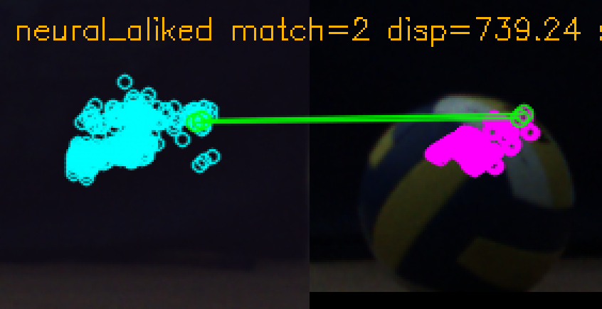

# 特征匹配实现

最后核对: 2026-07-03

本页说明当前 ROI 特征点和深度候选实现位置、实时可用性和验证门限。不要把“离线能跑”和“100fps 实时默认启用”混为一谈。

## 实时 GPU 候选

主要文件:

- `src/stereo/dual_yolo_depth_gpu.h`
- `src/stereo/dual_yolo_depth_gpu.cpp`
- `src/stereo/dual_yolo_depth_gpu.cu`

入口类:

```cpp
stereo3d::DualYoloDepthGpuMatcher
```

输入:

- 校正灰度左右 CUDA 指针。
- 可选校正 BGR 左右 CUDA 指针。
- 左右 YOLO bbox pair。
- 相机焦距、基线、主点和深度范围。

输出:

```cpp
std::vector<DualYoloGpuCandidate>
```

当前候选:

| 候选 | 字段 |
|---|---|
| 几何/圆 | `left_circle`, `right_circle`, edge/radial/edge-pair point |
| 中心 patch | `center_patch` |
| 多点 patch | `multi_point` |
| sparse-lite | `corner_points`, `texture_points`, `binary_points` |
| 历史描述子近似 | `orb_points`, `brisk_points`, `akaze_points`, `sift_points` lite kernel 仍存在，但当前 pipeline 不再把它们当真实算法启用 |
| 彩色区域 | `iou_region_color_patch`, `patch_iou_color_edge` |

配置开关在 `detector.dual_yolo.depth_modes`。

## 当前效果矩阵

数据来源:

- `test_logs/nx_true_gpu_features_20260702/report.md`
- `test_logs/nx_xfeat_trt_pipeline_fast_20260702/`
- `test_logs/nx_keypoint_gpu_20260702/`
- `test_logs/offline_keypoint_probe_recommended/summary.csv`
- `test_logs/volleyball_raw_pair_latest/offline_feature_eval_wiki_20260703/summary.csv`
- `test_logs/volleyball_raw_pair_latest/neural_feature_eval_wiki_20260703_venv/summary.csv`
- `test_logs/volleyball_raw_pair_latest/neural_feature_eval_wiki_20260703_venv_relaxed/summary.csv`

| 方法 | 当前执行路径 | NX 实时效果 | 匹配/深度效果 | 结论 |
|---|---|---:|---:|---|
| 默认几何候选 | CUDA kernel | 约 100fps | `z_stereo=666/666`, 深度 MAD 约 `1.5mm` | 生产主路径 |
| `roi_center_patch` | CUDA ZNCC | 约 100fps | 有效, 抖动高于默认几何 | 可 A/B, 不建议主用 |
| `roi_subpixel` / `multi_point` | CUDA + 同步后处理 | 约 81fps | `535/535` 有效 | 不能作为 100fps 默认项 |
| `corner_points` | CUDA sparse-lite | 约 100fps | 在线 `0/665` 有效 | 当前 gate 下无有效深度 |
| `texture_points` | CUDA sparse-lite | 约 100fps | 在线 `0/664` 有效 | 当前 gate 下无有效深度 |
| `binary_points` | CUDA sparse-lite | 约 100fps | 在线 `0/665` 有效 | 当前 gate 下无有效深度 |
| OpenCV CUDA ORB | true OpenCV CUDA | 78-79fps | `0/512` 有效, avg `3.24ms` | 真算法已接入, 但当前场景失败且慢 |
| BRISK | CPU debug / 历史 lite | 无 true CUDA 后端 | 历史 lite 在线 0 有效 | 不能写成真实 GPU 实时方法 |
| AKAZE | CPU debug / 历史 lite | 无 true CUDA 后端 | 历史 lite 在线 0 有效 | 不能写成真实 GPU 实时方法 |
| SIFT | CPU/离线 / 历史 lite | 无 true CUDA 后端 | 历史 lite 在线 0 有效 | 不能写成真实 GPU 实时方法 |
| 彩色 IoU/edge patch | CUDA BGR 快速近似 | 约 100fps | 当前在线 0 有效 | 已接入, 需继续和离线 LAB 语义对拍 |
| XFeat 224/top128 | TensorRT extractor + CPU 后处理 | 约 75fps | `496/496` 有效, MAD `2.3mm` | 质量最好, 同步不能 100fps |
| XFeat 160/top64 | TensorRT extractor + CPU 后处理 | 约 86fps | `568/602` 有效, MAD `3.8mm` | 质量稳定, 同步不能 100fps |
| XFeat 128/top64 | TensorRT extractor + CPU 后处理 | 89-90fps | `582/582` 有效, MAD `4.2mm` | 当前最快真实神经特征版本 |
| ALIKED | Python probe；C++ 支持 TensorRT direct extractor schema | 未 NX 验证 | 离线可匹配 | 需要真实 engine 导出和 schema 对拍 |
| SuperPoint+LightGlue | Python probe；fused 入口、direct extractor fallback、固定 schema split matcher 入口均有 | 未 NX 验证 | 离线可匹配 | 需真实 TensorRT engine 闭环，fused 仍优先 |

## 实时输入和内存需求

不同方法不能只按“算法名字”归类；实时开销主要由输入格式、计算后端和是否需要 CPU 可读图像决定。

| 方法/类别 | 图像输入 | 主要计算后端 | CPU 图像需求 | 关键限制 |
|---|---|---|---|---|
| 默认几何、edge/radial/edge-pair | gray GPU | CUDA | 无 | 100fps 主路径 |
| `roi_center_patch`, `roi_subpixel`, `multi_point` | gray GPU | CUDA + 少量 CPU gate | 无 | `roi_subpixel/multi_point` 同步实测不守 100fps |
| `corner/texture/binary` sparse-lite | gray GPU | 自研 CUDA sparse-lite | 无 | 不是 OpenCV 描述子算法，当前 gate 下 0 valid |
| 彩色 IoU/edge patch | BGR GPU | CUDA | 无 | 需要 BGR 管线和 async BGR snapshot |
| OpenCV CUDA ORB | gray GPU | `cv::cuda::ORB` + CUDA matcher | 仅 CPU fallback 时需要 | 真 GPU ORB，但当前场景 0 valid 且同步慢 |
| OpenCV BRISK/AKAZE/SIFT | gray pinned host | CPU OpenCV | 必需 | 当前 NX 无 true CUDA 后端，默认关闭 |
| XFeat extractor-only | gray 或 BGR GPU ROI | TensorRT extractor | 不需要 CPU 图像；输出回 CPU | 后处理仍 CPU，不是完整 GPU 常驻匹配 |
| ALIKED/SuperPoint direct extractor | gray 或 BGR GPU ROI | TensorRT extractor | 不需要 CPU 图像；输出回 CPU | 需要真实 engine 输出 `keypoints/descriptors/scores` |
| TensorRT split matcher | gray 或 BGR GPU ROI | TensorRT extractor + TensorRT matcher | 不需要 CPU 图像；中间特征 D2H/H2D，最终 gate 在 CPU | 仅 `use_lightglue=true` 时启用；matcher 只支持固定 keypoint/descriptor 输入和 `matches`/`matches0` 输出 schema |
| SuperPoint+LightGlue fused | gray 或 BGR GPU ROI | TensorRT fused matcher | 不需要 CPU 图像；输出回 CPU gate | 需要 fused engine 输出 `[N,4]` 或 `[N,5]` |
| fallback template/feature | gray pinned host | CPU fallback | 必需 | 仅漏检/回退场景使用，不应作为 100fps 默认重路径 |

在 `performance.async_roi_stage2=true` 时，async worker 只为实际可能用到的输入分配快照: GPU-only 方法只复制 gray/BGR GPU；CPU OpenCV 或 CPU fallback 开启时才分配 `left/right_gray_host` pinned host buffer。

## 本地 raw pair 单帧可视化

测试输入:

- 左图: `test_logs/volleyball_raw_pair_latest/left/0000.png`
- 右图: `test_logs/volleyball_raw_pair_latest/right/0000.png`
- 标定: `NX_volleyball/calibration/stereo_calib.yaml`
- 初始 ROI 中心视差: `750.20px`, 初始深度: `1.9845m`
- 输出资产: `wiki/assets/feature_matching/volleyball_raw_pair_latest_20260703/`

本轮本地离线测试只覆盖当前脚本已实现的后端: OpenCV `ORB/BRISK/AKAZE/SIFT`, `iou_region_color_patch`, `patch_iou_zncc_corner`, `patch_iou_zncc_edge`, `patch_iou_color_edge`, 以及神经 `xfeat/aliked/superpoint_lightglue`。DISK 和 VPI ORB 目前只是模型候选或平台候选, 没有本地 probe 后端和实时后端, 因此本轮没有 `matches_zoom`。

传统/IoU/patch 测试命令:

```bash
python3 NX_volleyball/stereo_3d_pipeline/tools/offline_volleyball_keypoint_probe.py \
  --left NX_volleyball/stereo_3d_pipeline/test_logs/volleyball_raw_pair_latest/left/0000.png \
  --right NX_volleyball/stereo_3d_pipeline/test_logs/volleyball_raw_pair_latest/right/0000.png \
  --calib NX_volleyball/calibration/stereo_calib.yaml \
  --out NX_volleyball/stereo_3d_pipeline/test_logs/volleyball_raw_pair_latest/offline_feature_eval_wiki_20260703
```

神经特征测试命令:

```bash
.venv-stereo-neural/bin/python NX_volleyball/stereo_3d_pipeline/tools/neural_feature_probe.py \
  --left NX_volleyball/stereo_3d_pipeline/test_logs/volleyball_raw_pair_latest/left/0000.png \
  --right NX_volleyball/stereo_3d_pipeline/test_logs/volleyball_raw_pair_latest/right/0000.png \
  --calib NX_volleyball/calibration/stereo_calib.yaml \
  --out NX_volleyball/stereo_3d_pipeline/test_logs/volleyball_raw_pair_latest/neural_feature_eval_wiki_20260703_venv \
  --backends xfeat,aliked,superpoint_lightglue \
  --device cpu \
  --xfeat-repo /home/rick/.local/share/stereo_3d_pipeline/neural_repos/accelerated_features
```

传统/IoU/patch 汇总图:


| 方法 | 本地单帧结果 | matches_zoom |
|---|---|---|
| ORB | 左图 `0` 点, 右图 `49` 点, `0` match, fail |  |
| BRISK | 左图 `0` 点, 右图 `20` 点, `0` match, fail |  |
| AKAZE | 左图 `0` 点, 右图 `20` 点, `0` match, fail |  |
| SIFT | 左图 `0` 点, 右图 `4` 点, `0` match, fail |  |
| `iou_region_color_patch` | `5` match, 深度 `2.0005m`, 严格 fail: `valid_points<8;sphere_residual` |  |
| `patch_iou_zncc_corner` | `7` match, 深度 `1.9313m`, 严格 fail: `valid_points<8;y_error;sphere_residual` |  |
| `patch_iou_zncc_edge` | `0` point, `0` match, fail |  |
| `patch_iou_color_edge` | `23` match, 深度 `1.9836m`, 严格 fail: `valid_points<8;y_error;disparity_mad;disparity_range;sphere_residual` |  |

神经特征默认汇总图:


| 方法 | 本地单帧结果 | matches_zoom |
|---|---|---|
| `neural_xfeat` | `28/54` 点, `6` candidates, `0` match, fail |  |
| `neural_aliked` | `84/123` 点, `1` candidate, `0` match, fail |  |
| `neural_superpoint_lightglue` | `18/128` 点, `2` candidates, `0` match, fail |  |

放宽诊断命令把 `top-k` 提到 `512`，并给 ALIKED 打开 LightGlue:

```bash
.venv-stereo-neural/bin/python NX_volleyball/stereo_3d_pipeline/tools/neural_feature_probe.py \
  --left NX_volleyball/stereo_3d_pipeline/test_logs/volleyball_raw_pair_latest/left/0000.png \
  --right NX_volleyball/stereo_3d_pipeline/test_logs/volleyball_raw_pair_latest/right/0000.png \
  --calib NX_volleyball/calibration/stereo_calib.yaml \
  --out NX_volleyball/stereo_3d_pipeline/test_logs/volleyball_raw_pair_latest/neural_feature_eval_wiki_20260703_venv_relaxed \
  --backends xfeat,aliked,superpoint_lightglue \
  --device cpu \
  --xfeat-repo /home/rick/.local/share/stereo_3d_pipeline/neural_repos/accelerated_features \
  --top-k 512 \
  --ratio 1.0 \
  --max-y-error-px 4.0 \
  --max-disp-delta-px 80.0 \
  --aliked-lightglue
```

放宽后只有 `neural_aliked` 得到 `2` 条匹配, 深度 `2.0139m`, 仍严格 fail: `valid_points<8;sphere_residual`。



本地单帧结论:

- OpenCV ORB/BRISK/AKAZE/SIFT 在这张排球图上没有可用左右匹配。
- `patch_iou_color_edge` 点数最多且深度接近初始 ROI 中心深度, 但视差离散和离群点明显, 需要更强 gate。
- `iou_region_color_patch` 点少但 y 误差和视差范围更稳, 可作为低点数诊断候选。
- 当前 Python 神经 probe 在这张图上没有稳定通过严格 gate；不能用这张单帧证明 XFeat/ALIKED/SuperPoint 可直接进入实时深度源。

## NX GPU 实时流水线

当前实时路径在 `src/pipeline/pipeline.cpp` 中由 `stage2_roi_match_fuse()` 和 `matchDualYoloDetections()` 驱动:

```text
100Hz 同步帧
  -> VPI/CUDA 校正, FrameSlot 缓存 rectGray/rectBGR CUDA 指针
  -> 左右 YOLO TensorRT detect stream
  -> Stage2 等待 detect event 并 collect 检测
  -> IoU + 极线/尺寸 gate 配对左右 bbox
  -> DualYoloDepthGpuMatcher 一次 CUDA batch 生成几何/patch/sparse-lite/颜色候选
  -> 可选 true OpenCV CUDA ORB 或 TensorRT XFeat
  -> CPU 端 gate/择优/记录 CSV
```

关键 profile:

| profile | 含义 |
|---|---|
| `Stage2_DualYoloGpuCandidates` | `dual_yolo_depth_gpu.cu` 批量候选耗时 |
| `Stage2_OpenCVCudaORB` | true OpenCV CUDA ORB ROI 提取和匹配耗时 |
| `Stage2_NeuralFeatureMatch` | TensorRT 神经特征 ROI 推理和当前 CPU 后处理耗时 |
| `Stage2_CPUFeatureSparse*` | CPU sparse corner/texture/binary fallback 耗时 |
| `Stage2_CPUFeatureOpenCV*` | CPU OpenCV ORB/BRISK/AKAZE/SIFT 耗时 |
| `Stage2_CPUFallbackSearch` | 单侧漏检 fallback 搜索总耗时 |
| `Stage2_AsyncRoiHostGrayD2HSubmit` / `Stage2_AsyncRoiCopyWait` | host gray D2H enqueue 和实际等待成本 |
| `Stage2_DualYoloMatch` | 左右配对、候选读取、gate 和深度候选整理 |
| `Stage2_ROIMatchFuse` | Stage2 ROI 候选和融合总耗时 |

当前重要边界:

- 默认几何候选在 GPU 上足够快, 是 100fps 主路径。
- OpenCV CUDA ORB 虽然是真 GPU 算法, 但同步路径会阻塞 Stage2；当前已新增整段异步 Stage2，超出下一帧 YOLO-ready deadline 的结果会被丢弃。
- XFeat extractor 在 TensorRT 上很快, 但当前左右各跑一次 extractor, 并把 `feats/keypoints/heatmap` 拷回 CPU 做 NMS、descriptor 采样和互反查匹配。
- `performance.async_roi_stage2=true` 时，重特征不再阻塞主线程继续取流和提交下一帧检测；但 running CUDA/CPU work 不能强杀，只能完成后按 frame deadline 丢弃结果。
- 后续若要进一步降低 GPU 争用和 snapshot copy 成本，应把重特征从整段 Stage2 中拆成小 ROI `FeatureJob`，使用独立 stream/context 和独立 ROI buffer。

## 真实 OpenCV CUDA ORB

主要文件:

- `src/stereo/roi_feature_match_cpu.h`
- `src/stereo/roi_feature_match_cpu.cpp`
- `src/pipeline/pipeline.cpp`

当前状态:

- `roi_orb_points` 在有校正灰度 CUDA 图像时调用 `matchOpenCVORBDisparityGPU()`。
- 该路径使用 `cv::cuda::ORB` 和 CUDA `DescriptorMatcher`，是真实 OpenCV CUDA ORB，不是 lite patch 近似。
- 外部 pitched ROI 会先复制到连续 `cv::cuda::GpuMat`，这是为了避开 OpenCV CUDA ORB 对非连续 ROI 的非法访存风险。
- 结果仍通过 y 残差、重叠椭圆、球体半径、反查、视差 delta 和 MAD 聚合 gate。

NX 实机结论:

- OpenCV 4.10 暴露 `cv::cuda::ORB_create` 和 CUDA `DescriptorMatcher`。
- 不暴露 CUDA BRISK、AKAZE、SIFT API；VPI 有 ORB 头文件但本项目尚未实现 VPI ORB 后端。
- OpenCV CUDA ORB 连续测试 `0/512` 有效，`Stage2_OpenCVCudaORB` 平均 `3.24ms`，同步路径约 `78-79fps`。它可作为真实算法 A/B，但不是 100fps 默认方案。

## CPU 调试候选

主要文件:

- `src/stereo/roi_feature_match_cpu.h`
- `src/stereo/roi_geometry_cpu.h`
- `src/stereo/roi_patch_match_cpu.h`

用途:

- 生成 debug feature match 图片。
- 离线验证 sparse/OpenCV 特征是否能在真实排球上稳定匹配。
- 在无 GPU 或专项 debug 时作为对照。

本地 CPU / 离线路径:

| 路径 | 用途 | 注意 |
|---|---|---|
| `--debug-feature-matches` | NX 或本机单帧抓取并输出匹配图 | 用于看点位和失败原因, 不是连续帧性能测试 |
| `tools/offline_volleyball_keypoint_probe.py` | 本地 CPU 传统特征、IoU、patch 诊断 | 输出 summary 和 triangulated points, 适合调 gate |
| `tools/neural_feature_probe.py` | 本地 XFeat/ALIKED/SuperPoint+LightGlue 正确性验证 | PyTorch/CPU/GPU 结果不能等同 NX TensorRT 实时性能 |
| `tools/compare_offline_online_depth.py` | 离线结果和在线 CSV 字段对拍 | 用于确认实时近似是否偏离离线语义 |

本地 CPU 结论:

- OpenCV ORB/BRISK/AKAZE/SIFT 在光滑排球上通常点数少, 连续帧稳定性不足。
- 离线神经特征能证明几何上可匹配, 但进入 NX 实时路径前必须导出 TensorRT engine 并实测。
- 本地 CPU 结果只作为语义和 gate 对照, 不能直接作为 100fps 能力证明。

不建议放进 100fps 默认路径:

- OpenCV BRISK/AKAZE 在当前 NX 上没有真实 CUDA 后端；OpenCV ORB 虽有 CUDA 后端，但实测有效率为 0 且同步耗时过高。
- CPU 特征和图片可视化会引入不可忽略的 CPU 时间和内存复制。
- 单帧看起来正确不代表连续帧稳定。

## 神经特征匹配

配置文件:

- `src/stereo/neural_feature_config.h`
- `src/stereo/neural_feature_matcher.*`

支持 backend:

| backend | 说明 |
|---|---|
| `xfeat` | 轻量局部特征 |
| `aliked` | 轻量关键点和描述子 |
| `superpoint_lightglue` | SuperPoint + LightGlue 路径 |

当前 C++ 实时路径重点是 fused TensorRT engine:

- 支持 GPU ROI crop/resize。
- 支持一个输入张量 C=2 或 C=6，也支持两个输入张量。
- 输出最后一维 4 或 5 时解释为左右点对和可选 score。
- 执行 positive disparity、max disparity、y error、initial disparity delta、MAD/final gate、min matches 等过滤。

当前 XFeat extractor-only split 路径也已有 C++ fallback:

- 条件: `backend=xfeat`，`extractor_engine_path` 有效，且没有可用 fused engine。
- 输入: 固定 ROI TensorRT extractor；C=1 使用 gray，C=3 必须使用 BGR 管线和校正 BGR 指针，输出 `feats/keypoints/heatmap`。
- 后处理: extractor 输出通过 `cudaMemcpyAsync` 拷回 host，CPU 做 heatmap NMS、descriptor 采样、互反查匹配、y/disp/MAD/final gate。
- 状态: 已通过 NX TensorRT extractor 管线验证；128/160/224 ROI 均能产出有效点，但同步路径 75-90fps，不是完整 GPU 常驻匹配路径。

通用 direct extractor fallback 也已接入:

- 条件: 无 fused engine, 且 extractor engine 输出可识别的固定 shape `keypoints`、`descriptors`、可选 `scores`。
- 支持 schema: keypoints 为 `[N,2]` 或 `[N,3]`, descriptors 为 `[N,D]` 或 `[D,N]`, `D` 等于 `descriptor_dim`。
- 后处理: TensorRT extractor 在 GPU 上跑；输出回 host 后做真实 descriptor mutual-NN、positive disparity、y/disp/MAD/final gate。
- 用途: 给 ALIKED、SuperPoint extractor-only 或其他导出为点+描述子的真实模型提供实时接线入口；没有匹配点输出时不会生成模拟候选。

固定 schema split matcher 路径也已接入:

- 条件: 无 fused engine, `use_lightglue=true`, 同时配置 `extractor_engine_path` 和 `matcher_engine_path`。
- 输入: extractor 先在左右 ROI 各跑一次；C=1 使用 gray，C=3 必须使用 BGR 管线。C++ 将 extractor 解析出的 keypoints/descriptors/可选 scores 填入 matcher 输入。
- 支持 matcher 输入: 左右 `keypoints/kpts/coords`, `descriptors/desc`, 可选 `scores/conf/prob`, 可选 `image_size`；名称中 `left/right/query/train` 或 `0/1` 语义后缀用于分左右，无法判断时按同类型输入顺序分配。
- 支持 matcher 输出: `matches [M,2]`、`matches [M,3]`，或左到右 `matches0` 加可选 `scores0/mscores0`。`matches1` 右到左索引不会被当成左到右结果使用。
- 后处理: matcher 输出 D2H 后仍执行 positive disparity、y/disp/MAD/final gate。它是真 TensorRT matcher 推理，但不是完整 GPU 常驻深度验证。

限制:

- split matcher 只覆盖上述固定 schema；需要 mask、length、动态 top-k 或其他额外状态的 LightGlue/匹配器 engine 仍可能 unsupported。推荐优先导出 fused `[N,4/5]` 点对输出 engine。
- direct extractor fallback 仍有 D2H 拷贝和 CPU mutual-NN 后处理，不能当作完整 GPU 常驻匹配路径。
- 彩色神经 engine 需要检测/取流侧启用 BGR 管线；否则实时 matcher 会返回 `unsupported_input_schema`，不会把灰度指针当 3 通道读。
- 没有 TensorRT engine 时不能把 Python torch probe 的结果直接等价为 NX 实时性能。
- 神经特征默认关闭，必须先用基准片段和 NX 矩阵测试证明耗时和稳定性。

## 离线 Python probe

| 工具 | 用途 |
|---|---|
| `tools/offline_volleyball_keypoint_probe.py` | 单对左右图的传统/IoU/patch 关键点和深度诊断 |
| `tools/neural_feature_probe.py` | XFeat、ALIKED、SuperPoint+LightGlue 的本机 CPU/GPU 试验 |
| `tools/compare_offline_online_depth.py` | 对比离线 summary 和在线 TrajectoryRecorder CSV |
| `scripts/export_xfeat_extractor_onnx.py` | 导出固定 ROI 输入的 XFeat extractor-only ONNX |
| `scripts/nx_build_xfeat_extractor_engine.sh` | 在 NX 上导出 ONNX 并构建 XFeat extractor TensorRT engine |

常用输出:

- 每种方法的匹配图。
- summary CSV/JSON。
- disparity、depth、MAD、range、sphere residual、validation pass/fail。

## 错误匹配剔除

实时和离线都应保持一致的验证顺序:

1. 点落在左右投影 overlap mask 内。
2. 校正后 y 残差小于配置门限。
3. 左右反查一致。
4. 正视差且在最大视差范围内。
5. disparity 走 weighted median 或 RANSAC/MAD，避免简单平均。
6. 三角化点接近球体物理半径。
7. 与 bbox/circle 中心深度不应出现无法解释的大偏差。

若存在稳定 y 倾斜，优先检查标定；确实是系统残差时再用 `feature_y_slope` 和 `feature_y_offset_px` 显式建模。

## 连续帧验收

新特征方法进入实时默认配置前，必须在同一 baseline clip 上给出:

- 每帧有效点数。
- validation pass rate。
- 深度中位数和 MAD。
- 帧间深度抖动。
- 每帧耗时。
- 球运动模型残差。
- 典型通过/失败帧的左右匹配图。

只看单张 contact sheet 不能作为启用依据。
