# 离线特征测试结果

最后核对: 2026-07-03

本页只记录离线 probe 和可视化结果。NX 实时管线中的耗时、fps、CSV 有效率见 [实时特征算法矩阵](实时特征算法矩阵.md)。算法实现和实时后端边界见 [特征匹配实现](特征匹配实现.md)。

## 输入数据

测试输入:

```text
left:  test_logs/volleyball_raw_pair_latest/left/0000.png
right: test_logs/volleyball_raw_pair_latest/right/0000.png
calib: NX_volleyball/calibration/stereo_calib.yaml
```

初始 ROI 中心视差 `431.00px`，初始深度 `3.4542m`。输出资产:

```text
wiki/assets/feature_matching/volleyball_raw_pair_latest_20260703/
```

2026-07-03 修复点: 旧 wiki 图里左 ROI 漂到背景，原因是离线自动 ROI 在 YOLO/IoU 退化场景下直接拿颜色碎片 bbox 配对，正确排球碎片会被 size gate 拒绝，fallback 又选到左侧背景色块。当前离线 probe 先把颜色碎片合并成球尺寸粗 ROI，再做左右 pair gate 和 Hough refine，并加入物理半径一致性打分。

## 传统/IoU/Patch Probe

命令:

```bash
python3 NX_volleyball/stereo_3d_pipeline/tools/offline_volleyball_keypoint_probe.py \
  --left NX_volleyball/stereo_3d_pipeline/test_logs/volleyball_raw_pair_latest/left/0000.png \
  --right NX_volleyball/stereo_3d_pipeline/test_logs/volleyball_raw_pair_latest/right/0000.png \
  --calib NX_volleyball/calibration/stereo_calib.yaml \
  --out NX_volleyball/stereo_3d_pipeline/test_logs/volleyball_raw_pair_latest/offline_feature_eval_fixed_20260703
```

汇总图:

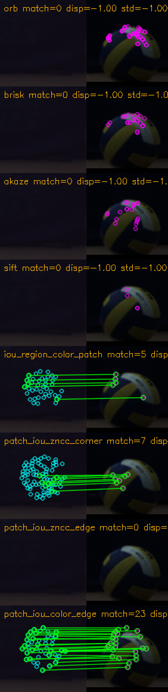

| 方法 | 本地单帧结果 | matches_zoom |
|---|---|---|
| ORB | `24/29` 点, `4` match, 深度 `3.3761m`, fail: `valid_points<8` | 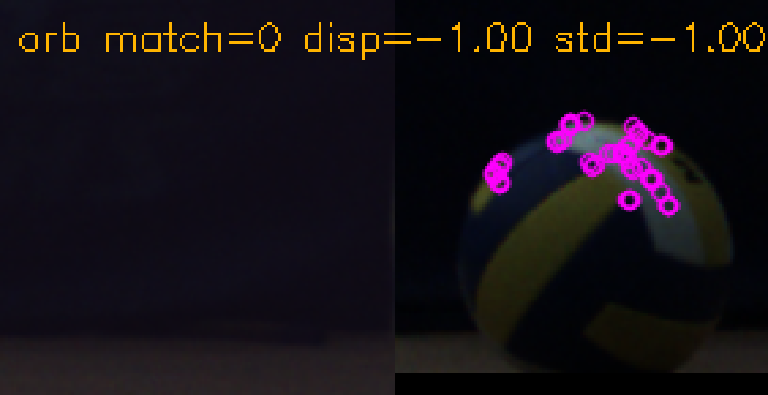 |
| BRISK | `13/15` 点, `4` match, 深度 `3.3856m`, fail: `valid_points<8` | 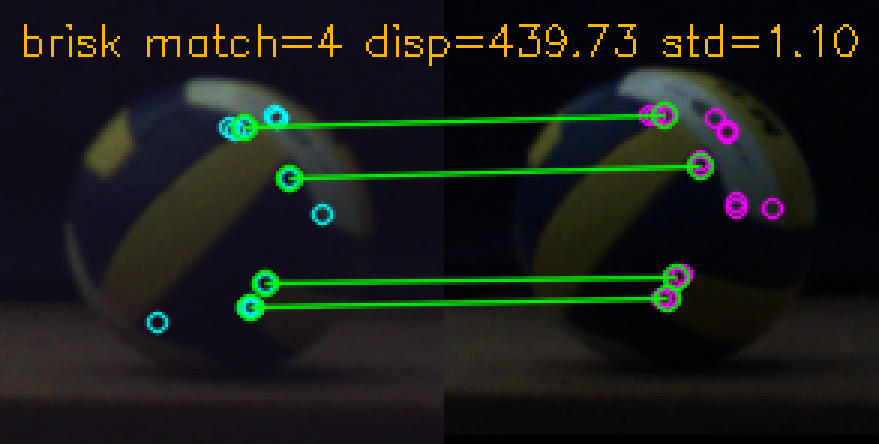 |
| AKAZE | `17/16` 点, `8` match, 深度 `3.3911m`, fail: `valid_points<8;disparity_range;sphere_residual` | 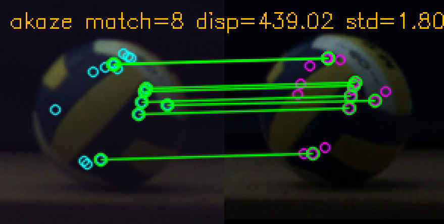 |
| SIFT | `2/5` 点, `1` match, 深度 `3.4148m`, fail: `valid_points<8` | 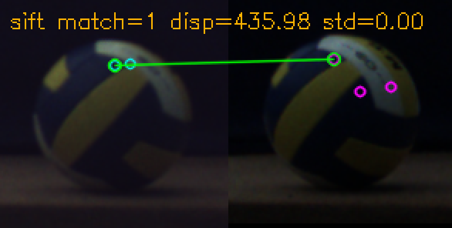 |
| `iou_region_color_patch` | `17` match, 深度 `3.3840m`, strict pass | 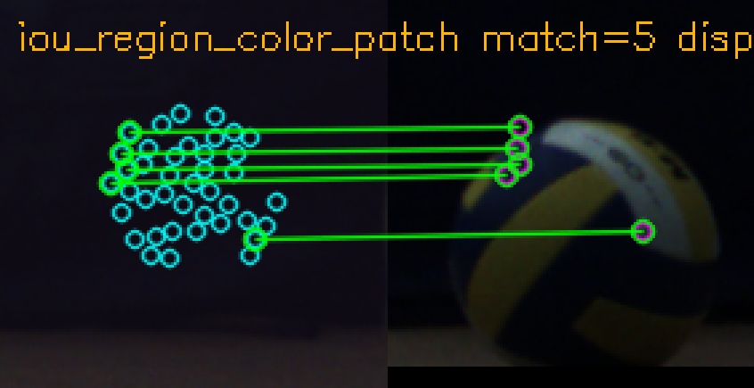 |
| `patch_iou_zncc_corner` | `57` match, 深度 `3.4030m`, fail: `y_error;disparity_mad;disparity_range;z_range;sphere_residual` | 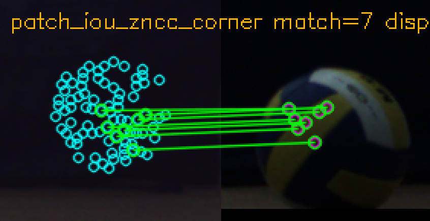 |
| `patch_iou_zncc_edge` | `23` match, 深度 `3.4024m`, fail: `y_error;disparity_mad;disparity_range;z_range;sphere_residual` | 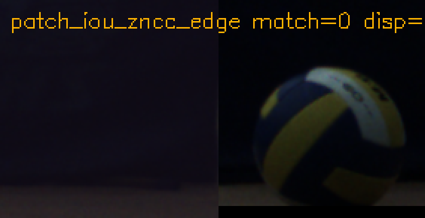 |
| `patch_iou_color_edge` | `22` match, 深度 `3.4001m`, fail: `y_error;disparity_mad;disparity_range;z_range;sphere_residual` | 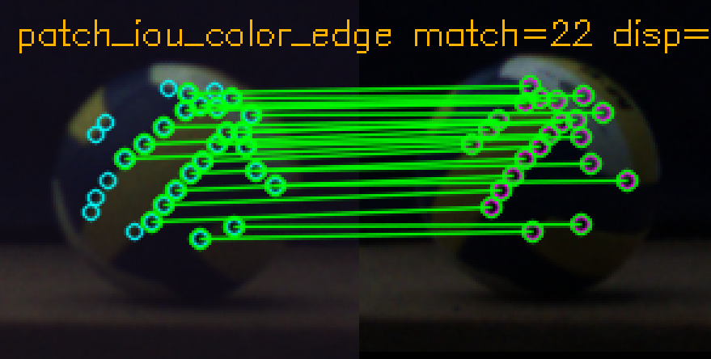 |

## 神经特征 Probe

命令:

```bash
.venv-stereo-neural/bin/python NX_volleyball/stereo_3d_pipeline/tools/neural_feature_probe.py \
  --left NX_volleyball/stereo_3d_pipeline/test_logs/volleyball_raw_pair_latest/left/0000.png \
  --right NX_volleyball/stereo_3d_pipeline/test_logs/volleyball_raw_pair_latest/right/0000.png \
  --calib NX_volleyball/calibration/stereo_calib.yaml \
  --out NX_volleyball/stereo_3d_pipeline/test_logs/volleyball_raw_pair_latest/neural_feature_eval_wiki_20260703_venv \
  --backends xfeat,aliked,superpoint_lightglue \
  --device cpu \
  --xfeat-repo /home/rick/.local/share/stereo_3d_pipeline/neural_repos/accelerated_features
```

默认汇总图:

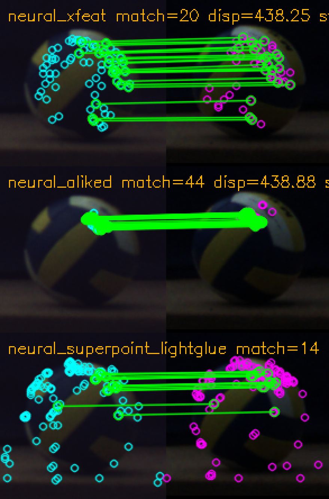

2026-07-03 复查: 旧神经图是在 ROI 自动配对修复前生成的，左图 crop 被 Hough refine 误拉到球右侧背景块。重新运行当前 `detect_ball_rois()` 后，左右 ROI 都落在排球上。

| 方法 | 本地单帧结果 | matches_zoom |
|---|---|---|
| `neural_xfeat` | `72/52` 点, `30` candidates, `20` match, 深度 `3.3971m`, fail: `valid_points<8;disparity_mad;disparity_range;z_range;sphere_residual` | 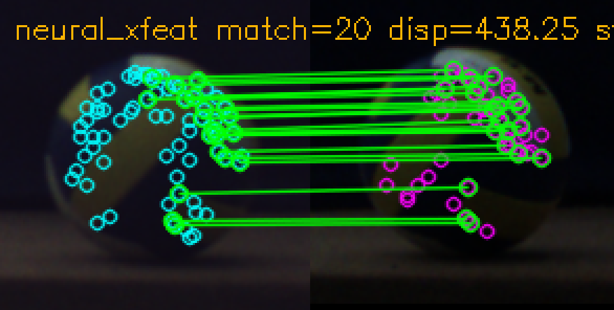 |
| `neural_aliked` | `127/123` 点, `44` candidates, `44` match, 深度 `3.3922m`, fail: `disparity_mad` | 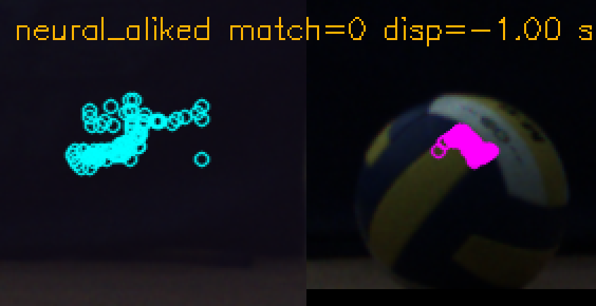 |
| `neural_superpoint_lightglue` | `128/128` 点, `38` candidates, `14` match, 深度 `3.3931m`, fail: `disparity_range` | 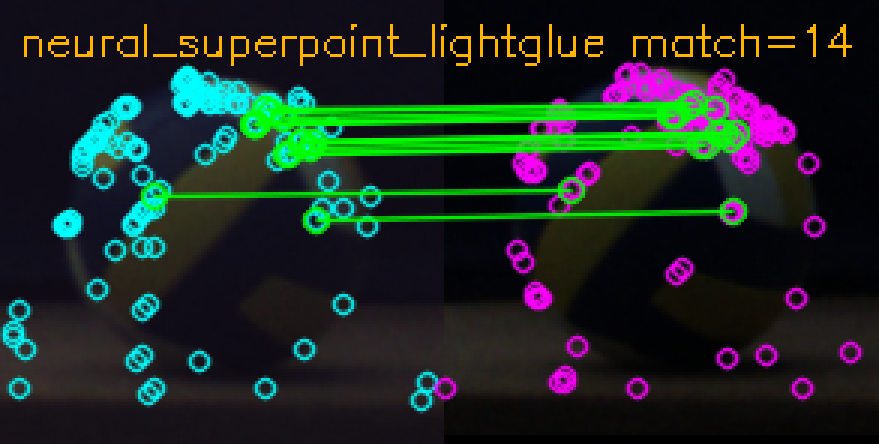 |

放宽诊断命令:

```bash
.venv-stereo-neural/bin/python NX_volleyball/stereo_3d_pipeline/tools/neural_feature_probe.py \
  --left NX_volleyball/stereo_3d_pipeline/test_logs/volleyball_raw_pair_latest/left/0000.png \
  --right NX_volleyball/stereo_3d_pipeline/test_logs/volleyball_raw_pair_latest/right/0000.png \
  --calib NX_volleyball/calibration/stereo_calib.yaml \
  --out NX_volleyball/stereo_3d_pipeline/test_logs/volleyball_raw_pair_latest/neural_feature_eval_wiki_20260703_venv_relaxed \
  --backends xfeat,aliked,superpoint_lightglue \
  --device cpu \
  --xfeat-repo /home/rick/.local/share/stereo_3d_pipeline/neural_repos/accelerated_features \
  --top-k 512 \
  --ratio 1.0 \
  --max-y-error-px 4.0 \
  --max-disp-delta-px 80.0 \
  --aliked-lightglue
```

放宽后 ROI 仍正确，三种方法都有真实匹配，但仍未通过严格 validation:

- `neural_xfeat`: `194/162` 点, `99` candidates, `83` match, 深度 `3.3893m`, fail: `disparity_mad;disparity_range;z_range;sphere_residual`。
- `neural_aliked` + LightGlue: `512/512` 点, `2` candidates, `1` match, 深度 `3.3859m`, fail: `valid_points<8`。
- `neural_superpoint_lightglue`: `304/511` 点, `125` candidates, `54` match, 深度 `3.3958m`, fail: `disparity_range`。

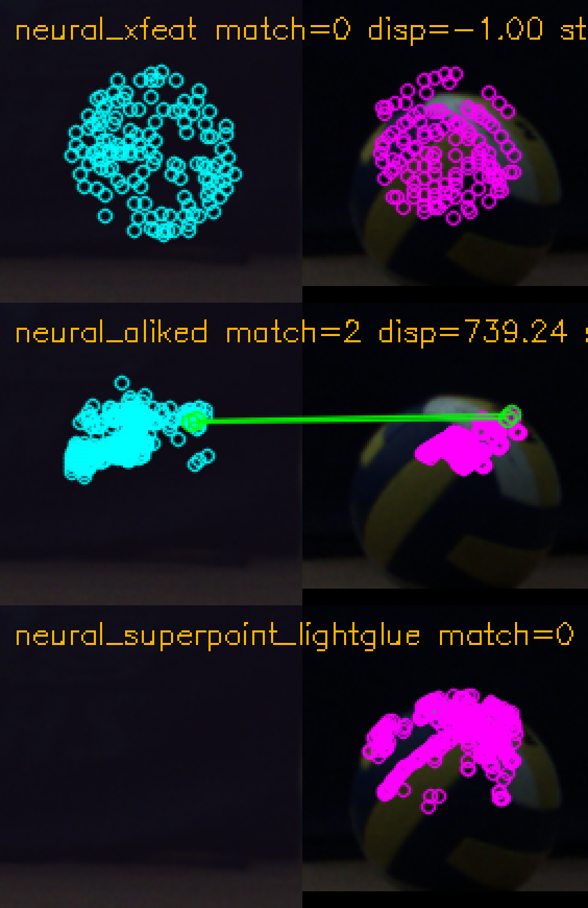

## 离线结论

- 2026-07-03 NX BGR 连续 clip 复测:
  `test_logs/nx_recordings/codex_bgr_latest/clip_20260703_075002_01`
  共 `60/60` 帧可处理。严格 validation pass rate 仍为 `0`。
  `patch_iou_color_edge` 数值最稳，深度中位数 `4.0677m`，
  深度 MAD `0.0055m`，帧间 p95 抖动 `0.0172m`，但 runtime geometry
  只过 `1/60`，不能直接作为可信实时深度。`iou_region_color_patch`
  深度中位数 `3.8272m`，p95 抖动 `0.1955m`。ORB/BRISK/AKAZE/SIFT
  在该片段上有效点不足或耗时过高。
- 同一 NX BGR clip 上的 YOLO/IoU 退化回归通过:
  正常配对、左右假框干扰、左/右单侧缺失 fallback pass rate 均为 `1.0`。
  单侧缺失模板搜索的中心误差 p95 约 `11-12px`，该路径可作为退化保护，
  但不应替代高质量双目采集。
- 同一 NX BGR clip 第一帧神经 probe:
  XFeat 本地 repo 缺失；ALIKED 与 SuperPoint+LightGlue 在 CPU 上可调用，
  但有效匹配点为 `0`，严格 validation 失败，单帧耗时约 `2.8-3.1s`。
  该结果只说明当前本地 CPU/依赖状态不可用于实时判断，NX 实时结论仍以
  TensorRT engine 矩阵为准。
- OpenCV ORB/BRISK/AKAZE/SIFT 能提到少量正确点，但有效点数不足，不适合作为默认深度。
- `iou_region_color_patch` 在当前单帧严格通过，但 NX 连续实时矩阵中 `0/640` 有效，说明离线单帧通过不能直接代表实时连续帧可用。
- `patch_iou_zncc_*` 和 `patch_iou_color_edge` 点数多，但离群点和 y 残差明显，必须依赖 MAD/RANSAC 与球体半径 gate。
- Python 神经 probe 能证明算法语义上能匹配，但实时结论必须看 TensorRT engine 和 NX 矩阵。
- 离线结果主要用于定位 ROI、点位、gate 失败原因；是否进入实时默认配置必须由 [实时特征算法矩阵](实时特征算法矩阵.md) 和连续片段评估决定。
