# 稳定 100fps 深度方法与训练入口

最后核对: 2026-07-05

本页是“实际选用”结论页，用于冻结当前 100fps 实时深度候选集合，并说明后续标定测试、数据采集和轨迹融合模型训练应如何使用这些候选。深度相关页面总入口见 [深度算法导航](深度算法导航.md)，算法分类和左右视差语义见 [深度算法分类总览](深度算法分类总览.md)。

轨迹模型、半监督训练、物理约束和数据集设计见 [排球轨迹模型训练方案](排球轨迹模型训练方案.md)。

当前方法分层详见:

- [P0几何基线深度](P0几何基线深度.md)
- [P1训练候选深度](P1训练候选深度.md)
- [XFeatTensorRT深度候选](XFeatTensorRT深度候选.md)
- [CUDA Template/NCC深度候选](CUDA-Template-NCC深度候选.md)
- [P0/P1+三算法联合测试](P0P1与P2三算法联合测试20260705.md)

## 依据

当前结论优先使用单算法隔离矩阵:

```text
test_logs/nx_algorithm_matrix_isolated_20260703_101520/report.md
```

P0+P1 联合录制复核:

```text
/home/nvidia/trajectory_dataset/p0p1_100fps_20260703_135728
```

该片段 `2304` 帧、`23.248s`，目标级 CSV 与 frame sidecar 均为 `2304` 行，实测输出约 `99.06fps`。`Stage2_AsyncRoiWorker` 平均 `4.67ms`、最大 `10.21ms`，只有 `1` 次超过 `10ms` deadline。说明旧 P0+P1 字段可以作为 100fps 采集基线。

2026-07-04 联合复测显示，`full12_default` 只有 `6.7fps`，`no_sgm_no_vpi` 可回到 `100.3fps`，但 worker `avg/p95/max=9.09/9.72/15.04ms`，仍有 `8` 次 stale 和 `62` 次 over deadline。因此当前测试配置去掉 SGM、VPI、两个已确认错配的彩色 IoU/edge 候选。OpenCV CUDA GFTT/LK 不再默认采集，只保留 A/B 和诊断文档。

2026-07-04 14:28 NX 联合实测结果: 组合 `XFeat TensorRT 128/top32 + OpenCV CUDA GFTT/LK sidecar(stride=10)` 能运行并写出主 CSV、`.frames.csv` 和 `*.p2_diagnostic.csv`，但 ROI 输出只有 `94.4fps`，`Stage2_AsyncRoiWorker avg/p95/max=8.58/9.54/15.41ms`，`Stage2_AsyncRoiOverDeadline=36`。A/B 短测显示，关闭 XFeat 但保留 GFTT/LK sidecar 后回到 `99.93fps`，worker `avg/p95/max=4.52/5.02/10.70ms`；只保留 XFeat、关闭 GFTT/LK 时为 `98.30fps`，worker `avg/p95/max=8.49/8.88/13.46ms`。结论: GFTT/LK 低频 sidecar 可作为 diagnostic 观察项；XFeat 主 CSV 候选当前不满足 100fps 准入，正式 100fps 采集前应关闭或改为低频/条件触发。

2026-07-05 复核: `z_roi_cuda_template_match` 默认后端已从 OpenCV CUDA TemplateMatching 替换为自研 CUDA Template/NCC。它匹配左 YOLO bbox 中心灰度 patch 到右图小极线窗口，不是通用关键点算法；OpenCV CUDA 版本只通过 `STEREO_CUDA_TEMPLATE_BACKEND=opencv` 作为 baseline。NX A/B 显示自研后端 `100.1fps`、`1372/1374` 有效、algo `avg/p95/p99/max=0.30/1.06/1.20/4.89ms`，比 OpenCV baseline 的 `60/1374` 有效和 `26.45ms` max 明显更稳。

2026-07-05 联合测试把 P0/P1 主线与 P1 sidecar `cuda_template`、`neural_xfeat`、`neural_superpoint` 同时打开。该 run 的三算法仍由 diagnostic worker 承载，不回写主融合；最终 run `/home/nvidia/trajectory_dataset/p0p1_xfeat_superpoint_ncc_review_20260705_103601` 为 `1270` 帧、`99.95fps`，`Stage2_AsyncRoiWorker avg/p95/max=4.98/5.90/9.82ms`；sidecar 请求 `318` 帧。NCC `317/317` 有效，SuperPoint `317/317` 有效，XFeat `185/317` 有效。完整记录见 [P0/P1+三算法联合测试](P0P1与P2三算法联合测试20260705.md)。

历史 `test_logs/nx_algorithm_matrix_20260703_0915/` 是旧脚本输出，默认几何候选没有完全关闭，只能作为历史参考，不能作为单算法有效性的最终依据。

P2 复测依据:

```text
test_logs/codex_p2_verify_20260704_104947/
test_logs/codex_p2_artifact_debug_20260704_105356/
wiki/assets/p2_20260704_artifacts/
wiki/assets/p2_20260704_final/
test_logs/codex_p2_after_diag_20260704_045653/
test_logs/codex_p2_diag_only_rebuilt_20260704_050431/
test_logs/codex_diag_csv_verify2_20260704_051834/
test_logs/codex_diag_csv_final_20260704_052610/
test_logs/codex_xfeat_remaining_neural_xfeat_128_top32_20260704_053420/
test_logs/codex_xfeat_remaining_neural_xfeat_128_top96_20260704_053426/
test_logs/codex_xfeat_remaining_neural_xfeat_160_top64_20260704_053433/
test_logs/codex_template_reduce_patch9_20260704_054407/
test_logs/codex_cuda_remaining_opencv_cuda_stereo_bm_patch9_20260704_054733/
test_logs/codex_cuda_remaining_opencv_cuda_stereo_sgm_patch9_20260704_054740/
test_logs/codex_cuda_remaining_opencv_cuda_orb_wide_y_20260704_054746/
test_logs/cuda_template_custom_tiebreak_debug_20260705_074358/
wiki/assets/cuda_template_ncc_20260705/
```

## P0: 当前可稳定使用

这些方法满足 100fps，候选有效率高，适合进入实时候选字段和训练数据采集。

| 方法 | CSV 字段 | source | FPS | 有效率 | 中位深度 | MAD | 用途 |
|---|---|---:|---:|---:|---:|---:|---|
| YOLO bbox 中心视差 | `z_bbox_center` | `3` | `100.0` | `611/611` | `3.6129m` | `0.0008m` | 最轻量后备和训练候选 |
| ROI 圆心/球心拟合 | `z_circle_center` | `1` | `99.9` | `615/615` | `3.6139m` | `0.0010m` | 当前默认主观测优先项 |
| ROI 边缘质心 | `z_roi_edge_centroid` | `5` | `99.3` | `637/637` | `3.6091m` | `0.0013m` | 稳定几何候选 |
| ROI 径向中心 | `z_roi_radial_center` | `8` | `100.3` | `616/616` | `3.6138m` | `0.0009m` | 稳定几何候选 |
| ROI 成对边缘中心 | `z_roi_edge_pair_center` | `9` | `100.1` | `641/641` | `3.6108m` | `0.0000m` | 稳定几何候选 |

实时采集必须开启 P0；当前主配置同时开启 P1 作为训练候选记录。

```yaml
detector:
  dual_yolo:
    depth_modes:
      bbox_pair: true
      bbox_edges: true
      circle_center: true
      circle_edges: false
      roi_edge_centroid: true
      roi_radial_center: true
      roi_edge_pair_center: true
      roi_center_patch: true
      roi_subpixel: true
      roi_patch_iou_color_edge: false
      roi_iou_region_color_patch: false
      roi_cuda_stereo_sgm: false
      roi_vpi_template_match: false
      roi_vpi_orb: false
      roi_cuda_template_match: true
      roi_cuda_gftt_lk: false
      epipolar_fallback: true
    subpixel_enabled: true
neural_feature_matching:
  enabled: false # legacy single-backend alias
neural_feature_matching_xfeat:
  enabled: true
  backend: "xfeat"
  extractor_engine_path: "/home/nvidia/NX_volleyball/stereo_3d_pipeline/models/neural/xfeat_extractor_160_b2.engine"
  roi_size: 160
  top_k: 64
  descriptor_dim: 64
  min_matches: 4
neural_feature_matching_superpoint:
  enabled: true
  backend: "superpoint_lightglue"
  extractor_engine_path: "/home/nvidia/NX_volleyball/stereo_3d_pipeline/models/neural/superpoint_extractor_160_top64_b2.engine"
  roi_size: 160
  top_k: 64
  descriptor_dim: 256
  min_matches: 4
performance:
  p2_realtime_lane_decision_enabled: true
  p2_diagnostic_lane_decision_enabled: false
  p2_diagnostic_results_enabled: false
```

`epipolar_fallback` 只作为单侧漏检退化保护，不作为正常主路径。当前 YOLO/IoU 退化回归通过，但单侧缺失模板搜索中心误差 p95 约 `11-12px`，训练时应单独标记 `stereo_match_source=2/3`。

## P1: 当前主管线与 inline 候选

这些方法已进入主管线候选集合。训练仍读取主 CSV 原始候选字段，用模型学习其偏置和可靠性；diagnostic sidecar 只在专项调试时开启。当前 `pipeline_rdk_joint.yaml` 已通过 `depth_solver=roi_subpixel_match` 将 `z_roi_multi_point` 提升为 direct pair 首选，失败后回退 P0 几何/bbox。

当前 90Hz 同步采集口径一共是 `13` 个主 CSV direct/fallback/inline 有效深度候选。P0 direct 字段 `7` 个，包括 `z_bbox_center`、`z_bbox_left_edge`、`z_bbox_right_edge`、`z_circle_center`、`z_roi_edge_centroid`、`z_roi_radial_center`、`z_roi_edge_pair_center`；P1 主 CSV 字段 `2` 个，为 `z_roi_multi_point`、`z_roi_center_patch`；单侧退化字段 `z_fallback_epipolar`；P2 inline 三算法字段为 `z_roi_cuda_template_match`、`z_roi_neural_xfeat`、`z_roi_neural_superpoint`。`z_circle_left_edge/right_edge` 仅旧兼容列，不进入训练候选。

| 来源 | 方法 | 记录字段 | FPS | 有效率 | 中位深度 | MAD | 当前判断 |
|---|---|---|---:|---:|---:|---:|---|
| 主 CSV | CUDA multi-point subpixel | `z_roi_multi_point` | `100.1` | `628/628` | `3.5384m` | `0.0000m` | 覆盖率和速度好，但相对 P0 几何候选有约 `7cm` 系统差，需要真实距离验证 |
| 主 CSV | CUDA center patch | `z_roi_center_patch` | `100.0` | `45/45` | `3.5384m` | `0.0000m` | 可跑但覆盖率低，不适合作为默认主路径 |
| P2 inline | 自研 CUDA Template/NCC | `z_roi_cuda_template_match` | 历史 sidecar 联合 `99.95` | `317/317` | `3.5032m` | `0.0020m` | 当前改为每帧 inline；`support=1` 的单点模板候选，不参与 legacy 输出 |
| P2 inline | XFeat TensorRT | `z_roi_neural_xfeat` | 历史 sidecar 联合 `99.95` | `185/317` | `3.4627m` | `0.0085m` | 当前改为每帧 inline；有效率不足，保留为训练候选和后续优化目标 |
| P2 inline | SuperPoint TensorRT | `z_roi_neural_superpoint` | 历史 sidecar 联合 `99.95` | `317/317` | `3.4090m` | `0.0047m` | 当前改为每帧 inline；覆盖率高但有系统差，需要模型学习偏置 |

P0+P1 联合录制复核中，`z_roi_multi_point` 为 `2229/2304`，相对 P0 几何中值约 `-5.17cm`；`z_roi_center_patch` 为 `2239/2304`，相对 P0 几何中值约 `+5.30cm`。这些历史数据仍用于监控方法偏置；当前只有 multi-point 被正式配置提升为在线首选，center patch 继续作为辅助训练候选。

推荐采集策略:

- 基线验证: 可以只开 P0，用于确认标定、水印、几何一致性和真实距离 bias。
- 训练采集: 当前 90Hz 同步版本应开 P0 + `z_roi_multi_point`、`z_roi_center_patch`，并把 NCC/XFeat/SuperPoint 写入主 CSV 候选字段。
- `roi_center_patch` 单算法历史测试覆盖有限，但 P0+P1 联合录制覆盖率已到 `97%` 左右；它仍有约 `+5cm` 系统偏置，不能作为主路径依赖。
- `*.p2_diagnostic.csv` 只在 `p2_diagnostic_results_enabled=true` 时写出；`trajectory_fusion/dataset.py` 仍保留按 `frame_id + mode` 合并历史 sidecar 的兼容能力。

## P2: 默认关闭的实验候选

当前冻结 P0 + 本页 P1/inline 三算法作为训练采集集合；NCC/XFeat/SuperPoint 已提升为同步 inline 候选。其它 P2 新增项仍必须单项开启、单项记录 `Stage2_AsyncRoiWorker`/有效率/深度偏置/长尾耗时，不能直接叠加进默认采集配置，也不能抢占 legacy `z_stereo/obj.z`。

2026-07-04 08:30 全量复测:

```text
test_logs/codex_p2_full_20260704_083048/
test_logs/codex_p2_debug_20260704_083851/
```

2026-07-04 10:49 targeted 复核、10:53 artifact debug 和 11:08 final artifact:

```text
test_logs/codex_p2_verify_20260704_104947/
test_logs/codex_p2_artifact_debug_20260704_105356/
wiki/assets/p2_20260704_artifacts/
NX run: codex_p2_artifacts_final_20260704_110837
wiki/assets/p2_20260704_final/
NX run: codex_p2_retest_inline_20260704_130245
NX run: codex_p2_retest_dense_20260704_130617
NX run: codex_p2_retest_dense_priority_20260704_131027
NX run: codex_p2_retest_sgm_valid_20260704_131452
wiki/assets/p2_20260704_inline/
wiki/assets/p2_20260704_dense/
```

判断优先级: `codex_p2_verify_20260704_104947` 是 07-04 P2 targeted 复核依据；`cuda_template_custom_tiebreak_20260705_074117` 是 07-05 自研 CUDA Template/NCC isolated 依据；`p0p1_xfeat_superpoint_ncc_review_20260705_103601` 是当前 P0/P1+NCC+XFeat+SuperPoint 联合依据；`codex_p2_full_20260704_083048` 保留为广覆盖矩阵历史。debug / artifact run 只用于证明算法级点对或峰值位置，不用于 FPS 准入。2026-07-04 联合复测后，`patch_iou_color_edge_wide_search`、`iou_region_color_patch_wide_search` 因 artifact 显示系统性错配而退出默认配置；OpenCV CUDA StereoSGM、VPI Template、VPI ORB 因联合运行长尾或有效率问题退出默认配置。OpenCV CUDA GFTT/LK 低频 sidecar 可运行，但当前默认组合已改为 NCC + XFeat + SuperPoint。

每帧 diagnostic-only 运行 OpenCV CUDA ORB/Template/BM/SGM 已证明调度和独立 GPU snapshot 可用，但会和 YOLO 争抢 GPU 并压低整体 FPS；后续只能按 stride 或 P0/P1 异常选择性触发。diagnostic CSV 已可用，见 [P2 算法 NX 测试排查指南](P2算法NX测试排查指南.md)。

### P2 输入与图像口径核对

结论: P2 推荐排序总表的性能/有效率统计来自实时管线单算法 isolated run，算法执行入口是正确的；10:49 targeted 复测覆盖的 case 以最新数值为准，未覆盖项仍保留 08:30 全量矩阵历史。表内 `wiki/assets/p2_20260704/` 图片不是算法级左右特征点对应图，只能作为 debug 状态抽样；真实点对/峰值/patch 样张见 `wiki/assets/p2_20260704_artifacts/`、`wiki/assets/p2_20260704_final/`、`wiki/assets/p2_20260704_inline/`、`wiki/assets/p2_20260704_dense/`、`wiki/assets/p2_20260704_update/` 和 [P2算法效果与可视化审查](P2算法效果与可视化审查.md)。

- 自研 CUDA color P2: `iou_region_color_patch*`、`patch_iou_color_edge*` 在 `matchDualYoloDetections()` 中只对通过左右 YOLO IoU/极线/尺寸 gate 的 direct pair 执行。输入同时包含 rectified gray GPU 指针和 rectified BGR GPU snapshot；如果 BGR snapshot 不存在，颜色候选不会运行。算法在原始 rectified 图像坐标上采样，不做 ROI resize。每个采样点在右图 `initial_disp ± search` 的极线小窗口找最佳 patch，视差为 `left_x - best_right_x`，再做 median/MAD/gate 聚合。`wide_search` 只是矩阵 case 名；当前 kernel 内 color residual 搜索实际夹紧到 `±3px`。
- OpenCV CUDA / VPI / Fixstars / ring-edge diagnostic: 运行输入是 rectified gray GPU snapshot，并由左右 YOLO direct pair 的 `left_det/right_det/initial_disp` 构造小 ROI 或 shifted search 窗口；diagnostic-only 结果写独立 `*.p2_diagnostic.csv`，包含 `debug_match_count` 和 `artifact_path`，不回写主 `Object3D`。
- TensorRT 神经特征: 1ch engine 使用 rectified gray 方形 ROI crop；3ch/6ch engine 使用 rectified BGR 方形 ROI crop，输出 CHW。2026-07-04 已修正 3ch 神经 crop，旧代码曾错误地把 BGR 指针按灰度 repeat 读取，因此历史 3ch 神经测试不能作为有效结论；本轮已测试的 1ch XFeat/SuperPoint 结论不受影响。
- 比例缩放: CUDA color P2 不缩放；神经特征 crop 使用正方形上下文并在结果映射回原图时使用同一尺度公式。debug realtime zoom 会把左右 crop 按固定高度缩放用于显示，不代表算法输入尺度。
- “球看起来椭圆”: 当前 sparse/color gate 会按 YOLO bbox 的 `width/height` 使用椭圆 mask，这是算法设计，不是显示拉伸。若 bbox 长宽比受检测框抖动影响，后续应增加基于拟合圆的圆形 mask A/B。
- 表内图片来源: `iou_region_color_patch*`、`patch_iou_color_edge*`、OpenCV CUDA ORB/BM/SGM、XFeat、SuperPoint 的缩略图是 realtime ROI/status zoom；自研 CUDA Template/NCC、VPI Template、GFTT/LK 等单独列出的 artifact 才能证明算法级峰值或点对。`vpi_*`、`fixstars_libsgm`、`cuda_hough_circle`、`cuda_ring_edge_profile`、`opencv_cuda_gftt_lk` 的早期缩略图多是全帧 detection panel，通常表示该 debug 帧没有主 `Object3D` 回写，不能当作该算法的 YOLO ROI 匹配可视化。
- 新增算法级 artifact: 11:08 final artifact run 生成 `65` 张真实 PNG；OpenCV CUDA ORB/Template/SGM/GFTT-LK、CUDA Hough circle 和 VPI Template 有样张。13:02 inline 重测补齐 XFeat 真实匹配图；color/color-edge 只补到 gate 后 sample overlay，不能作为 `wide_search` 完整匹配证明。13:06/13:14 dense 重测补齐 BM/SGM/VPI Stereo/libSGM 的 32x32 disparity patch，VPI Stereo 额外有 confidence patch。13:49 更新测试补齐 OpenCV/VPI Template score patch 和 ring-edge 采样点；13:51 补齐 SuperPoint 160/top64 真实点对 overlay。2026-07-05 自研 CUDA Template/NCC 已补有效峰值 artifact。VPI ORB 在 10:53 debug run 有少量点对样张，但 11:08 final 段未复现。VPI Harris/LK、CUDA-SIFT 本轮仍无有效 artifact。
- 当前 `--debug-feature-matches` 输出的是旧 CPU sparse/OpenCV debug 图，不等价于 OpenCV CUDA、VPI、TensorRT、libSGM 或自研 CUDA P2 的内部匹配结果。
- artifact 连线来自后端 `SparseFeatureDisparityResult.debug_matches`；不要用聚合 anchor 均值伪造特征点连线。

### P2 推荐排序总表

排序口径: 先看是否能稳定 100fps，再看有效率、深度偏置、长尾和是否需要 diagnostic-only lane。表内 `status` 图来自 `wiki/assets/p2_20260704/`，只说明检测/ROI/字段落点；`artifact` 图来自 `wiki/assets/p2_20260704_artifacts/`、`wiki/assets/p2_20260704_final/`、`wiki/assets/p2_20260704_inline/`、`wiki/assets/p2_20260704_dense/` 或 `wiki/assets/p2_20260704_update/`，才是算法级点对/峰值/disparity 可视证据。图片类型审查见 [P2算法效果与可视化审查](P2算法效果与可视化审查.md)。

| 排序 | 方法 | 实时字段/后端 | 最新性能 | 有效/深度 | 当前结论 | debug / artifact 图 |
|---:|---|---|---|---|---|---|
| 1 | `patch_iou_color_edge_wide_search` | `z_roi_patch_iou_color_edge`，自研 CUDA BGR edge/color patch | 10:49 targeted `100.1fps`；algo `0.85/1.17/4.22ms`；worker `1.13/1.48/7.06ms` | `654/654`，median/MAD `3.3334/0.0000m` | 退出默认配置: sample overlay 显示系统性错误 stripe/edge 对应；只保留历史对照 | sample overlay<br><a href="assets/p2_20260704_inline/patch_iou_color_edge.png">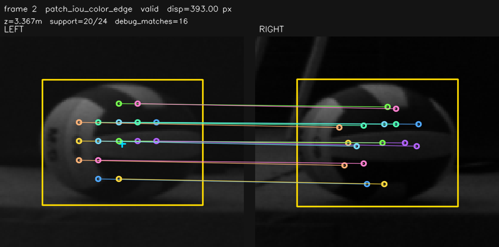</a> |
| 2 | `iou_region_color_patch_wide_search` | `z_roi_iou_region_color_patch`，自研 CUDA BGR patch | 10:49 targeted `100.0fps`；algo `0.85/1.09/4.10ms`；worker `1.14/1.39/7.24ms` | `647/647`，median/MAD `3.3250/0.0000m` | 退出默认配置: sample overlay 显示系统性错误重复纹理区域匹配；只保留历史对照 | sample overlay<br><a href="assets/p2_20260704_inline/iou_region_color_patch.png">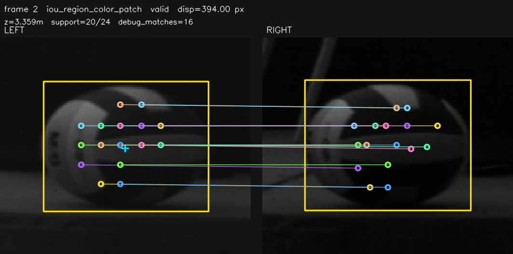</a> |
| 3 | `patch_iou_color_edge` base | `z_roi_patch_iou_color_edge`，自研 CUDA BGR edge/color patch | `98.1fps`；algo `3.55/3.84/7.83ms`；worker `3.83/4.12/10.56ms` | `632/637`，median/MAD `3.3250/0.0000m` | 有效率高，但 FPS 和 worker max 不如 wide_search；只保留参数对照 | <a href="assets/p2_20260704/patch_iou_color_edge_base.png">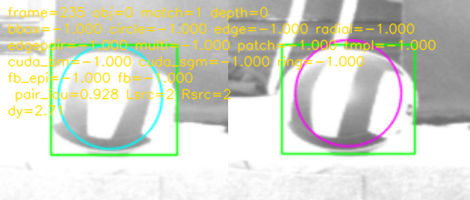</a> |
| 4 | `iou_region_color_patch` base | `z_roi_iou_region_color_patch`，自研 CUDA BGR patch | `98.2fps`；algo `3.50/3.81/7.52ms`；worker `3.81/4.37/9.23ms` | `628/628`，median/MAD `3.3250/0.0000m` | 全有效但不满足稳定 100fps；只保留参数对照 | <a href="assets/p2_20260704/iou_region_color_patch_base.png">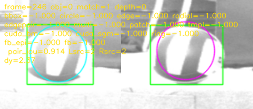</a> |
| 5 | OpenCV CUDA StereoSGM patch9 | `z_roi_cuda_stereo_sgm`，`cv::cuda::StereoSGM` | 10:49 targeted `99.0fps`；algo `2.30/3.54/10.70ms`；worker `2.38/3.70/10.87ms` | `139/624`，median/MAD `3.3136/0.0031m`；13:14 diagnostic `3/549` | 退出默认配置: 有效率低且 max 过 10ms；需要重新设计 dense ROI 后再测 | artifact<br><a href="assets/p2_20260704_dense/opencv_cuda_stereo_sgm_valid_patch.png">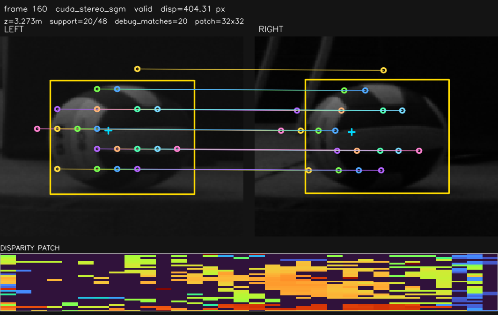</a> |
| 6 | 自研 CUDA Template/NCC | `z_roi_cuda_template_match`，gray patch NCC + GPU peak reduce | 2026-07-05 A/B `100.1fps`；algo `0.30/1.06/4.89ms`，p99 `1.20ms`；历史 sidecar 联合 run `99.95fps` | isolated `1372/1374`；历史 sidecar `317/317`，median/MAD `3.5032/0.0020m` | 当前工作区提升为 inline 训练候选；单点 `support=1`，不参与 legacy `z_stereo` | artifact<br><a href="assets/cuda_template_ncc_20260705/frame_000002_valid.png"></a> |
| 7 | VPI Template Matching | diagnostic-only，VPI CUDA NCC | 10:49 targeted `100.1fps`；algo `1.72/2.56/57.54ms`；main worker `0.07/0.09/3.50ms`；13:49 diagnostic `100.1fps` | `601/630`，median/MAD `3.3023/0.0004m`；13:49 `302/481` diagnostic valid | 退出默认配置: 去 VPI 以降低联合运行尾延迟；保留 isolated 参考 | artifact<br><a href="assets/p2_20260704_update/vpi_template_score_patch.png">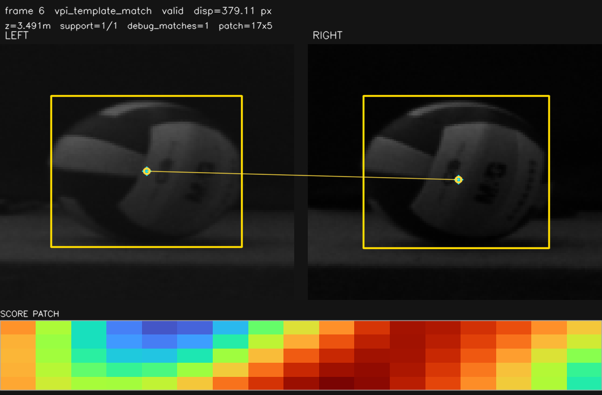</a> |
| 8 | VPI ORB + BruteForceMatcher | diagnostic-only，VPI CUDA ORB/BRIEF + matcher | 10:49 targeted `95.9fps`；algo `5.98/9.60/21.71ms`；main worker `0.11/0.62/4.07ms` | `16/603`，median/MAD `3.3001/0.0000m` | 退出默认配置: 去 VPI 且有效率极低；保留 isolated 参考 | status<br><a href="assets/p2_20260704/vpi_orb.png">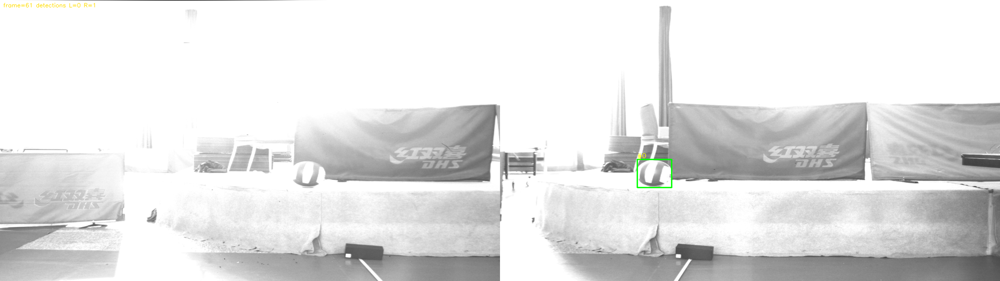</a><br>artifact<br><a href="assets/p2_20260704_artifacts/vpi_orb_valid.png">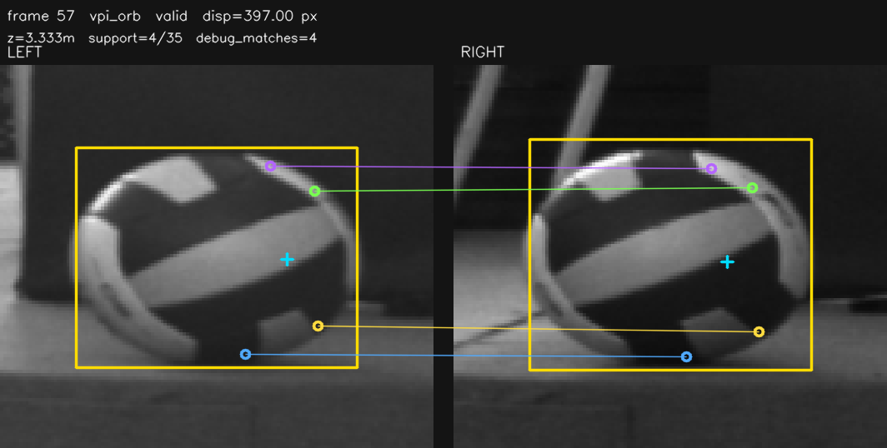</a> |
| 9 | XFeat TensorRT | `z_roi_neural_xfeat`，extractor-only TensorRT + GPU postprocess | 10:49 targeted 128/top32 `93.2fps`；14:30 xfeat-only `98.3fps`；历史 sidecar 联合 run `99.95fps` | 历史 sidecar `185/317`，median/MAD `3.4627/0.0085m` | 当前工作区提升为 inline 训练候选；有效率不足，仍是后续优化目标 | artifact<br><a href="assets/p2_20260704_inline/neural_xfeat.png">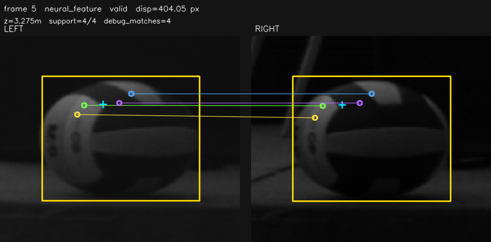</a> |
| 10 | SuperPoint TensorRT | `z_roi_neural_superpoint`，fixed extractor TensorRT + GPU mutual-NN | 13:51 160/top64 `89.0fps`；历史 sidecar 联合 run `99.95fps` | 历史 sidecar `317/317`，median/MAD `3.4090/0.0047m` | 当前工作区提升为 inline 训练候选；覆盖率高但有系统差 | artifact<br><a href="assets/p2_20260704_update/neural_superpoint_160_top64.png">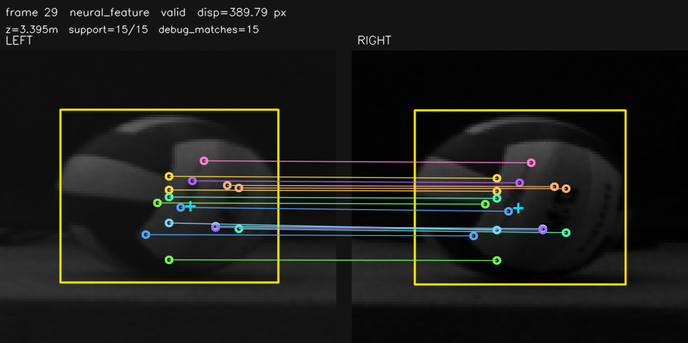</a> |
| 11 | OpenCV CUDA ORB | `z_roi_orb_points`，`cv::cuda::ORB` + CUDA BF | fast48 `92.9fps`、`11/570`；wide-y `89.6fps`、`59/547` | wide-y median/MAD `3.2919/0.0000m` | 真 GPU ORB 可跑；final artifact run `12/76` 有点对图，但 FPS/有效率不准入 | status<br><a href="assets/p2_20260704/opencv_cuda_orb_wide_y.png">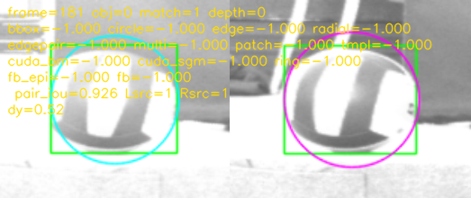</a><br>artifact<br><a href="assets/p2_20260704_final/opencv_cuda_orb.png">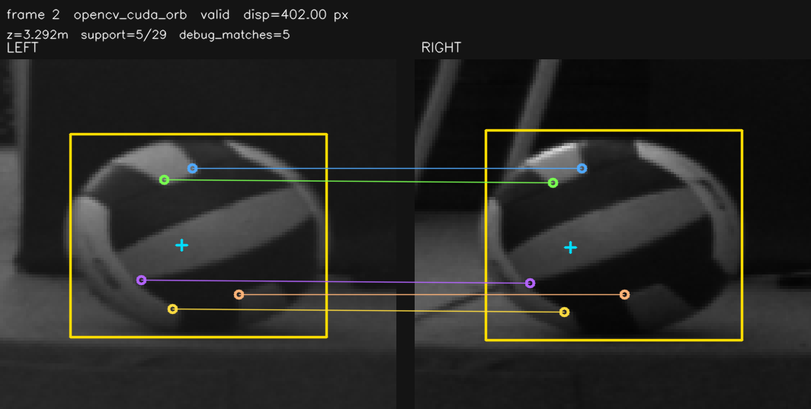</a> |
| 12 | CUDA Hough circle | diagnostic-only，OpenCV CUDA Hough circle | `90.3fps`；algo `5.62/8.01/32.28ms`；main worker `0.09/0.10/3.07ms` | `9/540`，median/MAD `3.3418/0.0514m` | 少量有效但抖动和 GPU 争用都不合格；final artifact run `3/88` 可看左右 refined center | status<br><a href="assets/p2_20260704/cuda_hough_circle.png"></a><br>artifact<br><a href="assets/p2_20260704_final/cuda_hough_circle.png">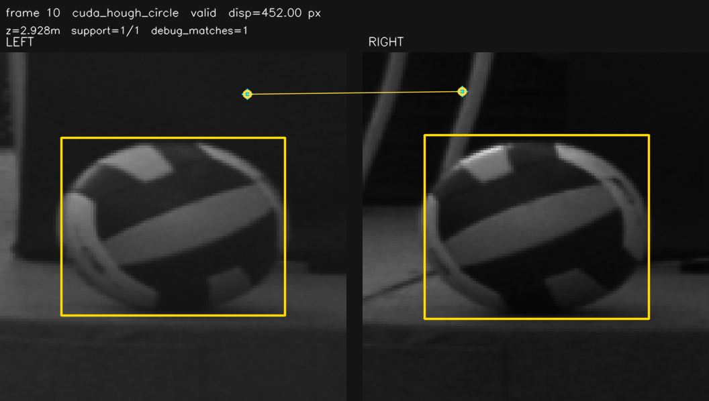</a> |
| 13 | VPI Harris + PyrLK | diagnostic-only，VPI CUDA Harris + Gaussian pyramid + PyrLK | 10:49 targeted `93.8fps`；algo `5.03/7.18/16.43ms`；main worker `0.08/0.09/3.05ms` | `48/606`，median/MAD `3.3350/0.0004m` | 有少量有效帧，但有效率低且本次 debug 段未捕获 artifact；不准入 | <a href="assets/p2_20260704/vpi_harris_lk.png"></a> |
| 14 | OpenCV CUDA GFTT/LK | diagnostic-only，OpenCV CUDA GFTT/Harris + SparsePyrLK | 10:49 targeted `94.0fps`；algo `4.05/5.39/86.39ms`；main worker `0.10/0.09/5.08ms` | `501/572`，median/MAD `3.2983/0.0005m` | 当前默认关闭；只保留 A/B 和诊断，不进入 P1 | status<br><a href="assets/p2_20260704/opencv_cuda_gftt_lk.png"></a><br>artifact<br><a href="assets/p2_20260704_final/opencv_cuda_gftt_lk.png">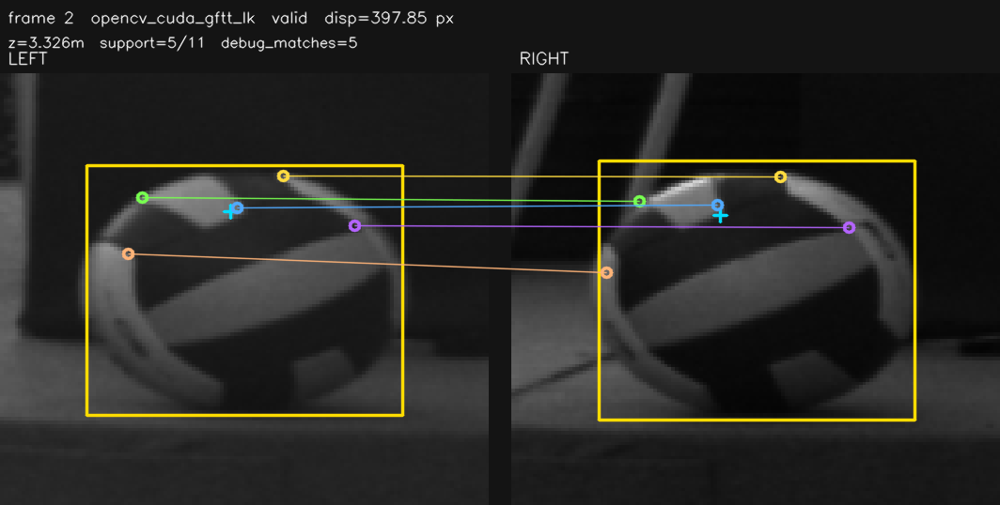</a> |
| 15 | CUDA ring/edge profile | `z_roi_ring_edge_profile` / diagnostic，自研 CUDA profile | 10:49 targeted `100.1fps`；algo `0.30/0.60/4.69ms`；main worker `0.10/0.61/1.95ms`；13:49 `100.6fps` | `0/638`；13:49 `0/849` diagnostic valid | kernel 很轻，但当前算法无有效匹配；已补采样点图，下一步看 gate/reject reason | artifact<br><a href="assets/p2_20260704_update/cuda_ring_edge_profile_samples.png">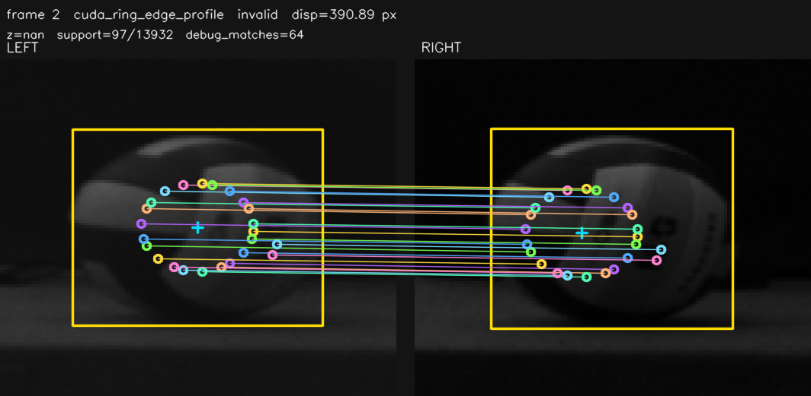</a> |
| 16 | OpenCV CUDA StereoBM patch9 | `z_roi_cuda_stereo_bm`，`cv::cuda::StereoBM` | `96.4fps`；algo `2.29/3.06/7.23ms`；worker `2.39/3.17/10.77ms`；13:10 diagnostic `87.8fps` | `0/610`；13:10 diagnostic `0/473` | 无有效候选；不准入，已有 invalid disparity patch 可排查 | artifact<br><a href="assets/p2_20260704_dense/opencv_cuda_stereo_bm_patch.png">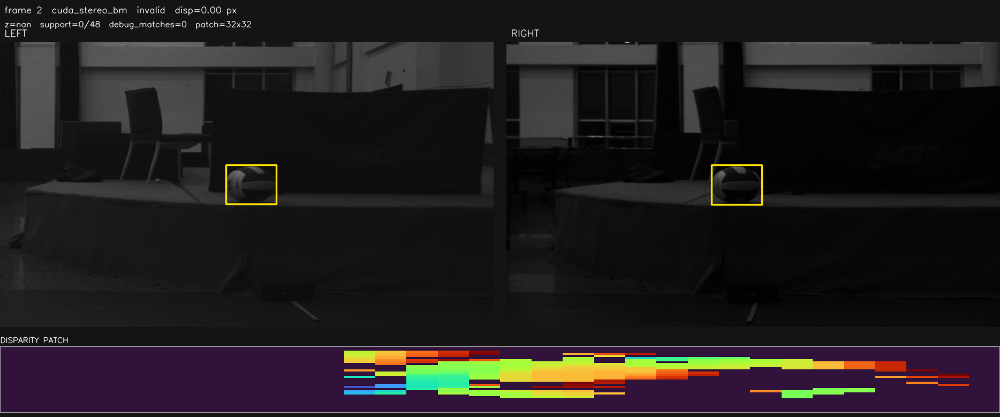</a> |
| 17 | VPI Stereo Disparity | diagnostic-only，VPI CUDA StereoDisparity | `80.3fps`；algo `7.34/10.85/22.07ms`；13:10 diagnostic `81.3fps` | `0/489`；13:10 diagnostic `0/434` | 无有效候选且 FPS 不准入，已有 disparity/confidence patch 可排查 | artifact<br><a href="assets/p2_20260704_dense/vpi_stereo_disparity_confidence_patch.png">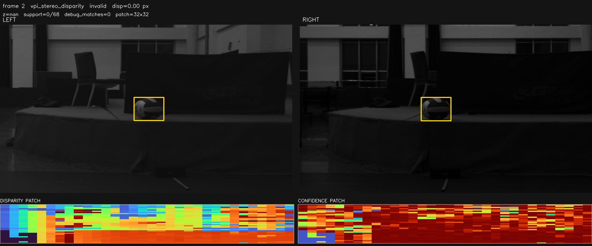</a> |
| 18 | Fixstars libSGM | diagnostic-only，Fixstars CUDA SGM wrapper | `70.5fps`；algo `70.81/7.51/5210.15ms`；13:06 diagnostic `86.9fps` | `0/80`；13:06 diagnostic `0/473` | 已构建/链接成功，但历史有 `5.2s` 级长尾且无有效候选；不准入，已有 invalid disparity patch 可排查 | artifact<br><a href="assets/p2_20260704_dense/fixstars_libsgm_patch.png">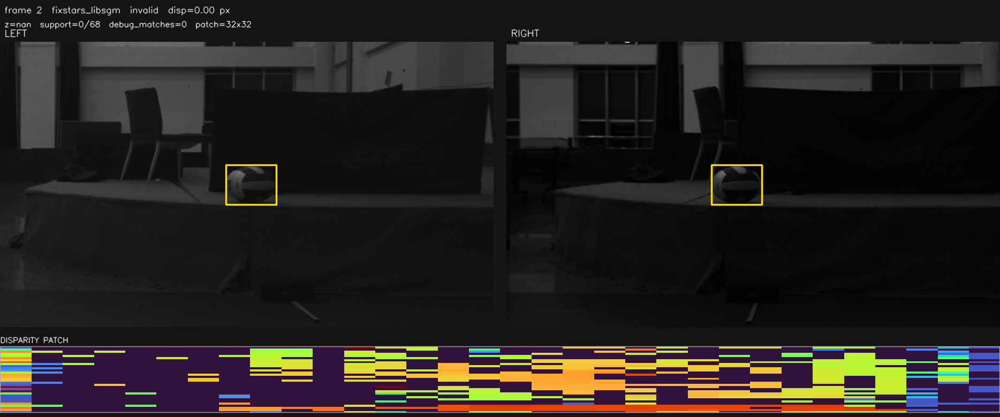</a> |
| 19 | ALIKED-t16 DCN TensorRT | `z_roi_neural_aliked`，官方 DCN extractor + TensorRT plugin | isolated `89.8-90.3fps`；联合 `NCC+XFeat+ALIKED-DCN` frame timestamp `87.8fps` | current `0/572`；gate-off `68/572`；联合 `0/1034` | engine 已落地，但有效率低且耗时接近 deadline；不参与默认准入 | artifact<br><a href="assets/aliked_dcn_20260706/aliked_dcn_gate_off_valid_000217.png"></a> |
| 20 | masked dense cost volume / SGM-lite | 未接实时 case，自研小 ROI cost volume 方向 | 未跑 | - | 仍是后续实现方向，不计入当前 P2 实测结论 | 无图 |

### 当前不再使用/不再推进的方法

这些项不进入默认 P0/P1，也不再放入 P2 待测矩阵。保留配置或历史记录仅用于兼容、debug 或解释旧测试数据。

| 方法 | 当前处理 | 原因 |
|---|---|---|
| OpenCV CPU ORB/BRISK/AKAZE/SIFT | 默认关闭，只允许离线 A/B 或故障诊断 | 会触发 CPU 图像路径和同步成本；历史有球测试有效率低，不能代表实时 GPU 能力 |
| OpenCV CUDA TemplateMatching 默认后端 | 已被自研 CUDA Template/NCC 替换；仅 `STEREO_CUDA_TEMPLATE_BACKEND=opencv` A/B 使用 | baseline 有效率和长尾明显差于自研 kernel，不再作为当前 `z_roi_cuda_template_match` 默认实现 |
| OpenCV 官方 BRISK/AKAZE/SIFT CUDA 路线 | 本轮不再推进 | 当前 OpenCV 没有项目可用的 `cv::cuda::BRISK` / `cv::cuda::AKAZE` / `cv::cuda::SIFT` 后端 |
| CUDA-SIFT 第三方实现 | 本轮不实现；`roi_cuda_sift` 只保留 unsupported diagnostic/config 占位 | 用户已决定标准 CUDA-SIFT 暂不做；不引入第三方依赖，不用 CPU SIFT 代替实时结论 |
| `all_sparse_gpu` 混跑项 | 不再作为正式矩阵 case | 这是历史脚本把 corner/texture/binary sparse-lite 一起打开的混跑项，不能代表真实 ORB/BRISK/AKAZE/SIFT |
| `corner_points` / `texture_points` / `binary_points` sparse-lite | 不作为实时选用深度源 | 仅保留历史对照和诊断含义；它们是轻量近似特征，不是完整描述子算法 |
| 每帧全开 P2 diagnostic | 不使用 | 已证明会和 YOLO 争抢 GPU 并压低整体 FPS；P2 只能 isolated、低频或条件触发 |

## 候选字段与模型边界

训练口径是: C++ 实时管线负责计算并写出每种深度方法对应的原始字段，包括深度、disparity、support、confidence 和质量诊断；可靠性模型训练时直接读取这些原始候选字段，不读取代码已经择一之后的兼容字段。

当前 C++ 里仍有 `z_stereo` / `z` 兼容输出，用于 ROS、日志和旧轨迹预测。实时管线通过 `buildDepthCandidateObservations()` 组装完整候选；direct pair 按 `depth_solver` 首选 `ROI_MULTI_POINT`，无效后再由 `selectLegacyDepthOutputCandidate()` 回退 P0 几何/bbox 和退化 fallback，最终写入 `z_stereo`、`obj.z`、`raw_z` 和 `stereo_depth_source`。训练模型时不要把 `z_stereo` 或 `z` 当作一个独立深度方法或标签；它们只能作为在线 baseline/诊断字段。`trajectory_fusion/dataset.py` 中的 `METHOD_COLUMNS` 只包含原始候选方法字段。

当前候选构建顺序以 `src/stereo/depth_candidate_builder.cpp` 为准。这个顺序只影响原始候选列表，不代表 legacy 输出选择:

```text
z_roi_multi_point
z_fallback_feature_points
z_fallback_template
z_fallback_epipolar / z_circle_center
z_roi_center_patch
z_roi_iou_region_color_patch
z_roi_patch_iou_color_edge
z_roi_cuda_template_match
z_roi_cuda_stereo_bm
z_roi_cuda_stereo_sgm
z_roi_ring_edge_profile
z_roi_neural_feature       # legacy neural 兼容字段
z_roi_neural_xfeat
z_roi_neural_superpoint
z_roi_corner_points
z_roi_texture_points
z_roi_binary_points
z_roi_orb_points
z_roi_brisk_points
z_roi_akaze_points
z_roi_sift_points
z_roi_radial_center
z_roi_edge_pair_center
z_roi_edge_centroid
z_bbox_center
bbox_edges_internal              # 内部边缘候选，CSV 主要看 left/right edge 字段
z_bbox_left_edge
z_bbox_right_edge
```

OpenCV CUDA GFTT/LK 不在 `Object3D` 主候选列表里，只在 A/B 时写入 `*.p2_diagnostic.csv`，由训练数据读取器按 `frame_id + mode=opencv_cuda_gftt_lk` 合并。

默认 `config/pipeline_dual_yolo_roi.yaml` 下，P0、`z_roi_multi_point`、`z_roi_center_patch`、NCC、XFeat 和 SuperPoint 会写入主 CSV 候选字段；`*.p2_diagnostic.csv` 默认关闭，仅用于专项诊断。OpenCV ORB、BM/SGM、VPI、ring-edge、GFTT/LK、CPU fallback 等其余 P2 默认关闭。实际允许参与 legacy `z_stereo` 兼容选择的候选为:

```text
z_fallback_epipolar / z_circle_center
z_roi_radial_center
z_roi_edge_pair_center
z_roi_edge_centroid
z_bbox_center
bbox_edges_internal
z_bbox_left_edge
z_bbox_right_edge
```

其中 `z_fallback_epipolar` 只在单侧漏检且极线 fallback 有效时排在该槽位；正常左右 YOLO 配对时同一槽位通常是 `z_circle_center`。`z_fallback` 仍作为兼容汇总字段写出。当前 direct pair 会先尝试 `z_roi_multi_point`，仅在它无效时进入上述回退序列；`z_roi_center_patch` 和 NCC/XFeat/SuperPoint inline 候选继续只写原始字段。模型训练和评估必须直接读取原始 P0/P1/P2-inline 字段。

训练采集时可以同时开启 P0/P1 候选，但评估脚本和训练脚本必须直接读取:

```text
z_bbox_center
z_circle_center
z_roi_edge_centroid
z_roi_radial_center
z_roi_edge_pair_center
z_roi_multi_point
z_roi_center_patch
z_roi_cuda_template_match
z_roi_neural_xfeat
z_roi_neural_superpoint
```

而不是读取“代码已选择之后”的 `z_stereo`。

## 标定测试采集要求

每次标定后应先录制静态球和短动态片段，使用 `recording.detail_level: extended`，保留所有 P0/P1 候选字段。

建议静态测试点:

- 距离: `2m`, `3m`, `4m`, `5m`, `6m`
- 横向: 中心、左侧、右侧
- 高度: 低、中、高
- 每个点至少 `5-10s`

必须记录:

- `z_bbox_center`
- `z_circle_center`
- `z_roi_edge_centroid`
- `z_roi_radial_center`
- `z_roi_edge_pair_center`
- P1 主 CSV 训练候选: `z_roi_multi_point`, `z_roi_center_patch`
- P2 inline 候选: `z_roi_cuda_template_match`, `z_roi_neural_xfeat`, `z_roi_neural_superpoint`
- P2 A/B sidecar 候选: `z_roi_opencv_cuda_gftt_lk` 仅在专项测试时记录
- `stereo_match_source`, `stereo_depth_source`
- `pair_initial_disparity`, `pair_epipolar_dy`, `pair_shifted_iou`, `pair_score`, `pair_bbox_prior_penalty`
- 左右 bbox/circle 几何字段
- frame counter / trigger / timestamp 水印字段
- `*.frames.csv` sidecar 中的 no-output、fallback 和 pair 质量统计
- 主 CSV 中的 NCC/XFeat/SuperPoint 候选字段；如开启 `*.p2_diagnostic.csv`，同步记录 `mode/valid/z_m/disparity/support/algo_ms/worker_elapsed_ms`

## 现有模型架构

已有训练入口位于:

```text
trajectory_fusion/
  dataset.py
  models.py
  losses.py
  train_reliability.py
  evaluate_fusion.py
```

当前模型不是直接预测最终轨迹，而是学习每个测量方法的可靠性:

- `MeasurementReliabilityNet`
  - 输入: 每帧候选深度、disparity、support、confidence、bbox/circle、同步水印等特征序列。
  - 主体: `Linear + LayerNorm + SiLU + GRU`。
  - 输出: 每个方法的 `log_sigma`, `bias`, `outlier_logit`，以及公共不确定度。
- `weighted_depth_consensus`
  - 使用模型输出的 sigma/bias/outlier 对多个深度候选做加权融合。
  - 输出融合后的深度 consensus。
- `TinyCausalFusionHead`
  - 可选实时部署实验头，避免 GRU，适合后续 NX 低延迟推理。

损失函数:

- `measurement_consistency_loss`: 候选深度之间的鲁棒一致性。
- `physics_depth_loss`: 深度方向低加速度/低 jerk 先验。
- `uncertainty_regularizer`: 避免模型退化为全大 sigma 或全 outlier。

## 训练输入状态

`trajectory_fusion/dataset.py` 已读取深度候选、support、confidence、同步水印、运动状态和左右配对质量。训练输入中已经加入:

- `pair_initial_disparity`
- `pair_epipolar_dy`
- `pair_y_tolerance`
- `pair_size_ratio`
- `pair_shifted_iou`
- `pair_score`
- `pair_bbox_prior_penalty`
- `pair_positive_disparity`

这些字段用于让模型学习 YOLO/IoU 配对质量，并区分“深度候选本身错”和“左右框配对错”。

模型还需要看到时间连续性。当前 `legacy_feature_names()` 不读取在线 `x/y/z/vx/vy/vz` 状态字段，而是从连续帧候选集合构造 `candidate_median_z`, `candidate_mad_z`, `candidate_valid_count`, `candidate_dz`, `candidate_ddz`，并读取候选深度、质量字段和 pair gate。严格候选-only 训练要继续避免把旧在线 `z_stereo/z` 选择结果泄漏进训练输入。

当前训练脚本已支持 `metadata.yaml` / `--metadata`，并接入 `known_z`, `known_z_min/max`, `static` 弱标签。固定平面、落地区域、重投影和完整物理 rollout loss 仍是下一阶段。

## 推荐训练路线

1. 先用 P0 候选做真实距离静态测试，建立每种方法的 bias/MAD 表。
2. 再加入 P1 的 `roi_multi_point`、`roi_center_patch`、NCC、XFeat 和 SuperPoint，判断各自系统差是否稳定可校正。
3. 按 [轨迹模型数据采集流程](轨迹模型数据采集流程.md) 录制带已知信息的数据: 静态已知距离、固定距离前后/上下运动、来回拍球、正常击球。
4. 下载后先用 `trajectory_fusion/check_dataset.py` 检查行数、FPS、frame gap、水印 delta、P0/P1 有效率、median/MAD 和 `known_z` bias。
5. 多段数据写入 `dataset_manifest.yaml`，再用 `train_reliability.py` 训练可靠性模型，输出每个方法的 bias/sigma/outlier。
6. 用 `evaluate_fusion.py --json-out ... --csv-out ...` 比较:
   - P0 几何候选 median/weighted median
   - P0/P1 候选直接模型融合
   - reliability model consensus
   - Kalman 后轨迹
7. 只有当模型在静态真实距离和动态轨迹残差上都优于 P0 主路径，才考虑部署实时融合头。

## 当前默认结论

现在可以稳定进入 100fps 采集和训练主线的方法是:

```text
z_bbox_center
z_circle_center
z_roi_edge_centroid
z_roi_radial_center
z_roi_edge_pair_center
```

可作为 A/B 训练候选的方法是:

```text
z_roi_multi_point
z_roi_center_patch
z_roi_cuda_template_match     # main CSV inline NCC
z_roi_neural_xfeat            # main CSV inline XFeat
z_roi_neural_superpoint       # main CSV inline SuperPoint
```

当前训练采集字段冻结为上述 P0+P1+inline 三算法集合；`trajectory_fusion/dataset.py` 仍兼容历史 sidecar 合并。GFTT/LK、彩色 IoU/edge、SGM、VPI 已从默认配置移除。P2 新算法可以有默认关闭字段和矩阵 case，但没有 NX isolated 和联合结果前不得加入 P1 采集配置。

P2 待测字段当前只做 isolated A/B，不进入默认训练主线:

```text
z_roi_cuda_stereo_bm
z_roi_ring_edge_profile
z_roi_orb_points
z_roi_brisk_points
z_roi_akaze_points
z_roi_sift_points
z_roi_opencv_cuda_gftt_lk
```
