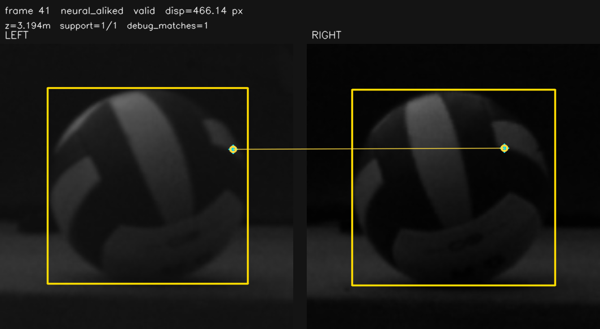
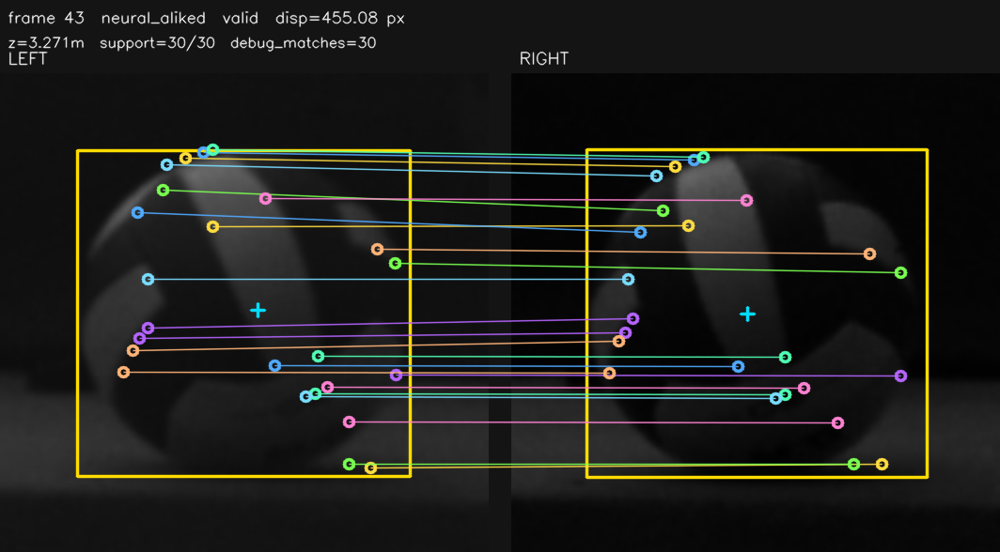
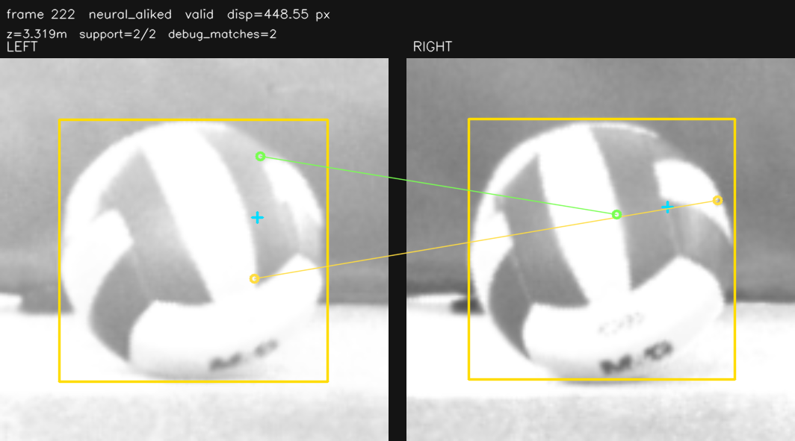
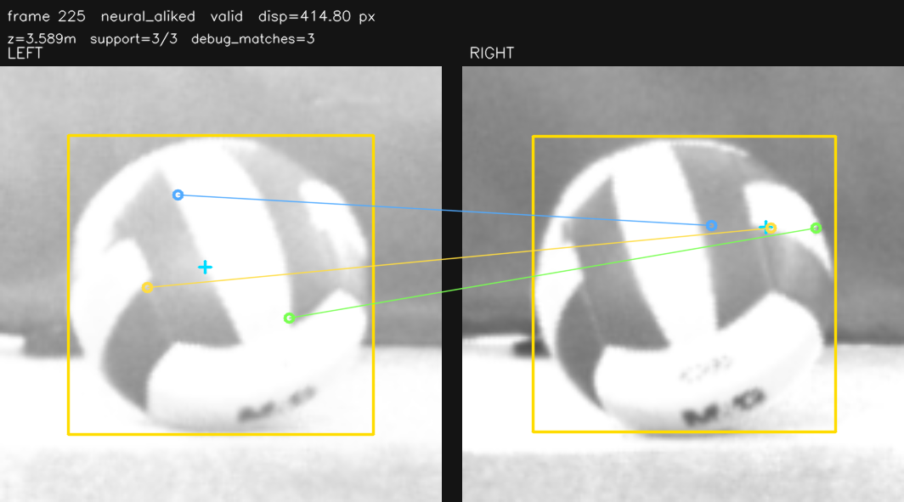
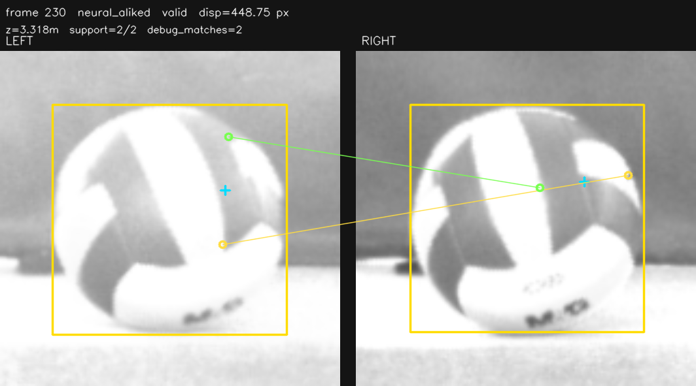

# P2 ALIKED-t16 DCN

最后核对: 2026-07-06

本页记录官方 ALIKED-t16 DCN TensorRT 候选。它不同于历史 `no-DCN` 对照: 当前 engine 保留 LightGlue ALIKED 的 4 个 deformable convolution layer，并通过 TensorRT DCNv2 plugin 落地。

## 方法概况

| 项 | 内容 |
|---|---|
| 字段 | `z_roi_neural_aliked` |
| sidecar mode | `neural_aliked` |
| 输入 | rectified gray ROI，batch=2，`128x128` |
| engine | `models/neural/aliked_t16_dcn_extractor_128_top64_b2.engine` |
| plugin | `models/neural/plugins/libdcnv2.so` |
| 输出 | `keypoints=2x64x2`, `descriptors=2x64x64`, `scores=2x64` |
| 实时后处理 | GPU mutual-NN / gate 后回传点对，最终 sparse geometry gate 在 C++ |
| 当前状态 | engine 已构建通过；实时质量/FPS 不准入 |

## 导出链路

官方 ALIKED-t16 含 DCN，legacy `torch.onnx.export(..., dynamo=false)` 会失败在 `torchvision::deform_conv2d`。当前链路:

```text
LightGlue ALIKED-t16
  -> PyTorch dynamo / onnxscript exporter, opset 19
  -> ONNX DeformConv
  -> rewrite to dcn::DCNv2 custom node
  -> TensorRT --staticPlugins libdcnv2.so
  -> aliked_t16_dcn_extractor_128_top64_b2.engine
```

命令:

```bash
cd /home/nvidia/NX_volleyball/stereo_3d_pipeline
scripts/nx_build_dcnv2_plugin.sh
ROI_SIZE=128 TOP_K=64 BATCH_SIZE=2 ALIKED_MODEL=aliked-t16 \
  scripts/nx_build_aliked_dcn_engine.sh
```

关键约束:

- `libdcnv2.so` 当前必须用 `trtexec --staticPlugins`，不能用 `--dynamicPlugins`。
- ONNXScript 会导出 `ScatterND(reduction="none")`，TensorRT 10.3 不支持该显式属性；导出脚本会移除它。
- 运行时配置必须填写 `plugin_library_path`，C++ 会在反序列化 engine 前 `dlopen(..., RTLD_GLOBAL)`。

## TensorRT 基准

2026-07-06 NX `trtexec`:

| engine | latency mean/p95 | GPU compute mean/p95 | 结论 |
|---|---:|---:|---|
| `aliked_t16_dcn_extractor_128_top64_b2.engine` | `2.5315 / 2.5574ms` | `2.5074 / 2.5305ms` | engine 和 plugin 可用 |

## 实时测试

### 单算法 isolated

```text
test_logs/neural_aliked_dcn_zoom_20260706_095209/
```

| gate | FPS | 有效/帧 | median/MAD | support | algo avg/p95/max | worker avg/p95/max | 判断 |
|---|---:|---:|---:|---:|---:|---:|---|
| current | `89.8` | `0/572` | `/` | `/` | `9.54/9.56/236.25ms` | `9.82/9.78/237.34ms` | current gate 全拒绝 |
| gate off | `90.3` | `68/572` | `3.4333/0.0370m` | `2.0` | `9.53/9.50/241.34ms` | `9.89/9.82/241.81ms` | 点少，深度离散大 |

注意: 上表的 `gate off` 只关闭了 neural y/disp/final geometry 等门控，但仍保留 `min_spatial_quadrants=2`、`min_spatial_spread_ratio=0.10`。因此它不是完整 true gate-off，日志中大量失败来自 `poor_spatial_quadrants`。

### DCN vs no-DCN true gate-off

```text
test_logs/aliked_dcn_vs_nodcn_true_gateoff_visible_20260706_120242/
wiki/assets/aliked_dcn_vs_nodcn_true_gateoff_visible_20260706_120242/
```

本轮修正 `scripts/nx_algorithm_matrix_test.py` 的 gate-off 配置生成，额外关闭 neural 内部空间门:

```yaml
min_spatial_quadrants: 0
min_spatial_spread_ratio: 0.0
```

| 模型 | FPS | 有效/帧 | median/MAD | support | algo avg/p95/max | worker avg/p95/max | 判断 |
|---|---:|---:|---:|---:|---:|---:|---|
| official DCN true gate-off | `89.9` | `561/573` | `3.3565/0.1472m` | `1.0` | `9.50/9.45/243.12ms` | `9.80/9.76/243.77ms` | 空间门关闭后不再点少，但多数帧只有单点，深度抖动大 |
| no-DCN true gate-off | `83.1` | `590/590` | `3.2754/0.0079m` | `26.0` | `8.32/9.11/11.99ms` | `8.61/9.45/12.57ms` | 点多且深度稳定，但不是官方 DCN 模型，且含背景/边界误匹配 |

代表 P2 artifact:

| 模型 | 图 | 观察 |
|---|---|---|
| official DCN true gate-off |  | `support=1/1`，单点，y 斜差明显；有效率高来自 `min_matches=1`，不能说明质量好 |
| official DCN true gate-off |  | 偶尔点位接近水平，但仍是单点，无法做多点鲁棒聚合 |
| no-DCN true gate-off |  | `support=29/29`，点多，深度稳定；但有球边界/背景点和非同名纹理 |
| no-DCN true gate-off |  | 多点分布稳定，仍需要更强 ROI mask / epipolar / robust gate 后才能作为候选 |

### NCC + XFeat + ALIKED-DCN 联合

```text
test_logs/ncc_xfeat_aliked_dcn_20260706_094952/
```

| 字段 | 有效/帧 | median/MAD |
|---|---:|---:|
| `z_roi_cuda_template_match` | `400/1034` | `3.3032/0.0085m` |
| `z_roi_neural_xfeat` | `54/1034` | `3.3320/0.0224m` |
| `z_roi_neural_aliked` | `0/1034` | `/` |

关键耗时:

| stage | avg/p95/max |
|---|---:|
| `Stage2_CudaTemplateNccMatch` | `0.40/0.46/4.57ms` |
| `Stage2_NeuralXFeatMatch` | `7.90/8.44/9.96ms` |
| `Stage2_NeuralAlikedMatch` | `10.10/10.29/241.25ms` |
| `Stage2_P2InlineFeatureEndToEnd` | `10.15/10.33/241.34ms` |
| `Stage2_AsyncRoiOverDeadline` | `40` 次 |

结论: 官方 ALIKED-DCN 当前不适合进入默认 P1 联合采集。它能真实跑 DCN TensorRT，但实时点对有效率太低，且单独耗时约 `9.5-10.1ms`，和 XFeat/NCC 同时跑时把 ROI worker 推到 deadline 边缘。

## Zoom 对比

| 模型 | 图 | 观察 |
|---|---|---|
| no-DCN gate off |  | 点多，但含多条背景/非同名纹理斜线；不是官方模型 |
| official DCN gate off |  | 点位大体落在球面相似区域，但只剩 `support=2`，不足以稳定测距 |

本次 official DCN gate-off 共同步 4 张有效 P2 artifact:

| frame | 图 |
|---|---|
| 217 |  |
| 222 |  |
| 225 |  |
| 230 |  |

## 当前结论

ALIKED-t16 DCN 已完成真实 GPU/TensorRT 落地，但当前不准入默认实时管线。下一步若继续优化，应优先看 descriptor matching / gate 参数和 topK/ROI，而不是继续修导出链路。
